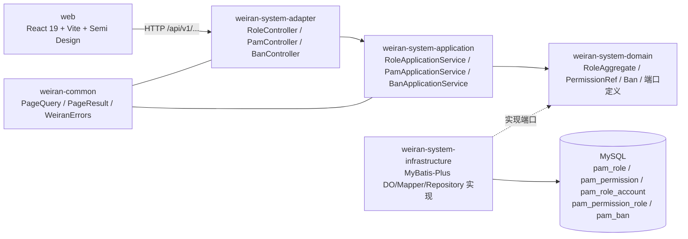

# Design

> 保持**意图粒度**：描述「行为如何」，不写逐文件的实现步骤。
> 实现细节属于 `exec/plan.md`，且**不得回写本文件**。

## Context

- 需求来源：`interview.md`
- 现有实现调研：`explore.md`
- 关键约束：
  - 五张既有表（`pam_role`/`pam_permission`/`pam_role_account`/`pam_permission_role`/`pam_ban`）迁移期与 PHP 并行读写，本次严禁 ALTER（CP-7）。
  - 现有 `rbac/Role.java`、`rbac/Permission.java` 是不可变只读值对象，已被登录鉴权链路（`RbacRepository`）使用，不能随意改造。
  - `weiran-common` 已有 `PageQuery`/`PageResult`/`WeiranErrors`，直接复用。
  - Controller 通过 `@Import` 显式登记，Mapper 通过模块内 `@MapperScan` 自声明，新增内容照抄这套装配模式。

## 宪法对照

> 逐条对照 `openspec/rules/constitution.md`。

| 原则 | 判定 | 说明 |
|---|---|---|
| CP-1 领域层不依赖框架 | ☑ | 新增的 `RoleAggregate`/`PermissionAggregate`/`Ban` 聚合根与 `RoleRepository`/`BanRepository` 端口全部放在 `weiran-system-domain`，只用 Lombok（`@Builder`/`@Getter`），不引入 Spring/MyBatis/Jakarta 类型；`weiran-system-domain/build.gradle.kts` 不新增任何 Web/持久化依赖 |
| CP-2 依赖方向单向向内 | ☑ | 新增 `RoleApplicationService`/`PamApplicationService`/`BanApplicationService` 位于 application 层，只依赖 domain 端口；`RoleController`/`PamController`/`BanController` 位于 adapter 层，只依赖 `weiran-system-api` 契约接口；infrastructure 层的 Repository 实现依赖 domain 端口反向注入，符合既有 `AuthApplicationService`/`MyBatisAccountRepository` 的既定模式 |
| CP-3 持久化类型不跨层 | ☑ | 新增 `PamRoleDO`/`PamPermissionDO`/`PamRoleAccountDO`/`PamPermissionRoleDO`/`PamBanDO`、对应 `BaseMapper` 子接口、`IPage`/`Wrappers` 的使用全部限定在 `weiran-system-infrastructure` 模块内；端口方法签名与应用层/适配层一律使用领域模型（`RoleAggregate`/`Ban`）或 `weiran-common` 的 `PageQuery`/`PageResult` |
| CP-4 版本号只有一个来源 | ☐ | 不涉及：本次不引入任何新第三方依赖（MyBatis-Plus、Semi、Spring 均已在 BOM 中管理），不改动 `weiran-dependencies` 或任何模块的 `build.gradle.kts` 版本声明 |
| CP-5 质量规则只在 build-logic 里配置 | ☐ | 不涉及：本次不修改任何 Checkstyle/Spotless/SpotBugs/Forbidden APIs/Error Prone 配置，也不在模块 `build.gradle.kts` 里放宽规则 |
| CP-6 豁免必须最小且带理由 | ☐ | 不涉及：当前设计不需要任何 `@SuppressForbidden`/`@NullUnmarked`/`@SuppressWarnings` 豁免；若实现阶段发现 MyBatis-Plus 反射填充的 DO 需要 `@NullUnmarked`（参照 `PamAccountDO` 的既有做法），届时按 CP-6 就地标注理由，不在此提前声明 |
| CP-7 pam_* 表结构改动必须双向核对 | ☑ | 已在 `explore.md` 核对 PHP 侧五张表迁移文件（`weiran-v1/weiran/system/resources/migrations/`），新增的五个 DO 字段类型/约束逐一对齐（详见下方 Database Design 表），不做任何 ALTER TABLE，对 PHP 侧无破坏性影响 |
| CP-8 历史密码算法只用于校验，永不用于生成 | ☑ | 账号新增与密码重置全部复用已有 `PasswordHasher.hash()` 端口产出 BCrypt，不新写、不调用任何 `md5(sha1(...))` 相关代码；与 `weiran-app` 已有的 `ResetPasswordRunner` 走同一条哈希生成路径（见 `rbac-account-management` spec 的 FR-005） |
| CP-9 凭据不进版本库、不进日志 | ☑ | 新增 Controller/应用服务的日志语句（若有）不打印密码明文或密码哈希；账号新增/重置密码请求体中的密码字段遵循现有 `LoginRequest` 的处理方式，不在异常消息中回显 |
| CP-10 认证失败不泄露账号存在性 | ☐ | 不涉及：本次新增的是管理端 CRUD 接口（已认证的管理员操作），不是登录鉴权路径，不产生新的「账号是否存在」信息泄露面；账号新增时的唯一性校验错误（见 `rbac-account-management` FR-002）返回的是「该账号类型下用户名已被占用」这类管理员操作反馈，不同于登录场景的账号枚举风险 |
| CP-11 错误码归属决定 HTTP 状态，不靠 Controller 判断 | ☑ | 新增的业务错误码（角色不存在、系统角色不可删除、账号名冲突、封禁记录不存在等）定义在 `weiran-system-domain/.../error/SystemErrors.java`（追加枚举值，复用 `@ErrorModule(name="SYSTEM")` 与既有 `origin=CALLER` 默认值），三个新 Controller 一律不手写 HTTP 状态码、不 catch 业务异常自行转换，与 `AuthController` 现有写法一致 |

## Architecture

## Data Flow

1. 前端页面（角色/账号/封禁管理）通过 `web/src/lib/api.ts` 的 `get`/`post` 向对应 Controller 发起请求。
2. Controller 将请求 DTO 转换为应用层命令对象，调用应用服务；应用服务通过领域端口读写数据，写操作包裹在 `@Transactional` 内（沿用 `AuthApplicationService` 的既有模式）。
3. Infrastructure 层的 Repository 实现将领域模型与 MyBatis-Plus DO 相互转换，对既有五张表做 CRUD。
4. Controller 返回裸业务对象，由 wuli3 的 `ApiResponseBodyAdvice` 统一包装为 `{code, message, timestamp, requestId, data}`。
5. 前端拿到统一响应后，用 TanStack Query 缓存并在写操作后 `invalidateQueries` 触发列表刷新。

## Role/Permission 写模型设计决策(回应 interview.md「本次要在 design 阶段决定」)

> 决策：**新增独立的可编辑聚合根，不改造现有 `rbac/Role.java`/`rbac/Permission.java`。**

- 现有 `weiran-system-domain/.../rbac/Role.java`、`Permission.java` 是不可变值对象（`@Builder(toBuilder=true)`，无持久化注解），职责是"登录鉴权链路里，账号当前持有的角色/权限名称快照"，被 `RbacRepository.findRoleNamesByAccountId`/`findPermissionNamesByAccountId` 使用。这条链路是只读的、高频的（每次令牌校验都可能触发），语义单一。
- 管理后台需要的是"可编辑的角色/权限定义本身"（增删改、启禁用、权限树分配），与上述只读快照是不同的使用场景，若合并到同一个类型，会让这个本该单一职责的值对象承担两种生命周期（一种是"账号视角的只读投影"，一种是"管理员视角的可编辑聚合根"），且现有类型没有 `id` 以外的可变性设计空间。
- 因此新增：
  - `weiran-system-domain/.../rbac/RoleAggregate.java`：可编辑角色聚合根，字段与 `pam_role` 表一一对应（`id`/`name`/`title`/`description`/`accountType`/`enabled`/`system`），提供业务方法 `rename()`（校验 `system=true` 时拒绝改名，对应 spec `rbac-role-management` FR-002）。
  - `weiran-system-domain/.../rbac/PermissionRef.java`：权限点只读引用（管理端展示权限树用，字段含 `group`/`root`/`module` 分组信息），因为权限点本身在本次 change 中不提供新增/编辑入口（PHP 侧权限点是代码级声明，不是运营可编辑的），只做绑定关系管理。
  - `weiran-system-domain/.../rbac/Ban.java`：封禁聚合根。
  - 与现有 `rbac/Role.java`/`Permission.java` **共存**，两者都读写同一张表，但服务不同的用例：`RbacRepository` 继续用于登录鉴权只读投影，新增的 `RoleRepository` 用于管理端 CRUD。两者在 infrastructure 层各自有独立的 Mapper 查询（`RbacMapper` 保持不变，新增 `PamRoleMapper`），不共享同一个 Mapper 类，避免管理端的写操作查询逻辑污染鉴权路径的只读查询。

## 前端 REST 交互方式决策(回应 interview.md「本次要在 design 阶段决定」)

> 决策：**沿用 POST 语义化路径，不引入 PUT/DELETE，不扩展 `web/src/lib/api.ts`。**

- `web/src/lib/api.ts` 当前只有 `get<T>()`/`post<T>()`，是所有页面共同依赖的请求封装（`explore.md` SL-4）。
- 若新增标准 REST 动词（PUT/DELETE），需要扩展这个共享文件，且 PHP 侧 mgr-page 的既有交互本身就是 POST-only 的 RPC 风格（`establish`/`delete` 等具名路由），语义上更贴近。
- 因此三个新 Controller 全部使用 `GET`（查询类）+ `POST`（新增/编辑/删除/状态切换类）的语义化路径，不引入 PUT/DELETE。`web/src/lib/api.ts` 本次不改动，不进入 Layer 0 共享层冲突范围（对应 `proposal.md` 共享层影响表里 `api.ts` 那一行标记为 ☐）。

## 跨模块契约变更

> `weiran-system-api` 是对外契约模块（不依赖 Spring、不依赖领域层），本次新增内容会被 `weiran-system-adapter` 消费。

| 对象 | 文件 | 动作 | 消费方 |
|---|---|---|---|
| `RoleService` 接口 | `weiran-system-api/.../rbac/RoleService.java` | 新增 | `weiran-system-adapter` 的 `RoleController` |
| `PamService` 接口 | `weiran-system-api/.../rbac/PamService.java` | 新增 | `weiran-system-adapter` 的 `PamController` |
| `BanService` 接口 | `weiran-system-api/.../rbac/BanService.java` | 新增 | `weiran-system-adapter` 的 `BanController` |
| 各服务对应的 Command/View record 类型 | `weiran-system-api/.../rbac/` | 新增 | 同上，参照 `LoginCommand`/`LoginResult`/`CurrentAccountView` 的既有 record 写法 |

> 改动后无需额外构建步骤——这是 Gradle 多模块单体仓库，`weiran-system-adapter` 直接依赖 `weiran-system-api` 的编译产物，`./gradlew :weiran-system-adapter:compileJava` 会自动感知契约变更，不存在"包发布滞后"的问题（这与 TS monorepo 需要 `pnpm --filter build` 是不同的构建模型）。

## API Design

| 路由 | 方法 | 所属模块 | 请求关键字段 | 返回关键字段 | 权限点 |
|---|---|---|---|---|---|
| `/api/v1/roles` | GET | RoleController | `page`/`size`/`accountType`/`enabled` | `PageResult<RoleView>` | `weiran-system:role.index` |
| `/api/v1/roles/{id}` | GET | RoleController | - | `RoleDetailView`（含已绑定权限 ID 集合） | `weiran-system:role.index` |
| `/api/v1/roles` | POST | RoleController | `name`/`title`/`description`/`accountType` | `RoleView` | `weiran-system:role.manage` |
| `/api/v1/roles/{id}/update` | POST | RoleController | `title`/`description`/`enabled`（`system=true` 时拒绝改 `name`） | `RoleView` | `weiran-system:role.manage` |
| `/api/v1/roles/{id}/delete` | POST | RoleController | - | 空（`system=true` 时返回错误码） | `weiran-system:role.manage` |
| `/api/v1/roles/{id}/permissions` | POST | RoleController | `permissionIds: long[]`（整体替换语义，见 spec FR-004） | 空 | `weiran-system:role.permissions` |
| `/api/v1/permissions` | GET | RoleController | - | `PermissionView[]`（按 `group`/`module` 分组，供权限树渲染） | `weiran-system:role.index` |
| `/api/v1/accounts` | GET | PamController | `page`/`size`/`keyword`/`accountType` | `PageResult<AccountView>` | `weiran-system:account.index` |
| `/api/v1/accounts/{id}` | GET | PamController | - | `AccountDetailView` | `weiran-system:account.index` |
| `/api/v1/accounts` | POST | PamController | `username`/`password`/`mobile`/`email`/`accountType` | `AccountView` | `weiran-system:account.manage` |
| `/api/v1/accounts/{id}/update` | POST | PamController | 可变资料字段（不含密码） | `AccountView` | `weiran-system:account.manage` |
| `/api/v1/accounts/{id}/enable` | POST | PamController | - | 空 | `weiran-system:account.manage` |
| `/api/v1/accounts/{id}/disable` | POST | PamController | - | 空 | `weiran-system:account.manage` |
| `/api/v1/accounts/{id}/reset-password` | POST | PamController | `newPassword` | 空 | `weiran-system:account.manage` |
| `/api/v1/accounts/{id}/login-logs` | GET | PamController | `page`/`size` | `PageResult<LoginLogView>` | `weiran-system:account.index` |
| `/api/v1/bans` | GET | BanController | `page`/`size`/`type`/`accountType` | `PageResult<BanView>` | `weiran-system:ban.index` |
| `/api/v1/bans` | POST | BanController | `type`/`value`/`ipStart`/`ipEnd`/`note`/`accountType` | `BanView` | `weiran-system:ban.manage` |
| `/api/v1/bans/{id}/update` | POST | BanController | 可变字段 | `BanView` | `weiran-system:ban.manage` |
| `/api/v1/bans/{id}/delete` | POST | BanController | - | 空 | `weiran-system:ban.manage` |

- 入参校验：复用 Jakarta Bean Validation（`@Valid`），与现有 `LoginRequest` 一致，不引入新校验框架。
- 分页：请求走 `weiran-common.page.PageQuery`（`page`/`size`，`size` 上限 200），返回走 `PageResult<T>`，不自定义分页协议。
- 路径前缀沿用 PHP 版 `/api/v1/...` 风格（与 `AuthController` 一致）。
- 权限拦截：由 wuli3 底座的权限注解/拦截器机制在 Controller 方法上声明（具体注解形式沿用现有鉴权基础设施，`AuthorizedPrincipal.permissionNames()` 已在 `PrincipalHolder` 中可读，拦截逻辑复用既有 `PermissionChecker`），不在业务代码里手写权限比对。

## Database Design

> 全部复用既有表，**不做任何 ALTER TABLE**，字段类型/约束逐一核对 PHP 迁移文件（`weiran-v1/weiran/system/resources/migrations/`）。

| 表 | 动作 | 关键字段（对齐 PHP 迁移定义） | 索引 | 迁移 |
|---|---|---|---|---|
| `pam_role` | 复用（新增 DO） | `id`(mediumint unsigned)/`name`(varchar100)/`title`(varchar100)/`description`(varchar100)/`type`(varchar20，对应 `accountType`)/`is_enable`(tinyint)/`is_system`(tinyint) | 主键 `id` | 无（本项目未选定 Flyway/Liquibase，本次不涉及） |
| `pam_permission` | 复用（新增 DO，只读） | `id`(int unsigned)/`name`(varchar255，唯一索引)/`title`/`description`/`group`/`root`/`module`(均 varchar) | 唯一索引 `u_permission_name(name)` | 无 |
| `pam_role_account` | 复用（新增 DO） | `account_id`(mediumint unsigned)/`role_id`(mediumint unsigned) | 普通索引 `role_id`、`account_id`，**无唯一约束**（历史行为，见下方兼容性说明） | 无 |
| `pam_permission_role` | 复用（新增 DO） | `permission_id`(int unsigned)/`role_id`(int unsigned) | 联合主键 `(permission_id, role_id)` | 无 |
| `pam_ban` | 复用（新增 DO） | `id`(bigint)/`account_type`(varchar20)/`type`(varchar)/`value`(varchar)/`ip_start`/`ip_end`(bigint unsigned)/`note`(varchar255)/`created_at`/`updated_at` | 普通索引 `k_val(value)` | 无 |

- MyBatis-Plus schema 位置：`weiran-system-infrastructure/.../persistence/entity/`，新增 `PamRoleDO`/`PamPermissionDO`/`PamRoleAccountDO`/`PamPermissionRoleDO`/`PamBanDO`，字段命名与既有 `PamAccountDO` 保持同样的驼峰-下划线映射约定（`mybatis-plus.configuration.map-underscore-to-camel-case: true`，已在 `application.yml` 全局启用）。
- 兼容性：`pam_permission_role` 有联合主键，角色-权限分配的"整体替换"写入必须走"先按 `role_id` 删除全部旧记录，再批量插入新集合"（利用联合主键天然去重，插入重复行会因主键冲突失败，需在应用层保证同一批插入内 `permission_id` 不重复）。`pam_role_account` 无唯一约束，账号-角色分配（若本次范围包含，见下方"Open Questions"）需要同样的"先删后插"策略并额外做应用层去重，因为数据库层面不会拦截重复行。
- 迁移：本项目尚未选定 Flyway/Liquibase（`openspec/project.json` 已注明），且本次全部复用既有表结构，不产生任何迁移脚本，不涉及序号型资源冲突。

## 权限 / 数据范围

| 项 | 设计 |
|---|---|
| 权限点 | 新增 `weiran-system:role.index`、`weiran-system:role.manage`、`weiran-system:role.permissions`、`weiran-system:account.index`、`weiran-system:account.manage`、`weiran-system:ban.index`、`weiran-system:ban.manage`，全部沿用 `weiran-system:{resource}.{action}` 格式，写入 `pam_permission` 表（需人工/初始化脚本录入，具体录入方式属于 exec/plan.md 的任务项，不在 design 阶段展开逐文件步骤） |
| 菜单挂载 | 前端 `AdminLayout` 侧边菜单：角色管理（`weiran-system:role.index`）、账号管理（`weiran-system:account.index`，二级菜单含登录日志）、风险拦截（`weiran-system:ban.index`），显隐判断复用已有 `hasPermission()` |
| 数据范围 | 不涉及：`AccountType`（`user`/`backend`）已是账号空间隔离维度，非本次新增概念；管理端查询默认不做数据范围过滤（后续若需要"只能管理本部门账号"等范围限制，属于未来 change） |
| 租户隔离 | 不涉及：本项目当前无多租户概念 |

## 前端设计

| 项 | 内容 |
|---|---|
| 页面/路由 | `web/src/layouts/AdminLayout.tsx`（Semi `Layout`/`Nav`）；`web/src/pages/role/RoleListPage.tsx`；`web/src/pages/account/AccountListPage.tsx`、`web/src/pages/account/LoginLogPage.tsx`；`web/src/pages/ban/BanListPage.tsx`。路由在 `web/src/App.tsx` 中以 `AdminLayout` 为父路由、各页面为嵌套子路由组织（对应 `admin-console-shell` spec FR-004） |
| 数据请求 | 直接用 TanStack Query 的 `useQuery`/`useMutation` 包裹 `web/src/lib/api.ts` 的 `get`/`post`，不新增 hook 抽象层（当前项目规模小，参照现有 `RequireAuth`/`LoginPage` 直接在页面组件内调用的既定风格，不提前引入 `hooks/queries/` 目录） |
| 复用组件 | `RequireAuth`（路由守卫）；`hasPermission()`（按钮/菜单显隐）；新增的列表页/表单弹层组件本身作为后续模块 change 的样板，但本次不抽出通用 `<CrudTable>`/`<CrudFormModal>` 组件——先在三个页面里各自实现，观察出稳定模式后再抽象（避免过早抽象，`minimal-code-discipline` 原则） |
| 状态与缓存失效 | 沿用现有 `queryClient.invalidateQueries({queryKey:['...']})` 模式（`LoginPage.tsx` 已示范），每个写操作（新增/编辑/删除/启禁用/权限分配）成功后失效对应列表的 query key |
| 权限控制点 | 菜单项显隐 + 页面内操作按钮（新增/编辑/删除/启禁用按钮）显隐，均用 `hasPermission()`；真正的访问控制在后端 Controller 层，前端隐藏仅是体验优化（对应 `admin-console-shell` spec FR-002 的两个场景） |

## Observability

- 日志关键字段：新增应用服务的写操作日志沿用 `AuthApplicationService` 的 `@Slf4j` 用法，记录操作类型 + 目标 ID，不记录密码/敏感字段（CP-9）。
- 指标：不涉及，本项目当前未接入自定义 HTTP 指标中间件。
- 审计：本次不做操作审计日志（interview.md 已明确"本次不决定"），仅保留应用层日志作为基本可观测手段。
- 告警/排障入口：无新增，沿用现有日志排障方式。

## Test Plan

| 层级 | 范围 | 命令 |
|---|---|---|
| 单元 | domain 领域规则（`RoleAggregate.rename()` 的系统角色保护逻辑等）、application 用例编排 | `./gradlew :weiran-system-domain:test :weiran-system-application:test` |
| 集成 | infrastructure 层 Repository 实现（对照 PHP 迁移表结构的字段映射正确性）、adapter 层 Controller 端到端 HTTP 请求 | `./gradlew :weiran-system-infrastructure:test :weiran-system-adapter:test`，以及 `weiran-app` 的 `AuthEndpointIT` 同类模式新增集成测试 |
| 全量门禁 | 编译 + 测试 + Checkstyle + SpotBugs + Forbidden APIs + Error Prone/NullAway + 覆盖率 | `./gradlew check` |
| 前端组件 | `AdminLayout` 权限过滤显隐、三个业务页面的列表/表单交互 | `pnpm test` |
| 前端静态检查 | ESLint | `pnpm lint` |

## Rollout Plan

1. 后端：`./gradlew check` 全绿后，五个模块的新增代码随 `weiran-app` 正常发布，无需数据库迁移步骤（复用既有表）。
2. 权限点数据：需要在目标环境的 `pam_permission` 表中录入本次新增的 7 个权限点（`weiran-system:role.index` 等），并将其分配给至少一个具备管理能力的角色（如 `system=true` 的超级管理员角色），否则新功能上线后无人能访问——具体录入方式（SQL 脚本 or 管理端自身操作）由 exec/plan.md 决定。
3. 前端：`pnpm build` 产物随静态资源发布，`AdminLayout` 与三个业务页面上线即可通过菜单访问（受权限点门控）。
4. 灰度：本项目当前无灰度机制，走标准 CI 门禁后直接发布。

## Rollback Plan

1. revert 锚点：本 change 归档后的 merge commit（在 `openspec archive` 执行后于 `git log` 中定位）。
2. 数据库回滚：不涉及，本次未做任何表结构变更，无需回滚脚本；已插入的权限点数据（`pam_permission`）如需回滚，删除对应 `name` 前缀为 `weiran-system:role.`/`weiran-system:account.`/`weiran-system:ban.` 的新增记录即可，不影响 PHP 侧既有权限点。
3. 代码回滚：`git revert` 该 merge commit 即可完全撤销，因为本次是新增能力（新文件为主，仅两处 `AutoConfiguration` 与 `App.tsx`/`AccountRepository` 有插入式改动，不修改任何既有方法的行为），无需额外清理步骤。

## Open Questions

- [ ] 账号-角色的分配入口本次是否包含在账号管理页面内（即账号管理页面除了基本资料编辑，是否需要一并提供"分配角色"的交互）？`interview.md` 的验收标准 AC-7/AC-8 分别提到角色管理页面的"分配权限"与账号管理页面的闭环操作，但未明确账号-角色绑定的具体承载页面。建议放在账号管理的编辑弹层内，作为 tasks.md 阶段的实现细节确认，不影响本 design 的整体架构。
