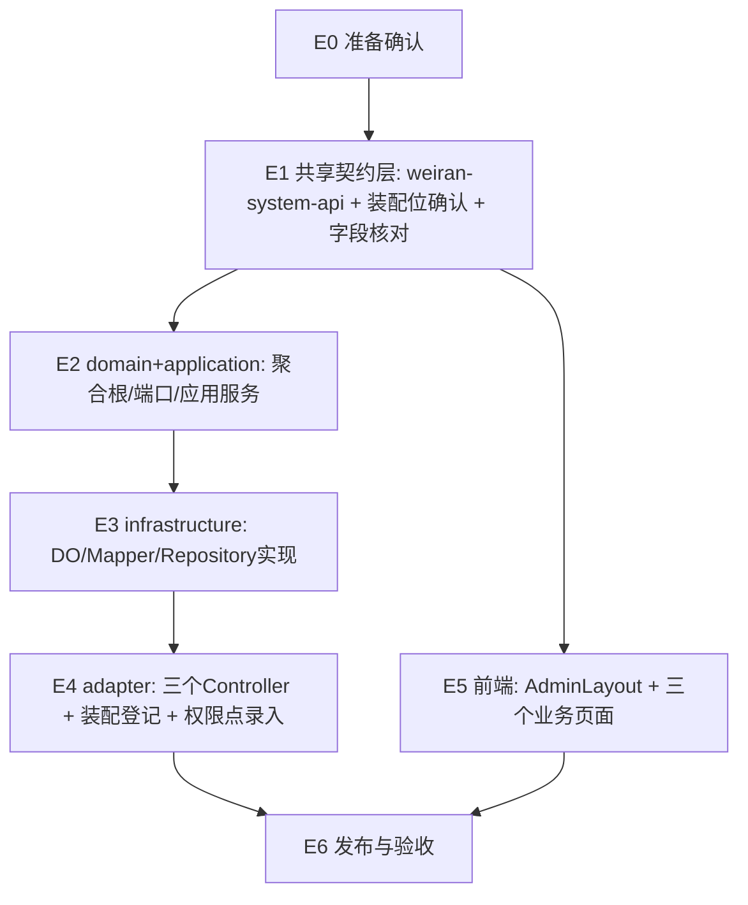

# Exec Plan

> **L4 · 交接点 1：意图 → 工程**。
>
> **不变量：本文件是 `tasks.md` 的下游派生物，单向。**

## 0. 执行模式说明(本 change 的实际情况，覆盖模板默认假设)

> `devops-ff-workflow` 技能模板默认假设多 worktree 并行开发（`node scripts/wt.mjs`）。
> 本仓库经 Phase 0 确认：**无 `scripts/wt.mjs`、无 `origin` 远程、单人开发**，
> 用户已明确指示跳过 worktree 隔离，直接在主工作区单 session 顺序推进（见对话记录）。
> 因此本文件的分层（Layer 0/1/2）仍然反映真实的依赖顺序，但"worktree 分配"一节
> 如实记为"不适用"，全部执行单元在同一个 session 内按层顺序完成，不并行。

## 1. 任务映射

| tasks.md 条目 | 执行单元 ID | 层 | 执行方式 |
|---|---|---|---|
| `0.1`、`0.2` | E0 | L0 | 顺序确认 |
| `1.1`、`1.2` | E1 | L0 | 顺序实现（跨模块契约） |
| `1.3`、`1.4` | E1 | L0 | 顺序实现（装配桶文件预留位确认，不实际改动代码，仅定位） |
| `2.1` | E1 | L0 | 顺序核对（字段类型复核） |
| `3.1`、`3.2`、`3.3`、`3.4`、`3.5`、`3.6`、`3.7`、`3.8`、`3.9`、`3.10` | E2 | L1 | 顺序实现（domain + application 层） |
| `4.1`、`4.2`、`4.3`、`4.4`、`4.5`、`4.6`、`4.7`、`4.8`、`4.9` | E3 | L2 | 顺序实现（infrastructure 层，依赖 E2 的端口签名） |
| `4.10`、`4.11`、`4.12`、`4.13`、`4.14` | E4 | L3 | 顺序实现（adapter 层，依赖 E3 的 Repository 实现 + design.md 冻结的 API 契约） |
| `5.1`、`5.2`、`5.3`、`5.4`、`5.5`、`5.6` | E5 | L2（与后端并行的逻辑层级，实际顺序执行） | 顺序实现（前端，依赖 design.md 冻结的 API 契约，不依赖 E3/E4 的具体实现完成，只依赖契约） |
| `6.1`、`6.2`、`6.3`、`6.4` | 跟随 E2/E3/E4/E5 | - | 测试跟随实现，不单独成执行单元 |
| `7.1`、`7.2` | E6 | L4 | 顺序执行（发布，依赖前序全部完成） |
| `8.1` | E6 | L4 | 顺序执行 |

### 未映射条目

无——全部 tasks.md 条目均已映射。

### L7 测试基线

- 基线：本仓库无 `main` 之外的分支概念（单分支 `main` 直接推进，无 PR 流程），`./gradlew check`/`pnpm test`/`pnpm lint` 直接对当前工作区状态跑，不需要 `TEST_BASE` 覆盖。

## 2. 依赖图

| 执行单元 | 前置 | 依赖性质 |
|---|---|---|
| `E2` | `E1` | 需要 `weiran-system-api` 冻结的 Command/View 类型签名（design.md「跨模块契约变更」） |
| `E3` | `E2` | 需要 `RoleRepository`/`BanRepository`/`AccountRepository` 端口签名（domain 层定义） |
| `E4` | `E3` | 需要 Repository 实现存在才能注入到应用服务；同时依赖 design.md「API Design」表冻结的路由/字段契约 |
| `E5` | `E1` | 只依赖 design.md 冻结的 API 契约（路由、请求/响应字段），不依赖后端具体实现是否完成——这是前后端"看似平行、实为契约依赖"的情形，契约已在 design.md 阶段提前冻结，故 `E5` 不必等 `E4` 完成 |
| `E6` | `E4`、`E5` | 发布需要前后端均已完成并通过 L7 门禁 |

## 3. 分层执行计划

### Layer 0 —— 共享层，串行，必须先完成

> 本仓库共享层是 `weiran-system-api`（跨模块契约）+ 两处 `AutoConfiguration` 桶文件（登记位确认）+ 既有表字段核对。不涉及 BOM/build-logic/数据库迁移（design.md 已确认本次零改动）。

| 执行单元 | 内容 | 涉及文件 |
|---|---|---|
| `E0` | 准备确认（负责人、测试角色） | 无代码文件 |
| `E1` | 新增 `weiran-system-api` 的 Command/View 契约类型；确认 `weiran-common` 复用；定位（非改动）两处 `AutoConfiguration` 的登记位；核对五张表字段类型 | `weiran-system-api/.../rbac/RoleService.java` 等新文件；`weiran-v1/weiran/system/resources/migrations/`（只读核对） |

**完成判据**：`./gradlew :weiran-system-api:compileJava` 通过，且下方「契约冻结」表已填满。

### Layer 1 —— 后端领域与应用层，串行（单执行单元，内部无并行）

| 执行单元 | 内容 |
|---|---|
| `E2` | `weiran-system-domain` 新增聚合根/端口 + `weiran-system-application` 新增三个应用服务（tasks.md 3.1-3.10） |

### Layer 2 —— 后端基础设施层 + 前端（逻辑并行，实际顺序执行）

> `E3`（infrastructure）与 `E5`（前端）在依赖图上互不阻塞（`E5` 只依赖 Layer 0 冻结的契约），
> 理论上可并行；但本 change 无 worktree 隔离、单 session 单人执行，两者按顺序完成，
> 不引入并行执行的额外开销与风险。此处标注"逻辑并行"仅用于说明它们之间**没有**顺序依赖关系，
> 不代表实际会同时进行。

| 执行单元 | 内容 |
|---|---|
| `E3` | `weiran-system-infrastructure` 新增五个 DO/Mapper + 两个 Repository 实现 + 改造 `MyBatisAccountRepository`（tasks.md 4.1-4.9） |
| `E5` | `web` 新增 `AdminLayout` + 三个业务页面 + 改造 `App.tsx`（tasks.md 5.1-5.6） |

### Layer 3 —— 后端适配层

| 执行单元 | 内容 |
|---|---|
| `E4` | 三个 Controller + 装配登记 + 权限点录入（tasks.md 4.10-4.14） |

### Layer 4 —— 发布与验收

| 执行单元 | 内容 |
|---|---|
| `E6` | 构建发布确认 + 验收记录（tasks.md 7.1-7.2、8.1） |

## 4. 契约冻结

> Layer 0（`E1`）完成后填写并锁定。这是 design.md「API Design」与「跨模块契约变更」两节的具体化。

| 契约 | 签名 / 结构 | 定义位置 | 消费方(逐单元列出所读/所写的键) | 冻结 |
|---|---|---|---|---|
| `RoleService` 接口 | `RoleView findById/list/create/update/delete/assignPermissions` | `weiran-system-api/.../rbac/RoleService.java` | `E4` 的 `RoleController` 调用；`E2` 的 `RoleApplicationService` 实现 | ☑ |
| `PamService` 接口 | `AccountView findById/list/create/update/enable/disable/resetPassword/loginLogs` | `weiran-system-api/.../rbac/PamService.java` | `E4` 的 `PamController` 调用；`E2` 的 `PamApplicationService` 实现 | ☑ |
| `BanService` 接口 | `BanView findById/list/create/update/delete` | `weiran-system-api/.../rbac/BanService.java` | `E4` 的 `BanController` 调用；`E2` 的 `BanApplicationService` 实现 | ☑ |
| REST 路由与字段 | design.md「API Design」表的 18 个端点，字段命名见各 View/Command record | `weiran-system-adapter/.../web/`（`E4` 新建） | `E5` 的三个前端页面按此发起 `get`/`post` 请求并解析响应字段；`E4` 按此实现 Controller | ☑ |
| 权限点命名 | `weiran-system:role.index`/`role.manage`/`role.permissions`/`account.index`/`account.manage`/`ban.index`/`ban.manage` | design.md「权限 / 数据范围」表 | `E4` 的 `@PreAuthorize`/权限拦截声明；`E5` 的 `hasPermission()` 调用点 | ☑ |
| `RoleRepository`/`BanRepository`/`AccountRepository` 端口签名 | 见 design.md「跨模块契约变更」与 tasks.md 3.4-3.6 | `weiran-system-domain/.../port/` | `E3` 的 Repository 实现类；`E2` 的应用服务调用方 | ☑（Layer 1 完成后锁定，供 Layer 2 的 `E3` 使用） |

> 表中标记为 ☑ 的是"design.md 阶段已确定的意图签名"，实现阶段（Layer 0/1）落成具体 Java 代码时若发现字段命名等细节需要微调，须在实现单元的收尾笔记中记录，不视为契约变更（数量级 `packages/shared` 那种跨包发布滞后风险在本仓库不存在，见 design.md「跨模块契约变更」节的说明）。若出现签名/语义级别的实质变更（如某个字段类型改变、某个端点删除），才需要走下方「契约变更记录」。

### 契约变更记录

| 时间 | 原签名 | 新签名 | 发起方 | 已通知 |
|---|---|---|---|---|
| （无变更） | - | - | - | - |

## 5. worktree 分配与文件所有权

**不适用。** 本 change 经用户明确指示跳过 worktree 隔离，在当前主工作区单 session 顺序执行（Phase 0 已记录此决定：仓库无 `scripts/wt.mjs`、无 `origin` 远程）。所有执行单元共享同一份工作区状态，不存在"拥有/只读/禁止触碰"的文件集划分需求——因为不存在第二个并行 agent 会同时写入同一仓库。

各层文件归属仍按第 3 节的"内容"列作为事实上的边界参考（例如 `E3` 不应触碰 `web/` 下的文件），但这是顺序执行时的自我约束，不是并行隔离机制。

## 6. 测试归属

> 测试不单独成执行单元，测试跟随它验证的实现。

| 执行单元 | 测试范围 | 测试文件 |
|---|---|---|
| `E2` | domain 单元测试（`RoleAggregate.rename()` 系统角色保护） | `weiran-system-domain/src/test/java/.../rbac/RoleAggregateTest.java` |
| `E3` | infrastructure 集成测试（DO 字段映射正确性，可选：对照既有 `MyBatisAccountRepository` 测试模式） | `weiran-system-infrastructure/src/test/java/.../persistence/` |
| `E4` | adapter 端到端 HTTP 测试（仿照 `AuthEndpointIT`），覆盖 tasks.md 6.2 | `weiran-app/src/test/java/com/weiran/app/RbacAdminEndpointIT.java` |
| `E5` | 前端组件测试（`AdminLayout` 权限过滤、三个页面交互），覆盖 tasks.md 6.3-6.4 | `web/src/**/__tests__/` |

集成测试（`E4` 的端到端 HTTP 用例）归 L7 硬闸门验证范围，但仍随 `E4` 单元一起产出，不单独拆分。

## 7. 失败与降级

| 场景 | 处置 |
|---|---|
| 某层实现中发现设计缺陷（如 design.md 的 API 契约字段不足以支撑前端需求） | 暂停，回到 design.md 重新设计并重新走 L3 人工审阅（本 change 无 worktree，直接在当前会话内修订） |
| 某执行单元产出编译不过/测试不过 | 定位根因修复，本仓库为顺序执行，不存在"降级为串行"的场景（本来就是串行） |
| 契约需要变更（Layer 0 冻结后发现签名不够用） | 暂停依赖该契约的后续单元，更新第 4 节契约冻结表与「契约变更记录」后恢复 |
| `./gradlew check` 或 `pnpm test`/`pnpm lint` 红灯 | 见 Phase 4（L7）处理流程：先判断是否为本次改动引入的回归，是则修复，不是则按既有红记录并标注 |

## 8. 收尾要求

每个执行单元完成时，在 `exec/notes/<单元ID>-<简述>.md` 写收尾笔记。本 change 因单 session 顺序执行，收尾笔记按 E1→E2→E3→E4→E5→E6 顺序累积产出，不存在多 agent 并行写入冲突的场景。

## Gate

- [x] 每条 task 都已映射（见第 1 节，无未映射条目）
- [x] `explore.md` 的共享层清单已逐项比对，命中项（`SystemAdapterAutoConfiguration`/`SystemInfrastructureAutoConfiguration`/`App.tsx`）全部落在 Layer 0/相应层的执行单元中
- [x] migration：不适用，本次零迁移脚本（design.md 已确认全部复用既有表）
- [x] 依赖图无环，且前后端契约依赖已识别（`E5` 依赖 Layer 0 冻结的契约而非 `E4` 的实现完成）
- [x] Layer 0 的契约冻结表已列出待填项并标记冻结状态
- [x] 无独立的测试执行单元（测试跟随实现，见第 6 节）
- [x] worktree 隔离不适用（见第 5 节说明），不存在需要检查"两两不相交"的并行 worktree
- [x] 「禁止触碰」以顺序执行的自我约束形式在第 5 节写明
- [x] 失败与降级策略已填（第 7 节）
- [x] 已确认本文件未产生任何对 `tasks.md` / `design.md` / `specs/**` 的回写
