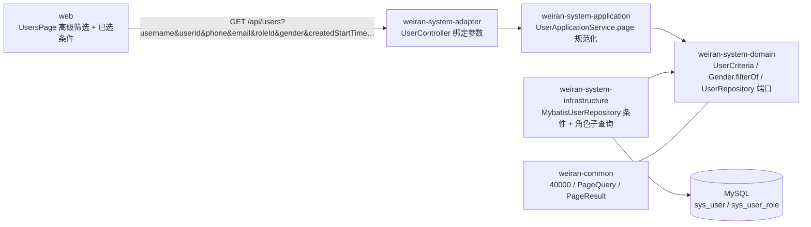

# Design

> 保持**意图粒度**:描述「行为如何」,不写逐文件的实现步骤。
> 实现细节属于 `exec/plan.md`,且**不得回写本文件** —— 需求侧到执行侧是单向的。
> 发现设计有问题时,唯一合法路径是停下来回 L2 重开设计并重新走人类审阅。

## Context

- 需求来源:`interview.md`(单字段精确匹配、按天时间范围、角色单选、并入未提交的搜索栏改造)
- 现有实现调研:`explore.md`(全链路 `UserController → UserQuery → UserApplicationService → UserCriteria → MybatisUserRepository`)
- 关键约束:
  - 不传任何新参数时结果与现状完全一致(AC-7 / FR-005);`Gender.of(null)` 返回 `UNKNOWN`,**不能**用于过滤解析。
  - 持久化类型只在 infrastructure;`UserQuery`(api)与 `UserCriteria`(domain)只用 `java.time` 与 JDK 类型。
  - 契约先行;不新增 Flyway 脚本;非法值复用 40000,不新增错误码。
  - Spring MVC 对**未声明的查询参数静默忽略**:前端先于后端上线时,新参数不生效且不报错——上线顺序必须后端在前。

## 宪法对照

> 逐条对照 `openspec/rules/enforced/constitution.md`。**这是本流水线唯一一处「跨 change 不变量」的落地点** ——
> 项目级约定只在宪法里断言一次,不在每个 change 里重新推导。
>
> 判定标记(三选一,`L2c/constitution-check` 会校验每条原则都有标记且说明非空):
> · **☑ 符合** —— 本次设计遵守该原则,说明列写「怎么遵守的」(一句话,能被 review 核对)
> · **☐ 不涉及** —— 本次改动碰不到该原则的范围,说明列写「为什么碰不到」
> · **⚠ 偏离** —— 本次有意违反,说明列必须写清**为什么必须偏离、代价是什么、
>   是否要连带修订宪法**。偏离是允许的,不写理由不是。
>
> 出现 ⚠ 时,L3 人类审阅的重点就在这一行。

<!-- openspec:required-table mark=2 note=3 -->
| 原则 | 判定 | 说明 |
|---|---|---|
| CP-1 领域层不依赖框架 | ☑ | `UserCriteria` 新增字段与 `Gender.filterOf` 只用 JDK / `java.time` 与 `BizException`(weiran-common),domain 构建脚本不动;`filterOf` 单测不启动容器 |
| CP-2 依赖方向单向向内 | ☑ | 仍是 adapter → application(`UserService`)→ domain(`UserRepository` 端口)← infrastructure;不新增跨层依赖 |
| CP-3 持久化类型不跨层 | ☑ | 子查询、`LambdaQueryWrapper` 条件只写在 `MybatisUserRepository`;端口签名仍是 `page(UserCriteria, PageQuery)` |
| CP-4 版本号只有一个来源 | ☐ | 不新增、不升级任何依赖 |
| CP-5 质量规则只在 build-logic 里配置 | ☐ | 不改任何质量规则配置 |
| CP-6 豁免必须最小且带理由 | ☐ | 不新增任何 `@Suppress*` / `@NullUnmarked` 豁免;新字段按 `@Nullable` 标注 |
| CP-7 表结构只经 Flyway 迁移变更，已发布的迁移永不修改 | ☐ | 不改表结构、不新增脚本:所需列与 `sys_user_role.role_id` 索引已存在 |
| CP-8 密码只用 BCrypt，令牌吊销只走 token_version | ☐ | 只读查询,不碰密码与令牌 |
| CP-9 凭据不进版本库、不进日志 | ☐ | 不涉及凭据;手机号 / 邮箱查询参数不新增任何日志输出 |
| CP-10 认证失败不泄露账号存在性 | ☐ | 不涉及登录;列表接口本就需 `system:user:list`,按用户名精确查询不是认证入口 |
| CP-11 错误码归属决定 HTTP 状态，不靠 Controller 判断 | ☑ | 非法性别由 `Gender.filterOf` 抛 `BizException.badRequest`,非法时间 / 非数字 ID 由全局异常处理器转 40000;Controller 不手写状态码 |

## Architecture

## Data Flow

1. 前端:管理员在高级筛选面板填写字段 → 点「搜索」→ 草稿复制为「已生效条件」→ `toQuery()` 生成查询串(时间按天补 `00:00:00` / `23:59:59`)。
2. adapter:`UserController.page` 以 `@RequestParam(required = false)` 绑定新参数;`userId` / `roleId` 为 `Long`,四个时间为 `LocalDateTime`
   (全局格式化器 `yyyy-MM-dd HH:mm:ss`);绑定失败 → 全局异常处理器 → 40000。组装扩展后的 `UserQuery`。
3. application:`page()` 规范化——字符串 `Texts.trimToNull`;`gender` 经 `Gender.filterOf`(空白 → 不过滤,非法 → 40000);
   其余原样;部门展开逻辑不变。组装扩展后的 `UserCriteria`。
4. infrastructure:在现有条件链上追加:`username` / `id` / `phone` / `email` / `gender` 等值;`created_at`、`last_login_at` 各自 `>= start`、`<= end`
   (对可空列的比较天然排除 NULL,满足「传了登录时间就排除从未登录」);`roleId` 用参数绑定的子查询
   `id in (select user_id from sys_user_role where role_id = ?)`,不 join,天然去重、`total` 正确。排序仍 `id` 升序。
5. 返回 `PageResult<UserView>`(结构不变)→ 前端渲染列表,「已选条件」按已生效条件生成可读标签。

<!-- openspec:slot design-sections
  【项目特定 · 换项目必须重写本槽内的章节集合】
  问:本项目的技术设计,必须回答哪些问题才算完整?
  为什么问:design.md 是 L3 人闸唯一的审阅对象,也是 L4 契约冻结的来源。
           章节缺一块,那块就不会被审,也不会进契约表。
  答案要求:按本项目的技术栈列出必填章节,每节给出「填什么 + 本项目的既定做法/踩过的坑」。
  下面这套是 Java 21 / Gradle 多模块(DDD 五层 + MyBatis-Plus + JWT + wuli3 底座)的版本;
  换栈时整体替换,但有两节任何项目都要保留:
    · 跨模块契约变更(它会成为 exec/plan.md 的 Layer 0 与契约冻结项)
    · Rollout / Rollback(Rollback 必须写 revert 锚点)

  本项目的权威版本住在 `openspec/rules/enforced/project.md` 的 `DS-N` 条目 —— 改必填章节先改那里,
  再同步下面标题末尾的 ID。两边 ID 不一致会被 `TEMPLATE/profile-rows` 拦。
-->

## 跨模块契约变更(DS-1)

> `weiran-common` 是所有模块的公共依赖,这里的变更会成为 `exec/plan.md` 的 Layer 0 与契约冻结项。

| 对象 | 文件 | 动作 | 消费方 |
|---|---|---|---|
| 错误码 | `weiran-common/.../error/WeiranErrors.java` | 不改:非法值复用 40000 | — |
| 分页契约 | `weiran-common/.../page/{PageQuery,PageResult}.java` | 不改 | — |
| **接口契约 §6.2**(非 weiran-common,但被后端 adapter、前端类型、前端页面三方共同消费) | `weiran4j/docs/01-架构与接口契约.md` | 改造:列出全部查询参数与口径(见下方 API Design) | `UserController`、`web/src/types/api.ts`、`UsersPage` |

> 本 change 不改 `weiran-common`。契约冻结项是 §6.2 的参数表——后端与前端动手前先定稿。

## API Design(DS-2)

| 路由 | 方法 | 所属模块 | 请求关键字段 | 返回关键字段 | 权限点 |
|---|---|---|---|---|---|
| `/api/users` | GET | `weiran-system-adapter/.../web/UserController` | 见下表(全部可选,缺省或空白即不过滤,全部条件取交集) | `PageResult<UserView>`,结构不变 | `system:user:list`(不变) |

| 参数 | 类型 | 匹配口径 | 非法值 |
|---|---|---|---|
| `keyword` | string | **不变**:用户名 / 昵称 / 手机三列模糊(OR) | — |
| `status` | string | **不变**:等值,`enabled` / `disabled` | 40000 |
| `departmentId` | number | **不变**:含全部子部门 | 40000(非数字) |
| `username` | string | 等值(去首尾空白) | — |
| `userId` | number | 等值 | 40000(非数字) |
| `phone` | string | 等值(去首尾空白) | — |
| `email` | string | 等值(去首尾空白) | — |
| `roleId` | number | 拥有该角色(子查询,去重) | 40000(非数字) |
| `gender` | string | 等值,`male` / `female` / `unknown` | 40000 |
| `createdStartTime` / `createdEndTime` | `yyyy-MM-dd HH:mm:ss` | `created_at >= start` / `<= end`,闭区间,可单边 | 40000(格式错) |
| `lastLoginStartTime` / `lastLoginEndTime` | `yyyy-MM-dd HH:mm:ss` | `last_login_at >= start` / `<= end`,闭区间,可单边;传任一端即排除从未登录 | 40000(格式错) |

- 开始晚于结束:不报错,返回空页(与登录日志的 `startTime` / `endTime` 口径一致)。
- 统一响应包络由本仓库 `weiran-framework` 产生(`{code, message, data}`,`code` 为数字 `0`),本 change 不动。
- 分页:复用 `PageQuery` / `PageResult`。
- 端口签名不出现框架类型:`UserRepository.page(UserCriteria, PageQuery)` 签名不变,只扩展 `UserCriteria` 的字段。

## Database Design(DS-3)

| 表 | 动作 | 关键字段 | 索引 | 备注 |
|---|---|---|---|---|
| `sys_user` | 不改 | `username`、`id`、`phone`、`email`、`gender`、`created_at`、`last_login_at` | 仅 `username` 唯一索引 + 主键;其余列无索引 | 后台管理量级下全表过滤可接受;加索引列入 interview「本次不决定」 |
| `sys_user_role` | 不改 | `user_id`、`role_id` | 主键 + `idx_sys_user_role_role_id` | 角色子查询走该索引 |

- 不新增 Flyway 脚本(宪法 CP-7 不涉及)。

## 权限与已知缺口(DS-4)

| 项 | 设计 |
|---|---|
| 权限点 | 沿用 `system:user:list`;角色下拉 `/api/roles/options` 仅需登录 |
| 菜单挂载 | 不涉及(不新增页面 / 菜单) |
| 是否新增写接口却漏标 `@OperationLog` | 不涉及:只读 GET |
| 已知缺口 | 角色下拉只含启用角色,前端无法按已禁用角色筛选(后端参数本身对禁用角色有效);在 `sys_user.md` 说明,不另开问题 |

> 数据范围 / 多租户 / 幂等 / 导出任务中心 / 工作流绑定:本次不涉及(见 proposal 横切关注点)。

## 分层与装配(DS-5)

| 项 | 设计 |
|---|---|
| 依赖方向 | 不变:`adapter → application → domain`,`infrastructure → domain` |
| api 层 | `UserQuery` record 扩展为 12 个可空字段(含 4 个 `LocalDateTime`);只依赖 JDK 与 JSpecify |
| domain 层 | `UserCriteria` 扩展同名规范化字段(`gender` 为 `Gender` 枚举);`Gender` 新增 `filterOf`,口径照抄 `EnableStatus.filterOf` |
| 新模块装配 | 不涉及 |

## 前端设计(DS-6)

| 项 | 内容 |
|---|---|
| 页面/路由 | 不变:`system/users/UsersPage`(菜单驱动路由) |
| 菜单挂载 | 不涉及 |
| 数据请求方式 | `useUserList(toQuery(filters, page, pageSize))`;`Filters` 扩展为 13 项(含两个日期范围 `[Date, Date] \| undefined`);`types/api.ts` 的 `UserQuery` 与契约 §6.2 一一对应 |
| 高级筛选面板 | 设计稿顺序:用户名(Input)、用户 ID(InputNumber,整数 ≥1,无步进按钮)、手机号、邮箱(Input)、所属部门(`DepartmentTreeSelect`)、角色(Select,`useRoleOptions`)、状态(`DictSelect sys_common_status`)、性别(`DictSelect sys_user_gender`)、创建时间 / 最后登录时间(DatePicker `dateRange`);顶栏常用筛选保持「关键字 / 状态 / 部门」,同名条件与面板共用草稿;顶栏「关键字」不进面板 |
| 时间边界 | `utils/date.ts` 新增「日期范围 → 当天 `00:00:00` / `23:59:59`」工具,单测覆盖;不改既有 `toTimeRange`(日志页在用) |
| 已选条件 | 每个已生效条件一枚标签:「用户名 / 用户 ID / 手机号 / 邮箱」显示原值;「角色」取角色名(找不到显示 `#id`);「性别」取字典名称;时间显示「YYYY-MM-DD ~ YYYY-MM-DD」,单端显示「≥ 开始」/「≤ 结束」;× 清掉该字段(草稿一并清)并回第 1 页 |
| 复用组件 | `SearchToolbar`(`leading` / `advanced` + `SearchField` / `conditions` / `onRefresh`)、`DepartmentTreeSelect`、`DictSelect`、`useRoleOptions`、`useDictOptions` |
| 权限控制点 | 不变:新增按钮 `system:user:create`;列表本身由菜单 / `system:user:list` 控制 |

<!-- /openspec:slot design-sections -->

## Observability

- 日志关键字段:不新增日志;手机号 / 邮箱等查询参数不写日志。
- 指标:无。
- 审计:只读 GET,不标 `@OperationLog`;不涉及登录日志。
- 告警 / 排障入口:参数绑定失败的 40000 message 带参数名(「<参数名>: 参数类型不正确」),前端 Toast 可见。

## Test Plan

| 层级 | 范围 | 命令 |
|---|---|---|
| 单元 | `Gender.filterOf`:空 / 空白 → null,合法值 → 枚举,非法 → 40000(domain,不启动容器) | `./gradlew :weiran-system-domain:test` |
| 集成 | `UserRoleIT` 新增用例覆盖 FR-001~FR-005:用户名 / ID / 手机 / 邮箱精确、角色去重、性别与非法值、时间闭区间与单边及从未登录、多条件交集;既有 `userCrud` 断言不改仍通过 | `./gradlew :weiran-app:test`(Testcontainers,需要 Docker) |
| 前端 | 日期边界工具单测;`UsersPage.test.tsx`:面板默认收起与字段顺序(FR-006)、搜索发出参数(含时间边界)、已选条件可读值与移除(FR-007) | `pnpm test` |
| 全量门禁 | 编译 + 测试 + Checkstyle + SpotBugs + Forbidden APIs + Error Prone/NullAway + 覆盖率;前端 test / lint / build | `./gradlew check`、`pnpm test`、`pnpm lint`、`pnpm build` |

## Rollout Plan

1. 数据库变更:无。
2. **先发布后端**,再发布前端:后端对未声明参数静默忽略,前端先上会让新筛选「看起来生效、实际没过滤」且不报错。
3. 发布前端;验证:在用户管理页按角色与创建时间筛选,「已选条件」与结果一致。

## Rollback Plan

1. revert 锚点:本 change 的提交(单个 commit;归档后在 `verify.md` 记录其 hash)。
2. 迁移回滚策略:无迁移,无需回滚数据。
3. 回滚顺序与上线相反:先回滚前端,再回滚后端(只回滚后端时,新前端发出的新参数会被静默忽略,列表退化为未筛选,不报错也不丢数据)。

## Open Questions

- 无
