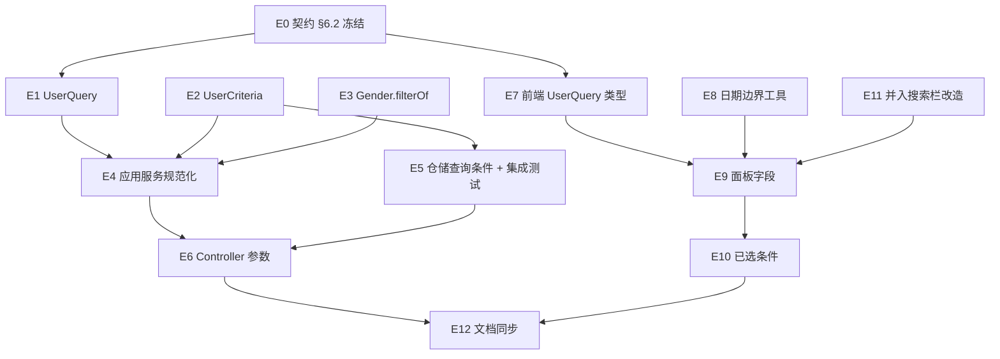

# Exec Plan

> **L4 · 交接点 1:意图 → 工程**。
>
> **不变量:本文件是 `tasks.md` 的下游派生物,单向。**
> 允许:`tasks.md` → 本文件。禁止:本文件的实现细节回写 `tasks.md` / `design.md`。
> 违反这条,spec 会退化成工单,失去描述意图的能力。
>
> 完成后逐条回填文末的 **Gate(10 项)** —— 那是本层的验收标准。

## 1. 任务映射

> `tasks.md` 的条目 → 执行单元。允许 1 条拆成多个执行单元;**禁止**把多条合并成一个执行单元
> (合并会让 L8 无法逐条追溯)。每条 task 必须有归宿:要么进本表,要么进「未映射条目」并写明原因。
>
> **第一列必须写 `tasks.md` 的编号**,覆盖校验靠编号做 —— 只写章节标题或留空,等于没映射。
> 三种合法写法:单个编号 `2.1`、连续区间 `3.1-3.3`(编号与连字符之间不要插反引号)、整组 `§6`。

| tasks.md 条目 | 执行单元 ID | 层 |
|---|---|---|
| `0.1` 契约 §6.2 | `E0` | L0 |
| `2.1` `UserQuery` 字段 | `E1` | L1 |
| `2.2` `UserCriteria` 字段 | `E2` | L1 |
| `2.3` `Gender` 过滤解析(含 6.1 单测) | `E3` | L1 |
| `3.1` 应用服务规范化 | `E4` | L2 |
| `3.2` 仓储查询条件(含 6.2 集成测试) | `E5` | L2 |
| `4.1` Controller 参数绑定 | `E6` | L3 |
| `5.1` 前端 `UserQuery` 类型 | `E7` | L1 |
| `5.2` 日期边界工具(含 6.3 工具单测) | `E8` | L1 |
| `5.3` 高级筛选面板字段(含 6.3 面板测试) | `E9` | L2 |
| `5.4` 已选条件回显(含 6.3 标签测试) | `E10` | L2 |
| `5.5` 并入搜索栏改造 | `E11` | L2 |
| `5.6` 组件文档与现状文档 | `E12` | L3 |
| `§6` 测试覆盖范围 | 跟随 `E3` / `E5` / `E8` / `E9` / `E10` | — |

### 未映射条目

> `tasks.md` 里本轮不执行的条目,必须显式列出并说明原因,不能静默丢弃。

| 条目 | 不执行的原因 |
|---|---|
| `7.1` 先发布后端 | 部署动作,在仓库外由发布流程执行,不属于本 change 的代码执行单元;顺序约束已写入 design Rollout |
| `7.2` 再发布前端 | 同上 |
| `8.1` 验收记录写入 `artifacts.md` | 上线后声明性条目,在 L8 验收完成后由 orchestrator 直接写,不属于实现单元 |

### L7 测试基线

> `project.json` 的 `commands` 跑的是 `./gradlew check`(全量门禁)或按模块的
> `./gradlew :<module>:check`(迭代时用)—— **本 change 用哪个,写在这里**,
> 否则 L8 无法复核当时的验证范围。分支不是从 `main` 切出来的(如叠在另一个分支上)时**必须**写。

- 基线:`main`(`52fc644`)。L7 用 `project.json` 的 `build` / `test` / `lint` 三条全量命令(后端 `./gradlew assemble|test|check`、前端 `pnpm build|test|lint`);迭代时用 `./gradlew :weiran-system-domain:check` 等按模块命令。
- 工作区在开工时已含本会话未提交的搜索栏改造(interview #6 并入),不是他人改动;基线红灯不预期(该改造提交前已跑过前端 test / lint / build 全绿)。

## 2. 依赖图

| 执行单元 | 前置 | 依赖性质 |
|---|---|---|
| `E1` | `E0` | 契约依赖:参数名与类型由 §6.2 冻结 |
| `E7` | `E0` | 契约依赖:TS 字段与 §6.2 一一对应 |
| `E4` | `E1`、`E2`、`E3` | 类型依赖:读 `UserQuery`、写 `UserCriteria`、调 `Gender.filterOf` |
| `E5` | `E2` | 类型依赖:读 `UserCriteria` 新字段 |
| `E6` | `E4`、`E5` | 调用依赖:构造 `UserQuery` 交给应用服务;集成测试经 HTTP 覆盖到仓储 |
| `E9` | `E7`、`E8`、`E11` | 类型 + 调用依赖:`UserQuery` 类型、日期工具、`SearchToolbar` 的 `advanced` / `SearchField` |
| `E10` | `E9` | 数据依赖:读 `Filters` 新字段生成标签 |
| `E12` | `E6`、`E10` | 文档描述最终行为 |

前后端之间没有直接边:二者都只依赖 `E0` 冻结的契约,这正是把契约提到 Layer 0 的目的。

## 3. 分层执行计划

### Layer 0 —— 共享层,**串行**,必须先完成

> 所有后续执行单元都会读写的文件集中在这一层一次性做完。
> 这一层不并行,是整个方案能并行的前提。

| 执行单元 | 内容 | 涉及文件 |
|---|---|---|
| `E0` | §6.2 列出 `GET /api/users` 全部查询参数、类型、匹配口径与非法值 | `weiran4j/docs/01-架构与接口契约.md` |

**完成判据**:§6.2 参数表与 design「API Design」一致,且下方「契约冻结」表已填满。(本 change 不改 `weiran-common`,无需跑其 check。)

### Layer 1 —— 可交替(文件集互不相交)

> 本仓库没有 worktree,「并行」指同一层内多个执行单元的文件集不相交,可交替编写、
> 一起提交,不代表可以真的同时有两个人在改。

| 执行单元 | 内容 |
|---|---|
| `E1` | `UserQuery` 增加 9 个可空字段 |
| `E2` | `UserCriteria` 增加规范化字段(性别为 `Gender`) |
| `E3` | `Gender.filterOf` + 单测 |
| `E7` | `web/src/types/api.ts` 的 `UserQuery` |
| `E8` | 日期范围 → 整天边界工具 + 单测 |
| `E11` | 核对已在工作区的搜索栏改造(不再改其结构) |

### Layer 2

| 执行单元 | 内容 |
|---|---|
| `E4` | 应用服务 `page()` 规范化新条件 |
| `E5` | 仓储 `page()` 新条件与角色子查询;`UserRoleIT` 新增高级筛选用例 |
| `E9` | 用户管理页 `Filters` / `toQuery` / 面板 10 个字段 |
| `E10` | 已选条件可读值与移除 |

### Layer 3

| 执行单元 | 内容 |
|---|---|
| `E6` | `UserController` 绑定新参数 |
| `E12` | `components.md` 的 `SearchToolbar` 条目、`sys_user.md` 列表 / 筛选说明、关闭 #08 |

## 4. 契约冻结

> Layer 0 完成后填写并**锁定**。后续并行单元照此实现,不得自行改签名。
> 需要改 → 停下,回到 orchestrator 走变更流程,不允许单个执行单元私自调整。
>
> **「消费方」列必须逐个单元写清它到底读/写哪几个字段,不能只写单元名。**

| 契约 | 签名 / 结构 | 定义位置 | 消费方(逐单元列出所读/所写的键) | 冻结 |
|---|---|---|---|---|
| `GET /api/users` 查询参数 | `keyword?`、`status?`、`departmentId?`(不变)+ `username?: string`、`userId?: number`、`phone?: string`、`email?: string`、`roleId?: number`、`gender?: 'male'\|'female'\|'unknown'`、`createdStartTime?` / `createdEndTime?` / `lastLoginStartTime?` / `lastLoginEndTime?: 'yyyy-MM-dd HH:mm:ss'` | `weiran4j/docs/01-架构与接口契约.md` §6.2 | `E6` 读全部 9 个新参数名并绑定;`E7` 写同名 9 个 TS 可选字段;`E9` 写 `username`/`userId`/`phone`/`email`/`roleId`/`gender`/四个时间;`E10` 读同样 9 项生成标签 | ☑ |
| `UserQuery`(api record) | 12 个 `@Nullable` 组件:原 3 项 + `username`、`userId`、`phone`、`email`、`roleId`、`gender`(String)、`createdStartTime`、`createdEndTime`、`lastLoginStartTime`、`lastLoginEndTime`(`LocalDateTime`) | `weiran-system-api/.../user/UserQuery.java` | `E6` 写全部组件;`E4` 读全部组件 | ☑ |
| `UserCriteria`(domain record) | 原 3 项 + `username`、`userId`、`phone`、`email`、`roleId`、`gender`(`Gender`)与 4 个 `LocalDateTime`,全部可空 | `weiran-system-domain/.../user/UserCriteria.java` | `E4` 写全部组件;`E5` 读全部组件 | ☑ |
| `Gender.filterOf` | `static @Nullable Gender filterOf(@Nullable String)`:空白 → `null`,非法 → `BizException.badRequest` | `weiran-system-domain/.../user/Gender.java` | `E4` 调用 | ☑ |
| 日期边界工具 | `toDayRange(range: Date[] \| undefined): { start?: string; end?: string }`,start 为当天 `00:00:00`、end 为当天 `23:59:59` | `web/src/utils/date.ts` | `E9` 用于两个时间范围的 `toQuery`;`E10` 读 `Date[]` 自行格式化为 `YYYY-MM-DD` | ☑ |

### 契约变更记录

| 时间 | 原签名 | 新签名 | 发起方 | 已通知 |
|---|---|---|---|---|
| — | — | — | — | — |

## 5. 并行判据与文件所有权

> **本仓库没有 worktree 工具,所有 change 都在同一个工作区主检出里推进。**
> 下表回答的**不是**「要不要隔离」——没有这个选项——
> 而是「**这个 change 能不能与别的 change 同时/交替推进**」。
>
> 正因为没有 worktree,WT-0 的三条后果**没有退路**:一旦撞上,唯一的办法是等对方收尾,
> 不能靠"反正各自 worktree 互不影响"来豁免。

| ID | 场景 | 能否与他人并行 | 原因 |
|---|---|---|---|
| WT-0 | **工作区已有他人在推进的 change** | ❌ **必须先问这一条** | 别人的红灯会染红你的 `./gradlew check`、别人的 diff 会让 L9 无法单独签字、别人改流水线文件会让你已落章的 design 被判缺行。三条判据(他人未提交改动 / 第二个 change **有文件且近期活跃** / `git log` 有他人提交)见 `rules/enforced/project.md` WT-0。**本次核对**:工作区未提交改动是本会话自己的搜索栏改造(已并入);无第二个 change;近期提交均为同一作者本会话产物 → 未命中 |
| WT-1 | 纯文档 / spec / openspec 流水线自身的改动 | ✅ 可与代码改动交替推进(仍受 WT-0 约束) | `node openspec/check.mjs` 零依赖,不需要 Gradle 构建。⚠️ 改**流水线本体**命中 WT-0 第 3 条动态读取风险。本次不改流水线本体 |
| WT-2 | 涉及 `weiran-common`,**或流水线本体** | ❌ 必须排队 | `weiran-common` 是所有模块的公共依赖,改了签名要同步检查所有消费方;`rules/**` `schemas/**` `config.yaml` `check.mjs` `guards/**` 被检查**动态读取**,对方一改,你已落章的 design 立刻被判缺行。本次未命中 |
| WT-3 | 单模块、3~5 个文件的小改动 | ✅ 可与他人交替推进(仍受 WT-0 约束) | 改动小不改变"同一工作区同一时刻只能有一个人在改"这条约束——决定能不能并行的是 WT-0/WT-2 是否命中,不是改动大小 |

> **「本 change 内部无并行」是常见且合法的结论。** 本 change 由单个 agent(orchestrator 本人)按层串行执行,
> 分层只用于保证依赖顺序与文件所有权,不派发 subagent。

> 本仓库没有 worktree,下表按**执行单元**记录文件所有权(同一工作区内,靠这张表避免
> 两个执行单元同时改同一文件,不是靠物理隔离)。

| 执行单元 | 拥有(可写) | 只读 | 禁止触碰 |
|---|---|---|---|
| `E0` | `weiran4j/docs/01-架构与接口契约.md` | `design.md` | 全部代码目录 |
| `E1` | `weiran-system-api/.../user/UserQuery.java` | 契约 §6.2 | `weiran-common/**`、`web/**` |
| `E2` | `weiran-system-domain/.../user/UserCriteria.java` | 契约 §6.2 | `weiran-common/**`、`web/**` |
| `E3` | `weiran-system-domain/.../user/Gender.java`、`weiran-system-domain/src/test/.../user/UserTest.java` | `weiran-common/.../EnableStatus.java` | `weiran-common/**`、`web/**` |
| `E4` | `weiran-system-application/.../user/UserApplicationService.java` | `UserQuery`、`UserCriteria`、`Gender` | `weiran-system-infrastructure/**`、`web/**` |
| `E5` | `weiran-system-infrastructure/.../persistence/MybatisUserRepository.java`、`weiran-app/src/test/java/com/weiran/app/UserRoleIT.java` | `UserCriteria`、`IntegrationTestSupport.java` | `db/migration/**`、`weiran-app/build.gradle.kts`、`web/**` |
| `E6` | `weiran-system-adapter/.../web/UserController.java` | `UserQuery` | `weiran-framework/**`、`web/**` |
| `E7` | `web/src/types/api.ts`(仅 `UserQuery`) | 契约 §6.2 | `weiran4j/**` |
| `E8` | `web/src/utils/date.ts`、`web/src/utils/__tests__/date.test.ts` | — | 既有 `toTimeRange` 的行为、`weiran4j/**` |
| `E9` | `web/src/pages/system/users/UsersPage.tsx`(面板与 `toQuery` 部分)、`web/src/pages/system/users/__tests__/UsersPage.test.tsx` | `SearchToolbar.tsx`、`types/api.ts`、`utils/date.ts` | `web/src/layouts/**`、其它页面、`weiran4j/**` |
| `E10` | `web/src/pages/system/users/UsersPage.tsx`(`conditions` 部分)、`UsersPage.test.tsx` | 同上 | 同上 |
| `E11` | 已在工作区的 `web/src/components/SearchToolbar.tsx`、`web/src/styles/global.css`(只核对,不改结构) | — | 其它页面 |
| `E12` | `openspec/rules/advisory/components.md`(`SearchToolbar` 条目)、`openspec/state/bizs/sys_user.md` | 最终代码 | `openspec/rules/enforced/**`、`openspec/schemas/**` |

> `E9` 与 `E10` 同写 `UsersPage.tsx`:二者不同层(E10 在 E9 之后),按层串行,不构成同层相交。

## 6. 测试归属

> **测试不单独成执行单元**。测试跟随它验证的实现,同一执行单元、同一 agent。

| 执行单元 | 测试范围 | 测试文件 |
|---|---|---|
| `E3` | `Gender.filterOf` 单元测试(tasks 6.1) | `weiran-system-domain/src/test/.../user/UserTest.java` |
| `E5` | 高级筛选集成测试(tasks 6.2):精确匹配、角色去重、性别与非法值、时间闭区间 / 单边 / 从未登录、非法时间、多条件交集 | `weiran-app/src/test/java/com/weiran/app/UserRoleIT.java` |
| `E8` | 日期边界工具单测(tasks 6.3) | `web/src/utils/__tests__/date.test.ts` |
| `E9` | 面板默认收起、字段顺序、搜索参数(tasks 6.3) | `web/src/pages/system/users/__tests__/UsersPage.test.tsx` |
| `E10` | 已选条件可读值与移除(tasks 6.3) | 同上 |

集成测试归 L7 硬闸门,不属于任何单个执行单元(`E5` 只负责编写,运行结果以 L7 证据为准)。

## 7. 失败与降级

| 场景 | 处置 |
|---|---|
| subagent 超时 | 不适用:本 change 不派发 subagent |
| 重试后仍失败 | 同一检查重试一次后仍红,停下把日志片段交给用户 |
| 产出不可用(编译不过/答非所问) | 回退该单元改动,重做 |
| 同层两个单元产生文件冲突 | 视为分层错误,停止,回第 3 节重切 |
| 契约需要变更 | 暂停依赖该契约的全部单元,更新第 4 节「契约变更记录」后恢复;若影响 design 的 API Design,回 L3 重新审批 |

## 8. 收尾要求

每个执行单元完成时,必须在 `exec/notes/<单元ID>-<简述>.md` 写收尾笔记后才能结束
(骨架复制 `templates/exec-note.md`)。
**subagent 上下文一销毁,未落盘的实现知识永久丢失**,而 L6 集成恰恰需要它。

## Gate

> 从 `tasks.md` 派生本文件时**逐条过**。十条全绿才算交接完成。

- [x] 每条 task 都已映射,或已在「未映射条目」声明并写明原因
- [x] `explore.md` 的共享层清单已逐项比对,命中项全部落在 Layer 0
- [x] 若涉及数据库结构变更,已按 `rules/enforced/constitution.md` CP-7 与 `weiran-v1` 核对
- [x] 依赖图无环,且「前后端」这类隐性契约依赖已识别(不是并行,是契约依赖)
- [x] Layer 0 的契约冻结表已列出待填项
- [x] 无独立的测试执行单元(测试跟随实现)
- [x] 同层执行单元的「拥有(可写)文件集」两两不相交
- [x] 每个执行单元的「禁止触碰」已写明
- [x] 失败与降级策略已填(第 7 节)
- [x] 已确认本文件未产生任何对 `tasks.md` / `design.md` / `specs/**` 的回写
