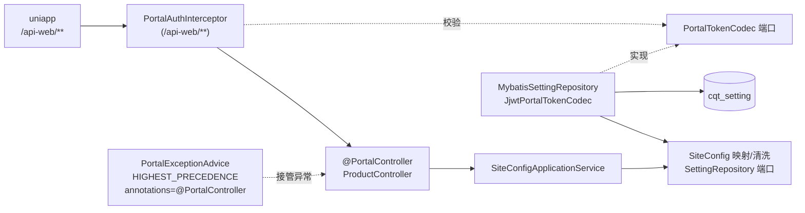

# Design

> 保持**意图粒度**:描述「行为如何」,不写逐文件的实现步骤。

## Context

- 需求来源:`interview.md`
- 现有实现调研:`explore.md`
- 关键约束:
  - uniapp 只认 HTTP 2xx + body `code`（200 成功、401 未登录），非 2xx 一律弹窗
  - 框架 `TokenAuthenticator` 是单例 SPI，C 端认证不能再实现它（否则后台认证 `NoUniqueBeanDefinitionException`）
  - 不改任何上游文件；所有 IT 共用一个 Spring 上下文，C 端密钥缺失会连带上游 IT 失败
  - 覆盖率只由 `weiran-app:test` 聚合，门槛行覆盖 70%

## 宪法对照

<!-- openspec:required-table mark=2 note=3 -->
| 原则 | 判定 | 说明 |
|---|---|---|
| CP-1 领域层不依赖框架 | ☑ | `weiran-cqt-domain` 只放配置键映射、HTML 清洗纯函数与仓储端口，只依赖 `weiran-common` |
| CP-2 依赖方向单向向内 | ☑ | adapter → application → domain；infrastructure → domain；令牌服务端口定义在 domain，JJWT 实现放 infrastructure |
| CP-3 持久化类型不跨层 | ☑ | `CqtSettingDO` / Mapper 只在 infrastructure；仓储端口返回领域类型（ident → contents 映射） |
| CP-4 版本号只有一个来源 | ☑ | jjwt / forbiddenapis 不写版本，取 BOM |
| CP-5 质量规则只在 build-logic 里配置 | ☑ | 模块脚本只用 `weiranConventions` 既有开关，不新增质量配置 |
| CP-6 豁免必须最小且带理由 | ☑ | 唯一豁免：JJWT 只接受 `java.util.Date`，在令牌编解码的两个方法上 `@SuppressForbidden` 并注释理由（同 `JwtTokenCodec`） |
| CP-7 表结构只经 Flyway 迁移变更，已发布的迁移永不修改 | ☑ | 新增 `db/migration/cqt/V202610022200__cqt_setting.sql` 只建表；数据走 `scripts/biz/import/`，不进 Flyway |
| CP-8 密码只用 BCrypt，令牌吊销只走 token_version | ⚠ | 本次 C 端令牌**没有吊销机制**：C 端账号表尚未迁入，载荷不带 `ver`。代价：账号 change 之前签发的令牌无法提前失效——但本次不提供登录接口，没有真实令牌会被签发，风险为零。账号 change **必须**为 C 端账号加 `token_version` 并在载荷带 `ver`。不修订宪法 |
| CP-9 凭据不进版本库、不进日志 | ☑ | 密钥 `${WEIRAN_CQT_JWT_SECRET:}` 走环境变量；校验失败只记异常类名不记令牌；测试密钥是只用于 `test` profile 的无效固定串（与上游 `application-test.yml` 同策略） |
| CP-10 认证失败不泄露账号存在性 | ☐ | 本次无登录接口；令牌无效时统一提示「登录失效,请重新登录」，不区分原因 |
| CP-11 错误码归属决定 HTTP 状态，不靠 Controller 判断 | ⚠ | `/api-web` 的 HTTP 状态恒为 200，**不等于** `ErrorCode.httpStatus()`。必须偏离：uniapp 对非 2xx 一律弹窗，且未登录靠 body `code:401` 识别。保留该原则的本意——状态仍只由错误码决定、只在一处转换：body `code` = `ErrorCode.code()/100`，由 `/api-web` 专属 advice 统一输出，Controller 不手写、不捕获转换。后台 `/api/**` 不受影响。不修订宪法（偏离限定在 `/api-web`，写进 `AGENTS.biz.md`） |
| CP-12 依赖只能业务 → 基座 → 框架，反向与同层横向禁止 | ☑ | `weiran-cqt` 只依赖 `weiran-framework`、`weiran-common`（及骨架里已声明、本次不使用的 `weiran-base-api`）；没有其它业务模块 |
| CP-13 业务只经基座的 weiran-base-api 接触基座 | ☑ | 不引用 `JwtTokenCodec` 等基座实现，只照搬写法；不读写 `sys_*` 表 |
| CP-14 错误码按号段分配，业务不得占用框架与基座的号段 | ☑ | 不新增错误码，只复用 `CommonErrors`（UNAUTHORIZED / BAD_REQUEST / NOT_FOUND / INTERNAL_ERROR） |
| CP-15 权限码、菜单 id 与 Flyway 模块段按层隔离 | ☑ | 表名 `cqt_setting`、脚本在 `db/migration/cqt/`；本次无权限码与菜单 |

## Architecture

## Data Flow

1. 请求 `/api-web/**` → `PortalAuthInterceptor`：读 `Authorization: Bearer`，用 `PortalTokenCodec` 解析出账号 ID（失败为空）。
   handler 方法或类标了 `@PortalPublic` → 放行（解析成功时仍写入当前账号）；否则无令牌抛「请求参数缺token」、无效令牌抛「登录失效,请重新登录」，
   两者都是 `BizException(CommonErrors.UNAUTHORIZED, <提示语>)`。当前账号放在请求作用域的 `PortalAccount`（ThreadLocal，`afterCompletion` 清除）。
2. Controller（类上 `@PortalController` = `@RestController` + `@SkipApiResponse`）返回 `PortalResult.ok(data)`，即 `{code:200,message:"成功",data}`。
3. 任何异常（含拦截器抛出的）→ `PortalExceptionAdvice`（`@RestControllerAdvice(annotations = PortalController.class)`、`@Order(HIGHEST_PRECEDENCE)`、
   继承 `ResponseEntityExceptionHandler`）→ HTTP 200 + `{code: errorCode.code()/100, message, data:null}`。
4. `getconfig`：应用服务从仓储取 `ident ∈ [1,100]` 的 `ident → contents`，交给领域 `SiteConfig` 按 22 键映射与清洗后返回 `Map<String,Object>`（保持插入顺序）。

## 跨模块契约变更(DS-1)

| 对象 | 文件 | 动作 | 消费方 |
|---|---|---|---|
| 无 | `weiran-common/.../error/CommonErrors.java` | 不改，只复用 | — |
| 无 | `weiran-common/.../page/{PageQuery,PageResult}.java` | 不涉及 | — |

本次「契约」全部在 `weiran-cqt` 模块内部：`@PortalController` / `@PortalPublic` / `PortalResult` / `PortalAccount`（adapter 内）、
`PortalTokenCodec` / `SettingRepository` 端口（domain）、`SiteConfigService`（api）。它们是 L4 的契约冻结项。

## API Design(DS-2)

| 路由 | 方法 | 所属模块 | 请求关键字段 | 返回关键字段 | 权限点 |
|---|---|---|---|---|---|
| `/api-web/product/getconfig` | GET | `weiran-cqt-adapter/.../portal/` | 无 | `data`：22 个键（见 spec `cqt-site-config` FR-002） | 公开（`@PortalPublic`） |

- **不使用框架统一包络**：`/api-web` 用自己的 `{code:200,message,data}`（spec `cqt-portal-api` FR-001），框架包络（`{code:0}`）只服务后台 `/api/**`
- 分页：本次不涉及
- 端口签名不出现框架类型
- 测试专用接口（回显当前账号、抛业务异常、抛运行时异常、必填参数）放在 `weiran-app/src/test`，标 `@PortalController`，路径 `/api-web/__test/**`，只存在于测试 classpath

## Database Design(DS-3)

| 表 | 动作 | 关键字段 | 索引 | 备注 |
|---|---|---|---|---|
| `cqt_setting` | 新增 | `id` int PK 自增、`ident` int、`name` varchar(255)、`contents` text、`created_at`/`updated_at`/`deleted_at` timestamp、`key` varchar(255) | 仅主键（与原表一致） | 列与 `cqtxj2026.sc_setting` 逐列一致，字符集 utf8mb4 |

- Flyway 只建表；数据由 `scripts/biz/import/cqt_setting.sql` 导入：`INSERT … SELECT … FROM cqtxj2026.sc_setting … ON DUPLICATE KEY UPDATE`（按主键 `id`，重复执行不产生重复行），
  源库名按约定写死为 `cqtxj2026`，执行前在脚本头注释说明
- 软删除列 `deleted_at` 原样保留；读取时**不**过滤 `deleted_at`（与 FastAPI 一致：它也没过滤）
- 不对照 `weiran-v1`（D-008 起不兼容）；对照对象是 `cqtxj2026` 原表

## 权限与已知缺口(DS-4)

| 项 | 设计 |
|---|---|
| 权限点(`pam_permission`) | 无：前台接口不走后台 RBAC |
| 菜单挂载 | 无 |
| 是否新增写接口却漏标 `@OperationLog` | 无写接口 |

C 端令牌没有吊销机制（见宪法对照 CP-8 ⚠），作为已知缺口交给账号 change。

## 分层与装配(DS-5)

| 项 | 设计 |
|---|---|
| 依赖方向 | `adapter → application → domain`,`infrastructure → domain` |
| 自动配置 | infrastructure：`CqtInfrastructureAutoConfiguration`（`@MapperScan` cqt mapper 包、仓储、令牌编解码 bean、`@ConfigurationProperties` `weiran.cqt.jwt`）；application：注册应用服务；adapter：注册 Controller、advice 与拦截器（`WebMvcConfigurer` `addPathPatterns("/api-web/**")`）。三者各自登记在 `META-INF/spring/…AutoConfiguration.imports` |
| `weiran-app` 依赖聚合 | 自动（D-012），不改 |
| 配置 | `weiran-cqt-infrastructure` 的 `application-biz.yml`：`weiran.cqt.jwt.secret: ${WEIRAN_CQT_JWT_SECRET:}`、`ttl: ${WEIRAN_CQT_JWT_TTL:7d}`；测试密钥在 `weiran-app/src/test/resources/application-biz-test.yml`（若 Spring 不加载导入文件的 profile 变体，退回 `application-biz.yml` 内 `on-profile: test` 文档块，实现时验证并在 verify 记录） |
| 时钟 | 令牌编解码注入 `Clock`（复用容器里已有的 `Clock` bean，若没有则 `Clock.systemDefaultZone()`），便于单测过期 |

## 前端设计(DS-6)

| 项 | 内容 |
|---|---|
| 页面/路由 | 无（`web/` 不动） |
| 菜单挂载 | 无 |
| 数据请求方式 | uniapp 已在初始化提交里改写到 `/api-web`，本次不改 |
| 复用组件 | 无 |
| 权限控制点 | 无 |

## Observability

- 日志关键字段：未预期异常记 error（含堆栈，不进响应）；令牌校验失败记 debug，只含异常类名
- 指标：无新增
- 审计：无写接口，不涉及 `@OperationLog`；不涉及登录日志
- 告警 / 排障入口：启动缺 `WEIRAN_CQT_JWT_SECRET` 时启动失败，异常信息直接指出环境变量名

## Test Plan

| 层级 | 范围 | 命令 |
|---|---|---|
| 单元 | domain：22 键映射、缺行 null、HTML 清洗、公众号数组；infrastructure：令牌签发/解析/过期/错误 typ/短密钥 | `./gradlew :weiran-cqt-domain:test :weiran-cqt-infrastructure:test` |
| 集成 | `weiran-app` 新增 `CqtWebIT`：getconfig 全键与取值、缺行、表结构；`/api-web` 三种令牌状态、公开接口带令牌、业务异常/校验异常/未预期异常、前后台令牌互斥 | `./gradlew :weiran-app:test` |
| 导入脚本 | 在本地两库同实例执行两遍，比对行数 | 手工（记录在 verify） |
| 全量门禁 | 编译 + 测试 + Checkstyle + SpotBugs + Forbidden APIs + Error Prone/NullAway + 覆盖率 | `./gradlew check` |

## Rollout Plan

1. 部署环境配置 `WEIRAN_CQT_JWT_SECRET`（≥ 32 字节）
2. 应用启动，Flyway 建 `cqt_setting`
3. 在库实例上执行 `scripts/biz/import/cqt_setting.sql` 导入站点配置
4. uniapp 指向新后端（`/api-web`）

## Rollback Plan

1. revert 锚点：本 change 的提交（归档后提交的 commit）；初始化提交 `24045fc` 为其父
2. 迁移回滚策略：`cqt_setting` 是新表，回滚时可直接 `DROP TABLE cqt_setting` 并删除对应 `flyway_schema_history` 记录；无存量数据被修改
3. uniapp 回退到旧后端地址即可恢复旧系统

## Open Questions

- 无
