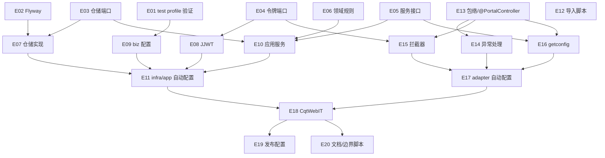

# Exec Plan

> **L4 · 交接点 1:意图 → 工程**。本文件是 `tasks.md` 的下游派生物,单向。

## 1. 任务映射

| tasks.md 条目 | 执行单元 ID | 层 |
|---|---|---|
| `0.1` 验证 biz 配置的 test profile 变体加载 | `E01` | L0 |
| `3.1` Flyway 建 `cqt_setting` | `E02` | L0 |
| `2.2` 站点配置仓储端口 | `E03` | L0 |
| `2.3` 前台令牌端口 | `E04` | L0 |
| `2.4` 站点配置查询服务接口 | `E05` | L0 |
| `2.1` 站点配置领域规则 | `E06` | L1 |
| `3.2` `cqt_setting` 持久化与仓储实现 | `E07` | L1 |
| `3.3` JJWT 前台令牌编解码 | `E08` | L1 |
| `3.4` `application-biz.yml` | `E09` | L1 |
| `3.5` 站点配置应用服务 | `E10` | L2 |
| `3.6` infrastructure / application 自动配置 | `E11` | L2 |
| `3.7` 导入脚本 | `E12` | L1 |
| `4.1` 前台包络与 `@PortalController` | `E13` | L2 |
| `4.2` 前台异常处理 | `E14` | L3 |
| `4.3` 前台登录拦截器 / `@PortalPublic` / 当前账号 | `E15` | L3 |
| `4.4` `getconfig` 接口 | `E16` | L3 |
| `4.5` adapter 自动配置 | `E17` | L4 |
| `5.1` 领域单测 | `E06` | L1 |
| `5.2` 令牌单测 | `E08` | L1 |
| `5.3` 集成测试 `CqtWebIT` | `E18` | L5 |
| `5.4` 导入脚本两遍执行 | `E12` | L1 |
| `6.2` 下游文档与边界脚本 | `E20` | L6 |

> 5.1 / 5.2 / 5.4 是测试，按「测试跟随实现」并入对应实现单元（1 条 task → 1 个单元，未合并多条实现任务）。

### 未映射条目

| 条目 | 不执行的原因 |
|---|---|
| `6.1` 部署环境配置 `WEIRAN_CQT_JWT_SECRET`、切换时执行导入脚本 | 发布动作，合并后在部署环境执行；所需步骤已由 `E19` 写入 `AGENTS.biz.md`「部署与数据迁移」 |
| `7.1` 验收记录写入 `artifacts.md` | 上线后条目，归档前不执行（L10 前补写） |

### L7 测试基线

- 基线：`main`（`24045fc`，初始化提交，全量 `./gradlew check` 已绿）。L7 用 `openspec/project.json` 的 `commands` 全量跑。

## 2. 依赖图

| 执行单元 | 前置 | 依赖性质 |
|---|---|---|
| `E07` | `E02`、`E03` | 数据依赖（表）+ 类型依赖（端口） |
| `E08` | `E04` | 类型依赖 |
| `E10` | `E03`、`E05`、`E06` | 类型 + 调用依赖 |
| `E11` | `E07`–`E10` | 装配依赖 |
| `E14`–`E16` | `E13` | 类型依赖（`@PortalController`、`PortalResult`） |
| `E15` | `E04` | 调用依赖（令牌解析） |
| `E16` | `E05` | 调用依赖 |
| `E18` | `E11`、`E17` | 运行时装配 |

## 3. 分层执行计划

### Layer 0 —— 共享层,**串行**,必须先完成

| 执行单元 | 内容 | 涉及文件 |
|---|---|---|
| `E01` | 验证 `application-biz-test.yml` 能否经 `spring.config.import` 的 profile 变体加载 | 临时验证（不留文件），结论写收尾笔记 |
| `E02` | `V202610022200__cqt_setting.sql` | `weiran-cqt-infrastructure/src/main/resources/db/migration/cqt/` |
| `E03` | `SettingRepository` 端口 | `weiran-cqt-domain/.../setting/` |
| `E04` | `PortalTokenCodec` 端口 | `weiran-cqt-domain/.../portal/` |
| `E05` | `SiteConfigService` 接口 | `weiran-cqt-api/.../setting/` |

**完成判据**：`./gradlew :weiran-cqt-domain:check :weiran-cqt-api:check` 通过，下方契约冻结表已填满。

### Layer 1

| 执行单元 | 内容 |
|---|---|
| `E06` | 领域规则 + 单测 |
| `E07` | DO / Mapper / 仓储实现 |
| `E08` | JJWT 编解码 + 单测 |
| `E09` | `application-biz.yml`（及 E01 结论决定的测试密钥位置） |
| `E12` | 导入脚本 + 本地两遍执行 |

### Layer 2

| 执行单元 | 内容 |
|---|---|
| `E10` | 应用服务 |
| `E11` | infrastructure / application 自动配置与 imports |
| `E13` | `PortalResult`、`@PortalController` |

### Layer 3

| 执行单元 | 内容 |
|---|---|
| `E14` | `PortalExceptionAdvice` |
| `E15` | `PortalAuthInterceptor`、`@PortalPublic`、`PortalAccount` |
| `E16` | `ProductController#getconfig` |

### Layer 4–6

| 执行单元 | 内容 |
|---|---|
| `E17` | adapter 自动配置（Controller、advice、拦截器注册）与 imports |
| `E18` | `weiran-app/src/test/.../CqtWebIT.java` + 测试专用 Controller + 测试配置 |
| `E19` | 环境变量与导入步骤写入 `AGENTS.biz.md` 部署段（服务未映射条目 `6.1` 的执行） |
| `E20` | `AGENTS.biz.md` 约定、`state/bizs/cqt_setting.md`、`README.biz.md`、`upstream-boundary.sh` 放行生成文件 |

## 4. 契约冻结

| 契约 | 签名 / 结构 | 定义位置 | 消费方(逐单元列出所读/所写的键) | 冻结 |
|---|---|---|---|---|
| `SettingRepository` | `Map<Integer, @Nullable String> findContentsByIdentRange(int from, int to)` | `weiran-cqt-domain/.../setting/SettingRepository.java` | `E07` 实现；`E10` 调用（1, 100） | ☑ |
| `SiteConfig` | `static Map<String, @Nullable Object> build(Map<Integer, @Nullable String> contentsByIdent)` | `weiran-cqt-domain/.../setting/SiteConfig.java` | `E10` 调用 | ☑ |
| `PortalTokenCodec` | `String issue(long accountId)`；`Optional<Long> parse(String token)` | `weiran-cqt-domain/.../portal/PortalTokenCodec.java` | `E08` 实现；`E15` 调 `parse`；`E18` 调 `issue` 造令牌 | ☑ |
| `SiteConfigService` | `Map<String, @Nullable Object> getConfig()` | `weiran-cqt-api/.../setting/SiteConfigService.java` | `E10` 实现；`E16` 调用 | ☑ |
| `PortalResult<T>` | record `(int code, String message, @Nullable T data)`；`ok(data)`、`fail(int code, String message)` | `weiran-cqt-adapter/.../portal/PortalResult.java` | `E14` 写 `code`/`message`；`E16` 用 `ok`；`E18` 断言 JSON `code`/`message`/`data` | ☑ |
| `@PortalController` | 类注解，元注解 `@RestController` + `@SkipApiResponse` | `weiran-cqt-adapter/.../portal/PortalController.java` | `E14` 以它作 advice 选择器；`E16`、`E18` 测试 Controller 标注 | ☑ |
| `@PortalPublic` / `PortalAccount` | 方法或类注解；`PortalAccount.current(): OptionalLong` | `weiran-cqt-adapter/.../portal/` | `E15` 读注解、写上下文；`E16` 标注；`E18` 测试 Controller 读 `current()` | ☑ |
| 配置键 | `weiran.cqt.jwt.secret`（`WEIRAN_CQT_JWT_SECRET`）、`weiran.cqt.jwt.ttl`（`WEIRAN_CQT_JWT_TTL`，默认 `7d`） | `application-biz.yml` | `E08`/`E11` 读；`E18` 测试密钥 | ☑ |

### 契约变更记录

| 时间 | 原签名 | 新签名 | 发起方 | 已通知 |
|---|---|---|---|---|
| — | — | — | — | — |

## 5. 并行判据与文件所有权

| ID | 场景 | 能否与他人并行 | 原因 |
|---|---|---|---|
| WT-0 | **工作区已有他人在推进的 change** | ❌ **必须先问这一条** | 开工时核对：`git status` 干净、无其它未归档 change、`git log` 只有本人的初始化提交 —— 未命中 |
| WT-1 | 纯文档 / spec / openspec 流水线自身的改动 | ✅ 可与代码改动交替推进(仍受 WT-0 约束) | 本 change 不改流水线本体 |
| WT-2 | 涉及 `weiran-common`,**或流水线本体** | ❌ 必须排队 | 未命中：不改 `weiran-common` 与流水线本体 |
| WT-3 | 单模块、3~5 个文件的小改动 | ✅ 可与他人交替推进(仍受 WT-0 约束) | 本 change 为单业务模块 |

**单执行者、串行推进，内部无并行**（20 个单元按层顺序由同一 agent 完成）。

| 执行单元 | 拥有(可写) | 只读 | 禁止触碰 |
|---|---|---|---|
| `E01`–`E17` | `weiran4j/weiran-cqt/**` | `weiran-common/**`、`weiran-framework/**`、`weiran-base/**` | 任何上游已有文件、`web/**`、`uniapp/**` |
| `E12` | `scripts/biz/import/**` | `常青藤20260929/cqtxj2026.sql` | 同上 |
| `E18` | `weiran-app/src/test/java/com/weiran/app/Cqt*`、`weiran-app/src/test/java/com/weiran/cqt/**`、`weiran-app/src/test/resources/application-biz-test.yml` | `IntegrationTestSupport.java` | `weiran-app/src/main/**`、`weiran-app/build.gradle.kts`、上游已有测试文件 |
| `E19`/`E20` | `AGENTS.biz.md`、`openspec/state/bizs/{cqt_setting.md,README.biz.md}`、`scripts/biz/upstream-boundary.sh` | — | `AGENTS.md`、`openspec/rules/**` |

## 6. 测试归属

| 执行单元 | 测试范围 | 测试文件 |
|---|---|---|
| `E06` | 单元：22 键、缺行 null、去标签、公众号数组 | `weiran-cqt-domain/src/test/.../SiteConfigTest.java` |
| `E08` | 单元：签发解析、过期、错误 typ、短密钥 | `weiran-cqt-infrastructure/src/test/.../JjwtPortalTokenCodecTest.java` |
| `E12` | 手工：本地两库同实例执行两遍 | 结论写收尾笔记 |
| `E18` | 集成：spec 两个能力的全部场景 | `weiran-app/src/test/java/com/weiran/app/CqtWebIT.java` |

## 7. 失败与降级

| 场景 | 处置 |
|---|---|
| subagent 超时 | 不使用 subagent；单执行者 |
| 重试后仍失败 | 同一检查重试一次仍红 → 停下报告用户 |
| 产出不可用(编译不过/答非所问) | 丢弃 diff,重做该单元 |
| 同层两个单元产生文件冲突 | 不适用（串行） |
| 契约需要变更 | 记入第 4 节变更记录；若影响 design 则回 L3 |

## 8. 收尾要求

单执行者串行推进，收尾笔记合并写在 `exec/notes/E-all-实现记录.md`，按单元分节记录偏差、必要连带与 E01 / E12 结论。

## Gate

- [x] 每条 task 都已映射,或已在「未映射条目」声明并写明原因
- [x] `explore.md` 的共享层清单已逐项比对,命中项全部落在 Layer 0
- [x] 若涉及数据库结构变更,已按 `rules/enforced/constitution.md` CP-7 与 `weiran-v1` 核对（本仓库 D-008 后不对照 `weiran-v1`；对照 `cqtxj2026.sc_setting`，只新增脚本）
- [x] 依赖图无环,且「前后端」这类隐性契约依赖已识别(不是并行,是契约依赖)
- [x] Layer 0 的契约冻结表已列出待填项
- [x] 无独立的测试执行单元(测试跟随实现)
- [x] 同层执行单元的「拥有(可写)文件集」两两不相交
- [x] 每个执行单元的「禁止触碰」已写明
- [x] 失败与降级策略已填(第 7 节)
- [x] 已确认本文件未产生任何对 `tasks.md` / `design.md` / `specs/**` 的回写
