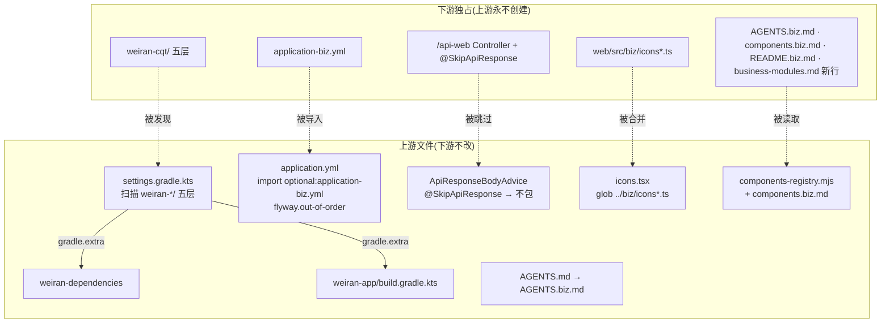

# Design

> 保持**意图粒度**:描述「行为如何」,不写逐文件的实现步骤。
> 实现细节属于 `exec/plan.md`,且**不得回写本文件** —— 需求侧到执行侧是单向的。
> 发现设计有问题时,唯一合法路径是停下来回 L2 重开设计并重新走人类审阅。

## Context

- 需求来源:`interview.md`
- 现有实现调研:`explore.md`
- 关键约束:业务模块清单在 settings / BOM / app 三处各写一份;`ApiResponseBodyAdvice` 的 `basePackages = "com.weiran"` 覆盖下游包;
  不开 Gradle 配置缓存;classpath 配置导入不支持通配;已合入的 Flyway 脚本不改。
- 总原则:**上游只开「下游独占的文件或目录」作为扩展入口**——要么是上游永不创建的旁路文件(`*.biz.*`、`web/src/biz/`),
  要么是靠目录约定自动发现(`weiran-*/`)。下游此后的改动全部落在这些位置,与上游文件不相交,`git merge` 无冲突。

## 宪法对照

<!-- openspec:required-table mark=2 note=3 -->
| 原则 | 判定 | 说明 |
|---|---|---|
| CP-1 领域层不依赖框架 | ☐ | 不改任何 domain 代码 |
| CP-2 依赖方向单向向内 | ☑ | `weiran-app` 仍只依赖各模块 adapter / infrastructure,自动生成不改变方向 |
| CP-3 持久化类型不跨层 | ☐ | 不涉及持久化类型 |
| CP-4 版本号只有一个来源 | ☑ | BOM 的本仓坐标仍用 `${project.version}`,只是模块名改读发现清单;不新增第三方依赖 |
| CP-5 质量规则只在 build-logic 里配置 | ☑ | 覆盖率门槛与聚合机制不变,仍在 app 现有位置;只把聚合的项目列表改为计算得出 |
| CP-6 豁免必须最小且带理由 | ☑ | 唯一新增豁免是 Kotlin 脚本读取 `gradle.extra` 的 `@Suppress("UNCHECKED_CAST")`,就地写理由 |
| CP-7 表结构只经 Flyway 迁移变更，已发布的迁移永不修改 | ☑ | 不新增、不修改脚本;`out-of-order` 只改执行策略,不改任何已合入脚本 |
| CP-8 密码只用 BCrypt，令牌吊销只走 token_version | ☐ | 不碰认证路径 |
| CP-9 凭据不进版本库、不进日志 | ☑ | `application-biz.yml` 定位为「业务默认配置」,契约写明密钥仍走环境变量 / `config/application-local.yml` |
| CP-10 认证失败不泄露账号存在性 | ☐ | 不碰登录 |
| CP-11 错误码归属决定 HTTP 状态，不靠 Controller 判断 | ☑ | `@SkipApiResponse` 只影响成功返回值的包装;异常仍由 `GlobalExceptionHandler`(或下游更高优先级的 advice)处理 |
| CP-12 依赖只能业务 → 基座 → 框架，反向与同层横向禁止 | ☑ | `@SkipApiResponse` 放在 `weiran-framework`,不依赖基座/业务;`weiran-app` 依赖业务 adapter / infrastructure 属 CP-12 明列的装配例外 |
| CP-13 业务只经基座的 weiran-base-api 接触基座 | ☐ | 本 change 不新增业务代码;自动发现只生成 app 的装配依赖,不给业务模块加依赖 |
| CP-14 错误码按号段分配，业务不得占用框架与基座的号段 | ☑ | 号段规则不变;只把「在哪里登记」从契约 §2.1 改为 `business-modules.md`,条文同步改引用 |
| CP-15 权限码、菜单 id 与 Flyway 模块段按层隔离 | ☑ | 同上,只改登记位置;Flyway 目录与表前缀规则不变 |

## Architecture

## Data Flow

1. **Gradle 配置阶段**:settings 列出 `weiran4j/` 下所有 `weiran-*` 目录 → 对每个目录检查五层子目录 →
   一层都没有的忽略(如 `weiran-common`)、五层齐全的收录、介于两者之间的直接失败 → 以 `weiran-base` 打头、其余字母序 →
   include 五层并映射嵌套目录 → 写入 `gradle.extra["weiran.businessModules"]`。
   BOM 读清单生成 `com.weiran:<mod>-<layer>` 约束;app 读清单生成 `implementation(project(":<mod>-adapter|infrastructure"))`
   与 `:weiran-framework` + 各模块三层的 jacoco 聚合。
2. **应用启动**:`application.yml` 先加载 → 导入可选的 `classpath:application-biz.yml`(存在则覆盖同名键)→
   profile 文件与环境变量仍按 Spring Boot 规则覆盖二者 → Flyway 扫描 `db/migration/**`,以 out-of-order 方式补跑未执行的低版本脚本。
3. **响应写出**:`ApiResponseBodyAdvice.supports()` 检查方法与所在类是否(直接或经元注解)带 `@SkipApiResponse` → 有则返回 false,
   Spring 按普通流程用对应 converter 写出原值(对象走 Jackson,`String` 走 `StringHttpMessageConverter`)→ 无则走原有包装逻辑。
4. **前端图标**:`icons.tsx` 用 `import.meta.glob('../biz/icons*.ts', { eager: true })` 拿到下游模块 →
   `mergeIcons(基座表, 模块集)` 按键合并,基座已有的键跳过并在开发模式 `console.warn` → 结果作为 `MENU_ICONS`,
   `MENU_ICON_NAMES`、`renderIcon`、`renderNavIcon`、`IconPicker` 全部自动生效。
5. **流水线**:`components-registry` 守卫把 `components.md` 与(若存在)`components.biz.md` 的文本拼接后做同样的 `includes` 判定;
   `check.mjs` 的证据新鲜度用 `weiran4j/weiran-*` pathspec 取最后改动时间。

## 跨模块契约变更(DS-1)

| 对象 | 文件 | 动作 | 消费方 |
|---|---|---|---|
| — | `weiran-common/**` | 不改 | — |
| `gradle.extra["weiran.businessModules"]: List<String>` | `settings.gradle.kts` | 新增(构建期契约,先冻结) | `weiran-dependencies`、`weiran-app` 构建脚本 |
| `@SkipApiResponse` | `weiran-framework/.../web/` | 新增 | 下游 `/api-web` Controller |
| `web/src/biz/icons*.ts` 导出形状 `export const icons: Record<string, LucideIcon>` | `web/src/utils/icons.tsx` | 新增(前端扩展契约) | 下游前端 |

## API Design(DS-2)

| 路由 | 方法 | 所属模块 | 请求关键字段 | 返回关键字段 | 权限点 |
|---|---|---|---|---|---|
| — | — | — | 不新增路由 | — | — |

- 统一响应包络由 `weiran-framework` 的 `ApiResponseBodyAdvice` 产生(`{code, message, data}`,`code` 为数字 `0`)。
  本次只增加一条跳过规则:`@SkipApiResponse`,`@Target({TYPE, METHOD})`、`@Retention(RUNTIME)`、`@Documented`。
  javadoc 的「边界」列表加第四条,并写明**只用于 `/api/**` 之外的前缀**。
- `/api/**` 的包络约束(`admin-foundation` FR-001)不变。
- 契约文档 §3「扩展点」表加 `@SkipApiResponse` 一行;新增一小节「下游扩展入口」列出全部旁路文件与约定(含 `application-biz.yml` 的优先级与唯一性、
  `out-of-order` 下脚本不得有隐含顺序依赖、业务代码计入 app 聚合覆盖率门槛)。

## Database Design(DS-3)

| 表 | 动作 | 关键字段 | 索引 | 备注 |
|---|---|---|---|---|
| — | 无 | — | — | 不新增、不修改迁移脚本 |

- Flyway 新增 `out-of-order: true`。影响:上游后发布的、版本号早于下游已执行脚本的迁移,在下游库上会被补执行而不是启动失败。
  `project.md` 的「序号型资源」段补一句此语义。

## 权限与已知缺口(DS-4)

| 项 | 设计 |
|---|---|
| 权限点 | 不新增;号段 / 前缀规则不变,登记位置改到 `business-modules.md` |
| 菜单挂载 | 不新增菜单;图标可选值可由下游扩展 |
| 是否新增写接口却漏标 `@OperationLog` | 不新增接口 |

## 分层与装配(DS-5)

| 项 | 设计 |
|---|---|
| 依赖方向 | 不变 |
| 新模块的 `@AutoConfiguration` | 不变;下游模块仍自带 `.imports` 自我登记 |
| `weiran-app` 依赖聚合 | 改为按发现清单自动生成,新增模块不再改 app |
| 登记文件 | `weiran4j/docs/business-modules.md`:表头 + 「框架 + 基座」一行(`00`–`19`、`1`–`999`、`system:`、`system/` `platform/` · `sys_`);「当前用到 119」移到契约 §2.1 |

## 前端设计(DS-6)

| 项 | 内容 |
|---|---|
| 页面/路由 | 不变 |
| 菜单挂载 | 不变 |
| 数据请求方式 | 不变 |
| 复用组件 | `IconPicker` 自动读到合并后的 `MENU_ICON_NAMES` |
| 权限控制点 | 不变 |

- `mergeIcons(base, modules)` 导出为纯函数供测试;`MENU_ICONS` 改为其结果。重名告警走 `import.meta.env.DEV` 判断。

## 流水线与协作规范

- `components-registry.mjs`:新增可选来源 `openspec/rules/advisory/components.biz.md`,读到则与主清单拼接;`watches` 加上它;报错提示补一句「下游写到 components.biz.md」。
  `components.md` 头部、`design/check.md` 对应条目、`design/CHANGELOG.md` 同步。
- `state/bizs/README.md` §3 文件索引下加说明:下游表文档的索引写在同目录 `README.biz.md`(state-waitlist 已扫描整个目录,无需改守卫)。
- `project.json` sourcePaths:`weiran4j/weiran-common`、`weiran-framework`、`weiran-base`、`weiran-app` 四条换成 `weiran4j/weiran-*`(同时覆盖 BOM 模块);`web/src` 保留。
- `AGENTS.md`:「先读这四条」后加一段「仓库根存在 `AGENTS.biz.md` 时必读」;`:78` 改为「建好五层目录即被自动发现」;`:137` 改为指向 `business-modules.md`。
- `project.md`:SL-1/SL-3 改写为「新增业务模块不再需要改」;SL-2 同步(BOM 自动);SL-4 的「契约 §2.1」改为 `business-modules.md`。
- `00-决策记录.md` 新增 D-012:为 fork 下游开扩展点,记录总原则(下游独占文件 + 目录约定)与上游此后不得创建的文件清单。

## Observability

- 日志关键字段:无新增
- 指标:无
- 审计:不新增写接口;`@OperationLog` 切面不受 `@SkipApiResponse` 影响
- 告警 / 排障入口:模块发现失败时 Gradle 报错含模块名与缺层;图标重名时浏览器控制台 warn

## Test Plan

| 层级 | 范围 | 命令 |
|---|---|---|
| 单元 | `WebLayerTest`:类级跳过、方法级跳过且同类未标方法仍包、`String` 原样 | `./gradlew :weiran-framework:test` |
| 前端 | `icons.test.tsx`:`mergeIcons` 追加 / 空 / 重名 | `pnpm --filter @weiran/web test` |
| 构建手工验证 | `projects` 输出不变;临时 `weiran-demo` 五层被收录且进 app 依赖;临时三层目录配置失败;验完删除 | `./gradlew projects`、`:weiran-app:dependencies` |
| 流水线手工验证 | 临时 `components.biz.md` + 临时组件,check 不报;删除旁路文件后报 | `pnpm openspec:check` |
| 全量门禁 | 编译 + 测试 + Checkstyle + SpotBugs + Forbidden APIs + Error Prone/NullAway + 覆盖率 | `project.json` 的 build / test / lint |

## Rollout Plan

1. 无数据库变更
2. 合入 main;下游 `git merge upstream/main` 后再建 `weiran-cqt` 等目录
3. 通知下游:旁路文件清单见契约「下游扩展入口」

## Rollback Plan

1. revert 锚点:本 change 的合入 commit(合入后回填到 verify.md)
2. 迁移回滚策略:无迁移;回滚后 `out-of-order` 消失,若下游已依赖乱序补跑需先自行处理
3. 回滚后下游需把模块重新手工写进三处构建脚本

## Open Questions

- 无
