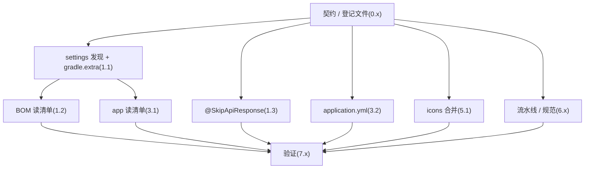

# Exec Plan

> **L4 · 交接点 1:意图 → 工程**。
>
> **不变量:本文件是 `tasks.md` 的下游派生物,单向。**
> 允许:`tasks.md` → 本文件。禁止:本文件的实现细节回写 `tasks.md` / `design.md`。

## 1. 任务映射

> 单执行单元 `E1`,由 orchestrator 串行完成。任务之间按下表顺序做(契约 → 构建 → 框架 → 应用配置 → 前端 → 流水线 → 验证)。

| tasks.md 条目 | 执行单元 ID | 层 |
|---|---|---|
| `0.1-0.3` 契约 / 登记文件 / 决策记录 | `E1` | L0 |
| `1.1-1.2` settings 发现 + BOM 读清单 | `E1` | L0 |
| `1.3` `@SkipApiResponse` | `E1` | L0 |
| `3.1-3.2` weiran-app 构建与配置 | `E1` | L0 |
| `5.1` 前端图标合并 | `E1` | L0 |
| `6.1-6.6` 流水线与协作规范 | `E1` | L0 |
| `7.1-7.5` 测试与验证 | `E1` | L0 |

### 未映射条目

| 条目 | 不执行的原因 |
|---|---|
| `8.1` 通知下游 | 发布动作,合入 main 之后由 orchestrator 经跨会话消息完成,不属于代码执行单元 |
| `9.1` 写 `artifacts.md` | 上线后动作,在 L8 通过后、归档前写 |
| `6.7` `rules-index` 守卫读 `AGENTS.biz.md` | 非预先规划:L5 手工验证 7.4 时发现并就地修复,由 `E1` 完成,发现与修复记录见 `exec/verify.md` |

### L7 测试基线

- 基线:`main`(`99604e7`),全量 `./gradlew check` + 前端 test / lint / build(`project.json` 的三条命令)。

## 2. 依赖图

| 执行单元 | 前置 | 依赖性质 |
|---|---|---|
| `E1` | 无 | 单元内:BOM / app 读 settings 冻结的 `gradle.extra` 键(契约依赖) |

## 3. 分层执行计划

### Layer 0 —— 共享层,**串行**,必须先完成

| 执行单元 | 内容 | 涉及文件 |
|---|---|---|
| `E1` | 全部任务 | 见第 5 节「拥有」 |

**完成判据**:第 4 节契约已冻结;7.1-7.5 全部完成。

## 4. 契约冻结

| 契约 | 签名 / 结构 | 定义位置 | 消费方(逐单元列出所读/所写的键) | 冻结 |
|---|---|---|---|---|
| 业务模块清单 | `gradle.extra["weiran.businessModules"]: List<String>`,`weiran-base` 第一,其余字母序 | `weiran4j/settings.gradle.kts` | `E1`(BOM 读,生成五层坐标;app 读,生成 adapter/infrastructure 依赖与三层聚合) | ☑ |
| 跳过包络注解 | `@SkipApiResponse`,`@Target({TYPE, METHOD})`、`RUNTIME`、`@Documented`,无属性 | `weiran-framework/.../web/SkipApiResponse.java` | `E1` 的 `ApiResponseBodyAdvice.supports()` 读;下游 Controller 标注 | ☑ |
| 下游图标模块 | `export const icons: Record<string, LucideIcon>`,文件 `web/src/biz/icons*.ts` | `web/src/utils/icons.tsx` | `E1` 的 `mergeIcons` 读 `icons` 键 | ☑ |
| 组件旁路清单 | `openspec/rules/advisory/components.biz.md`,任意 md,按文本包含判定 | `components-registry.mjs` | `E1` 守卫读全文 | ☑ |

### 契约变更记录

| 时间 | 原签名 | 新签名 | 发起方 | 已通知 |
|---|---|---|---|---|
| — | — | — | — | — |

## 5. 并行判据与文件所有权

> **本仓库没有 worktree 工具,所有 change 都在同一个工作区主检出里推进。**

| ID | 场景 | 能否与他人并行 | 原因 |
|---|---|---|---|
| WT-0 | **工作区已有他人在推进的 change** | ❌ **必须先问这一条** | 开工时核对:`git status` 干净、`openspec/changes/` 无其他活跃 change、近 6 小时无他人提交 —— 未命中 |
| WT-1 | 纯文档 / spec / openspec 流水线自身的改动 | ✅ 可与代码改动交替推进(仍受 WT-0 约束) | 本 change 含此类改动 |
| WT-2 | 涉及 `weiran-common`,**或流水线本体** | ❌ 必须排队 | 本 change 改 `guards/components-registry.mjs` 与 `rules/**`,命中:期间不与其他改流水线的 change 同时推进 |
| WT-3 | 单模块、3~5 个文件的小改动 | ✅ 可与他人交替推进(仍受 WT-0 约束) | 不适用(本 change 跨多模块) |

**单执行单元,内部无并行。**

| 执行单元 | 拥有(可写) | 只读 | 禁止触碰 |
|---|---|---|---|
| `E1` | `weiran4j/settings.gradle.kts`、`weiran4j/weiran-dependencies/build.gradle.kts`、`weiran4j/weiran-app/build.gradle.kts`、`weiran4j/weiran-app/src/main/resources/application.yml`、`weiran4j/weiran-framework/src/{main,test}/java/com/weiran/framework/web/**`、`weiran4j/docs/{00-决策记录,01-架构与接口契约,business-modules}.md`、`web/src/utils/icons.tsx`、`web/src/utils/__tests__/icons.test.tsx`、`openspec/guards/components-registry.mjs`、`openspec/rules/{enforced/constitution,enforced/project,advisory/components}.md`、`openspec/state/bizs/README.md`、`openspec/design/{check,CHANGELOG}.md`、`openspec/project.json`、`AGENTS.md`、本 change 目录 | `weiran-base/**`、`weiran-common/**`、`build-logic/**`、`openspec/check.mjs` | 全部 `db/migration/**`、`web/src/{pages,layouts,components}/**`、`web/src/App.tsx`、`openspec/schemas/**` |

临时验证文件(`weiran4j/weiran-demo/`、`weiran4j/weiran-half/`、临时组件、`components.biz.md`)只在 7.3/7.4 中短暂存在,验完删除,不入库。

## 6. 测试归属

| 执行单元 | 测试范围 | 测试文件 |
|---|---|---|
| `E1` | framework 单元(MockMvc)、前端单元、构建与守卫手工验证 | `WebLayerTest.java`、`icons.test.tsx` |

集成测试归 L7 硬闸门,不属于任何单个执行单元。

## 7. 失败与降级

| 场景 | 处置 |
|---|---|
| subagent 超时 | 不适用:不派 subagent,orchestrator 亲自做 |
| 重试后仍失败 | 同一检查重试一次仍红 → 停下展示日志给用户 |
| 产出不可用(编译不过/答非所问) | 回退该文件改动,重做 |
| 同层两个单元产生文件冲突 | 不适用:单执行单元 |
| 契约需要变更 | 更新第 4 节并记录变更;若影响 design 则回 L3 |

## 8. 收尾要求

完成时写 `exec/notes/E1-extension-points.md`。

## Gate

- [x] 每条 task 都已映射,或已在「未映射条目」声明并写明原因
- [x] `explore.md` 的共享层清单已逐项比对,命中项全部落在 Layer 0
- [x] 若涉及数据库结构变更,已按 `rules/enforced/constitution.md` CP-7 与 `weiran-v1` 核对(不涉及)
- [x] 依赖图无环,且「前后端」这类隐性契约依赖已识别(不是并行,是契约依赖)
- [x] Layer 0 的契约冻结表已列出待填项
- [x] 无独立的测试执行单元(测试跟随实现)
- [x] 同层执行单元的「拥有(可写)文件集」两两不相交
- [x] 每个执行单元的「禁止触碰」已写明
- [x] 失败与降级策略已填(第 7 节)
- [x] 已确认本文件未产生任何对 `tasks.md` / `design.md` / `specs/**` 的回写
