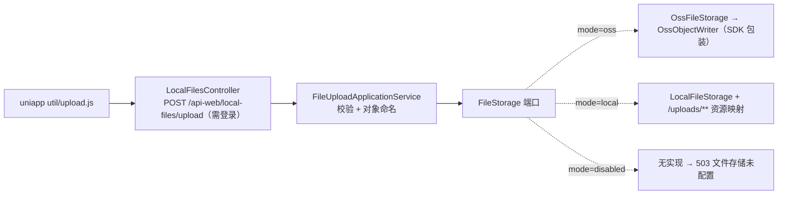

# Design

> 保持**意图粒度**:描述「行为如何」,不写逐文件的实现步骤。

## Context

- 需求来源:`interview.md`
- 现有实现调研:`explore.md`
- 关键约束:
  - 接口路径与返回字段沿用 FastAPI（uniapp `util/upload.js` 不改）；上传必须登录
  - 1GB 上限：必须流式写 OSS；multipart 延迟解析，超限异常才能由 `/api-web` advice 输出
  - OSS 公共读 + UUID 对象名；凭据只走环境变量

## 宪法对照

<!-- openspec:required-table mark=2 note=3 -->
| 原则 | 判定 | 说明 |
|---|---|---|
| CP-1 领域层不依赖框架 | ☑ | `FileStorage` 端口、对象名 / 扩展名规则、`FileStorageException` 在 domain，纯 Java（输入流用 `java.io.InputStream`） |
| CP-2 依赖方向单向向内 | ☑ | infrastructure 实现 `FileStorage`；adapter 只把 `MultipartFile` 转成流与元数据交给应用服务 |
| CP-3 持久化类型不跨层 | ☐ | 不落表 |
| CP-4 版本号只有一个来源 | ☑ | `aliyun-sdk-oss:3.18.5` 只登记在 `biz-dependencies.gradle.kts` |
| CP-5 质量规则只在 build-logic 里配置 | ☑ | 不新增质量配置 |
| CP-6 豁免必须最小且带理由 | ☑ | OSS 客户端包装类中捕获 SDK 运行时异常一处，写理由 |
| CP-7 表结构只经 Flyway 迁移变更，已发布的迁移永不修改 | ☐ | 无表结构变更 |
| CP-8 密码只用 BCrypt，令牌吊销只走 token_version | ☐ | 不涉及 |
| CP-9 凭据不进版本库、不进日志 | ☑ | OSS AccessKey 只走环境变量；配置缺失只列变量名；异常只记类名 |
| CP-10 认证失败不泄露账号存在性 | ☐ | 不涉及 |
| CP-11 错误码归属决定 HTTP 状态，不靠 Controller 判断 | ☑ | 沿用 `/api-web` 已批准偏离；新码在 `CqtErrors`；超限异常在 `PortalExceptionAdvice` 统一映射，Controller 不捕获 |
| CP-12 依赖只能业务 → 基座 → 框架，反向与同层横向禁止 | ☑ | 只依赖框架与第三方 SDK |
| CP-13 业务只经基座的 weiran-base-api 接触基座 | ☐ | 不涉及基座 |
| CP-14 错误码按号段分配，业务不得占用框架与基座的号段 | ☑ | 新增 `50322`、`50323`（号段 20–39） |
| CP-15 权限码、菜单 id 与 Flyway 模块段按层隔离 | ☐ | 不涉及 |

## Architecture

## Data Flow

1. Controller 收 `MultipartFile file`（`required=false`），取当前账号 ID，把「原始文件名、大小、输入流供应」交给应用服务；不捕获异常。
2. 应用服务：无存储实现 → `50322`；文件为空 → 400「请选择文件」；扩展名不在白名单 → 400「不支持的文件类型」；
   生成对象名 `<前缀>user_files/<账号ID>/<yyyyMM>/<UUID><ext>`（`yyyyMM` 取注入 `Clock`）→ `FileStorage.store(objectName, InputStream, size, contentType)` 得到 url；
   存储抛 `FileStorageException` → `50323`；成功记 info 日志（账号、对象名、大小）并返回 `{url, name, path, size}`。
3. OSS 实现：`ObjectMetadata.setContentLength(size)` + `setContentType` → `putObject(bucket, objectName, stream, metadata)`；返回 `<publicBaseUrl 去尾斜杠>/<objectName>`。
4. 本地实现：写入 `<root>/<objectName>`（先校验规范化路径仍在 root 内）→ 返回 `<urlPrefix>/<objectName>`；`/uploads/**` 资源处理器只在 `mode=local` 注册。
5. 超过 1GB：`resolve-lazily: true` 使 `MaxUploadSizeExceededException` 在参数解析时抛出 → `PortalExceptionAdvice` 专门映射为 400「文件大小不能超过 1GB」（其余异常仍委托框架处理器）。

## 跨模块契约变更(DS-1)

| 对象 | 文件 | 动作 | 消费方 |
|---|---|---|---|
| 无 | `weiran-common/.../error/WeiranErrors.java` | 不改 | — |
| 无 | `weiran-common/.../page/{PageQuery,PageResult}.java` | 不涉及 | — |

模块内契约（L4 冻结项）：
- `FileStorage`（domain）：`String store(String objectName, InputStream content, long size, @Nullable String contentType)`，失败抛 `FileStorageException`
- `UploadedFiles`（domain）：允许的扩展名集合、`extensionOf(name)`、`objectName(prefix, accountId, yearMonth, uuid, ext)`
- `FileUploadService`（api）：`UploadedFileView upload(long accountId, @Nullable String originalName, long size, InputStreamSupplier content, @Nullable String contentType)`；`UploadedFileView(url, name, path, size)`
- `CqtErrors.STORAGE_NOT_CONFIGURED(50322, 503, "文件存储未配置")`、`UPLOAD_FAILED(50323, 503, "文件上传失败，请稍后再试")`

## API Design(DS-2)

| 路由 | 方法 | 所属模块 | 请求关键字段 | 返回关键字段 | 权限点 |
|---|---|---|---|---|---|
| `/api-web/local-files/upload` | POST multipart | `weiran-cqt-adapter` | `file`（`original_name` 等其它表单字段忽略） | `{url, name, path, size}` | 前台登录 |

## Database Design(DS-3)

| 表 | 动作 | 关键字段 | 索引 | 备注 |
|---|---|---|---|---|
| 无 | — | — | — | 上传结果不落表；地址由调用方（如 `updateuserinfo`）写进各自业务字段 |

## 权限与已知缺口(DS-4)

| 项 | 设计 |
|---|---|
| 权限点(`pam_permission`) | 无，前台登录即可 |
| 菜单挂载 | 无 |
| 是否新增写接口却漏标 `@OperationLog` | 前台接口不标（无后台用户上下文）；以 info 日志替代 |

已知缺口：孤儿文件（上传后未被引用）不清理；公共读地址外泄即可访问（用户接受）；旧文件未迁移。

## 分层与装配(DS-5)

| 项 | 设计 |
|---|---|
| 依赖方向 | `adapter → application → domain`,`infrastructure → domain` |
| 配置 `weiran.cqt.storage.*` | `mode`（`disabled` 默认 / `oss` / `local`）、`key-prefix`（默认 `cqt/`）；`oss.{access-key-id, access-key-secret, bucket, endpoint, public-base-url}`；`local.{root, url-prefix=/uploads}` |
| `application-biz.yml` | `spring.servlet.multipart.{max-file-size: 1GB, max-request-size: 1100MB, resolve-lazily: true}`；存储配置的环境变量占位（`WEIRAN_CQT_STORAGE_MODE`、`WEIRAN_CQT_OSS_*`） |
| 自动配置 | `OssFileStorage` 与 OSS 客户端 `@ConditionalOnProperty(mode=oss)`，应用关闭时 `shutdown()`；`LocalFileStorage` 与 `/uploads/**` 资源映射 `@ConditionalOnProperty(mode=local)` |
| 依赖 | `weiran-cqt-infrastructure`：`implementation("com.aliyun.oss:aliyun-sdk-oss")`；版本在 `biz-dependencies.gradle.kts`；`verifyFrameworkVersions` 有偏离先查来源 |
| 测试配置 | `application-biz-test.yml`：`storage.mode=local`、`local.root` 指向临时目录 |

## 前端设计(DS-6)

| 项 | 内容 |
|---|---|
| 页面/路由 | uniapp `pages/login/register.vue`：`is_school==1` 时隐藏「事业单位法人证书」「参赛知情承诺书」两个上传区块（含下载模板按钮所在区块保留在认证页），改为一行提示「注册后请到「我的 → 学校认证」上传事业单位法人证书与参赛知情承诺书」；提交参数中 `zhizhao`/`chengnuoshu` 自然为空串 |
| 菜单挂载 | 无 |
| 数据请求方式 | `util/upload.js` 不变（已带 `Authorization`） |
| 复用组件 | 无 |
| 权限控制点 | 无 |

## Observability

- 日志关键字段：`accountId`、`objectName`、`size`、原始文件名；失败 warn 记对象名与异常类名
- 指标：无新增
- 审计：不入库
- 告警 / 排障入口：OSS 控制台按对象名追查

## Test Plan

| 层级 | 范围 | 命令 |
|---|---|---|
| 单元 | domain：扩展名白名单（大小写）、对象名格式；application：未配置 503、空文件、类型、存储失败 503；infrastructure：OSS 写入参数（假客户端）、配置不全、本地存储路径越界防护 | `./gradlew :weiran-cqt-*:test` |
| 集成 | `CqtFileUploadIT`：登录上传并经 `/uploads/**` 取回、未登录 401、缺文件、不支持类型；`CqtUploadLimitIT`（单独上下文，调小上限）超限 400 | `./gradlew :weiran-app:test` |
| 人工 | 真实 OSS 凭据本地上传，浏览器打开返回地址（AC-9） | 本地 |
| 全量门禁 | build / test / lint（含 `verifyFrameworkVersions`） | `openspec/project.json` 的 commands |

## Rollout Plan

1. 阿里云：创建公共读 Bucket（建议绑定自定义域名）；RAM 子账号只授该 Bucket 的 `PutObject`
2. 部署环境：`WEIRAN_CQT_STORAGE_MODE=oss` 与 `WEIRAN_CQT_OSS_{ACCESS_KEY_ID,ACCESS_KEY_SECRET,BUCKET,ENDPOINT,PUBLIC_BASE_URL}`；反向代理 `client_max_body_size 1g`、读超时放宽；临时目录放大盘
3. 发布 uniapp（注册页改动）
4. 用测试账号上传一次

## Rollback Plan

1. revert 锚点：本 change 的提交
2. 迁移回滚策略：无表结构变更；已上传的 OSS 对象保留
3. 止血：`WEIRAN_CQT_STORAGE_MODE=disabled` 重启，上传接口回到 503

## Open Questions

- 无
