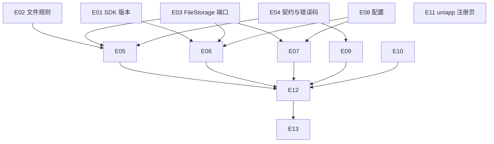

# Exec Plan

> **L4 · 交接点 1:意图 → 工程**。本文件是 `tasks.md` 的下游派生物,单向。

## 1. 任务映射

| tasks.md 条目 | 执行单元 ID | 层 |
|---|---|---|
| `0.1` 登记 OSS SDK 版本 | `E01` | L0 |
| `2.1` 文件规则 | `E02` | L0 |
| `2.2` `FileStorage` 端口 | `E03` | L0 |
| `2.3` 对外契约与错误码 | `E04` | L0 |
| `3.1` 上传用例 | `E05` | L1 |
| `3.2` OSS 存储 | `E06` | L1 |
| `3.3` 本地存储与资源映射 | `E07` | L1 |
| `3.4` 配置 | `E08` | L1 |
| `4.1` `LocalFilesController` | `E09` | L2 |
| `4.2` 超大文件提示 | `E10` | L2 |
| `5.1` uniapp 注册页 | `E11` | L2 |
| `5.2` 领域 / 应用单测 | `E02`、`E05` | L0/L1 |
| `5.3` 基础设施单测 | `E06`、`E07` | L1 |
| `5.4` 集成测试 | `E12` | L3 |
| `6.2` 文档 | `E13` | L4 |

### 未映射条目

| 条目 | 不执行的原因 |
|---|---|
| `5.5` 人工真实上传 | 需要用户用真实 OSS 凭据在本机执行，凭据不进仓库、不交给 agent |
| `6.1` 阿里云与部署配置 | 发布动作，由用户完成；步骤由 `E13` 写入 `AGENTS.biz.md` |
| `7.1` 验收记录 | 上线后条目 |

### L7 测试基线

- 基线：`main`（`f8a1919`）。L7 用 `openspec/project.json` 的 `commands` 全量跑。

## 2. 依赖图

| 执行单元 | 前置 | 依赖性质 |
|---|---|---|
| `E05` | `E02`、`E03`、`E04` | 类型 + 调用依赖 |
| `E06` | `E01`、`E03`、`E08` | 编译 + 类型依赖 |
| `E09` | `E04` | 契约依赖 |
| `E12` | 全部后端单元 | 运行时装配 |

## 3. 分层执行计划

### Layer 0 —— 共享层,**串行**,必须先完成

| 执行单元 | 内容 | 涉及文件 |
|---|---|---|
| `E01` | 登记 `aliyun-sdk-oss:3.18.5`，跑 `verifyFrameworkVersions` | `weiran4j/weiran-dependencies/biz-dependencies.gradle.kts` |
| `E02` | `UploadedFiles` 规则 | `weiran-cqt-domain/.../file/` |
| `E03` | `FileStorage`、`FileStorageException` | `weiran-cqt-domain/.../file/` |
| `E04` | `FileUploadService`、`UploadedFileView`、`CqtErrors` 两码 | `weiran-cqt-api` |

**完成判据**：`./gradlew :weiran-cqt-domain:check :weiran-cqt-api:check :weiran-app:verifyFrameworkVersions` 通过。

### Layer 1–4

| 层 | 执行单元 |
|---|---|
| L1 | `E05`–`E08` |
| L2 | `E09`–`E11` |
| L3 | `E12` |
| L4 | `E13` |

## 4. 契约冻结

| 契约 | 签名 / 结构 | 定义位置 | 消费方(逐单元列出所读/所写的键) | 冻结 |
|---|---|---|---|---|
| `UploadedFiles` | `Set<String> ALLOWED_EXTENSIONS`（含点、小写）；`Optional<String> extensionOf(@Nullable String name)`；`String objectName(String prefix, long accountId, YearMonth month, UUID id, String ext)` | `weiran-cqt-domain/.../file/UploadedFiles.java` | `E05` 调用 | ☑ |
| `FileStorage` | `String store(String objectName, InputStream content, long size, @Nullable String contentType)`，失败抛 `FileStorageException` | `weiran-cqt-domain/.../file/` | `E06`、`E07` 实现；`E05` 调用 | ☑ |
| `FileUploadService` | `UploadedFileView upload(long accountId, @Nullable String originalName, long size, UploadContent content, @Nullable String contentType)`；`UploadContent` 为 `InputStream open() throws IOException` 的函数接口 | `weiran-cqt-api/.../file/` | `E05` 实现；`E09` 调用 | ☑ |
| `UploadedFileView` | `record(String url, String name, String path, long size)` | `weiran-cqt-api/.../file/` | `E05` 写；`E09` 输出 `url/name/path/size`；`E12` 断言 | ☑ |
| `CqtErrors` | `STORAGE_NOT_CONFIGURED(50322, 503, "文件存储未配置")`、`UPLOAD_FAILED(50323, 503, "文件上传失败，请稍后再试")` | `weiran-cqt-api/.../error/CqtErrors.java` | `E05` 抛 | ☑ |
| 配置键 | `weiran.cqt.storage.{mode, key-prefix, oss.{access-key-id, access-key-secret, bucket, endpoint, public-base-url}, local.{root, url-prefix}}`；`spring.servlet.multipart.*` | `CqtProperties`、`application-biz.yml` | `E05`–`E08` 读写；`E12` 覆盖 | ☑ |

### 契约变更记录

| 时间 | 原签名 | 新签名 | 发起方 | 已通知 |
|---|---|---|---|---|
| — | — | — | — | — |

## 5. 并行判据与文件所有权

| ID | 场景 | 能否与他人并行 | 原因 |
|---|---|---|---|
| WT-0 | **工作区已有他人在推进的 change** | ❌ **必须先问这一条** | 开工时核对：`git status` 干净、无其它未归档 change —— 未命中 |
| WT-1 | 纯文档 / spec / openspec 流水线自身的改动 | ✅ 可与代码改动交替推进(仍受 WT-0 约束) | 不改流水线本体 |
| WT-2 | 涉及 `weiran-common`,**或流水线本体** | ❌ 必须排队 | 未命中 |
| WT-3 | 单模块、3~5 个文件的小改动 | ✅ 可与他人交替推进(仍受 WT-0 约束) | 单业务模块 |

**单执行者、串行推进，内部无并行。**

| 执行单元 | 拥有(可写) | 只读 | 禁止触碰 |
|---|---|---|---|
| `E01` | `weiran4j/weiran-dependencies/biz-dependencies.gradle.kts` | — | 上游 `weiran-dependencies/build.gradle.kts` |
| `E02`–`E10` | `weiran4j/weiran-cqt/**` | `weiran-common/**`、`weiran-framework/**` | 上游文件、`web/**` |
| `E11` | `uniapp/pages/login/register.vue` | — | uniapp 其它文件 |
| `E12` | `weiran-app/src/test/java/com/weiran/app/Cqt*`、`weiran-app/src/test/resources/application-biz-test.yml` | `IntegrationTestSupport.java` | 上游已有测试文件 |
| `E13` | `AGENTS.biz.md`、`openspec/state/bizs/*.biz.md`、`openspec/state/bizs/cqt_*.md` | — | `AGENTS.md`、`openspec/rules/**` |

## 6. 测试归属

| 执行单元 | 测试范围 | 测试文件 |
|---|---|---|
| `E02` | 白名单大小写、对象名格式 | `UploadedFilesTest.java` |
| `E05` | 未配置、空文件、类型、存储失败映射、成功返回 | `FileUploadApplicationServiceTest.java` |
| `E06` | 写入参数、公网地址、配置不全、写入异常 | `OssFileStorageTest.java` |
| `E07` | 写入与路径越界 | `LocalFileStorageTest.java` |
| `E12` | 端到端上传、未登录、校验、超限 | `CqtFileUploadIT.java`、`CqtUploadLimitIT.java` |

## 7. 失败与降级

| 场景 | 处置 |
|---|---|
| subagent 超时 | 不使用 subagent；单执行者 |
| 重试后仍失败 | 同一检查重试一次仍红 → 停下报告用户 |
| 产出不可用(编译不过/答非所问) | 丢弃 diff,重做该单元 |
| 同层两个单元产生文件冲突 | 不适用（串行） |
| 契约需要变更 | 记入第 4 节变更记录；若影响 design 则回 L3 |
| `verifyFrameworkVersions` 失败 | `dependencyInsight` 查来源；能排除传递依赖就排除，否则加白名单并写理由，记入收尾笔记 |

## 8. 收尾要求

单执行者串行推进，收尾笔记合并写在 `exec/notes/E-all-实现记录.md`。

## Gate

- [x] 每条 task 都已映射,或已在「未映射条目」声明并写明原因
- [x] `explore.md` 的共享层清单已逐项比对,命中项全部落在 Layer 0
- [x] 若涉及数据库结构变更,已按 `rules/enforced/constitution.md` CP-7 与 `weiran-v1` 核对（无表结构变更）
- [x] 依赖图无环,且「前后端」这类隐性契约依赖已识别(不是并行,是契约依赖)
- [x] Layer 0 的契约冻结表已列出待填项
- [x] 无独立的测试执行单元(测试跟随实现)
- [x] 同层执行单元的「拥有(可写)文件集」两两不相交
- [x] 每个执行单元的「禁止触碰」已写明
- [x] 失败与降级策略已填(第 7 节)
- [x] 已确认本文件未产生任何对 `tasks.md` / `design.md` / `specs/**` 的回写
