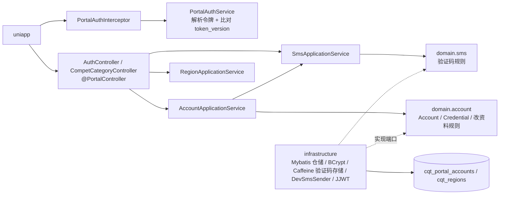

# Design

> 保持**意图粒度**:描述「行为如何」,不写逐文件的实现步骤。

## Context

- 需求来源:`interview.md`
- 现有实现调研:`explore.md`
- 关键约束:
  - uniapp 的请求 / 响应字段名全部沿用（`password_confirmation`、`credential_type`、`idcard`、`cities`、`access_token` …）
  - 原表明文存储、手机号无唯一约束且旧数据可能重复；`phone_value` 是 `TEXT`
  - 前台 `code==401` 在 uniapp 里等于「未登录」
  - 上一切片的令牌没有 `ver`；本次补齐吊销并 MODIFIED `cqt-portal-api`

## 宪法对照

<!-- openspec:required-table mark=2 note=3 -->
| 原则 | 判定 | 说明 |
|---|---|---|
| CP-1 领域层不依赖框架 | ☑ | 账号、证件校验、改资料规则、验证码规则是纯 Java（时间由调用方传入）；端口（仓储、密码哈希、短信发送、验证码存储、令牌）定义在 domain |
| CP-2 依赖方向单向向内 | ☑ | adapter → application → domain；infrastructure 实现 domain 端口 |
| CP-3 持久化类型不跨层 | ☑ | `CqtPortalAccountDO` / `CqtRegionDO` / Mapper 只在 infrastructure，仓储返回领域对象 |
| CP-4 版本号只有一个来源 | ☑ | `spring-security-crypto`、`caffeine` 不写版本，取 Spring Boot BOM |
| CP-5 质量规则只在 build-logic 里配置 | ☑ | 只用 `weiranConventions` 既有开关 |
| CP-6 豁免必须最小且带理由 | ☑ | 不新增豁免；沿用令牌编解码已有的 `@SuppressForbidden` |
| CP-7 表结构只经 Flyway 迁移变更，已发布的迁移永不修改 | ☑ | 新增 `V202610041000__cqt_portal_accounts.sql`、`V202610041001__cqt_regions.sql`；上一切片脚本不动 |
| CP-8 密码只用 BCrypt，令牌吊销只走 token_version | ☑ | `BCryptPasswordEncoder`（原生兼容 `$2y$`）；账号表加 `token_version`，令牌带 `ver`，认证时比对；重置密码递增。**关闭上一切片的 CP-8 ⚠** |
| CP-9 凭据不进版本库、不进日志 | ☑ | 密钥仍走环境变量；日志不出现密码、验证码（开发模式的 warn 例外，生产默认 `disabled`）、令牌、证件号；手机号只记掩码 |
| CP-10 认证失败不泄露账号存在性 | ☑ | `login` / `autologin` 账号不存在与密码错误同为 `code` 400「手机号或密码错误」。`resetPassword` 的「用户信息不存在」发生在验证码校验之后（已证明持有号码），不构成枚举；`register` 的「当前手机号已经注册」同样在验证码校验之后 |
| CP-11 错误码归属决定 HTTP 状态，不靠 Controller 判断 | ☑ | 延续 `/api-web` 的已批准偏离（HTTP 恒 200，body 取前三位）；新错误码定义在 `CqtErrors`，Controller 只抛异常 |
| CP-12 依赖只能业务 → 基座 → 框架，反向与同层横向禁止 | ☑ | 只依赖框架、`weiran-common`；无其它业务模块 |
| CP-13 业务只经基座的 weiran-base-api 接触基座 | ☑ | BCrypt 照搬写法自己实现，不引用 `BCryptPasswordHasher`；不读写 `sys_*` |
| CP-14 错误码按号段分配，业务不得占用框架与基座的号段 | ☑ | 新错误码全部用序号 `20`–`39`（见 API Design 错误码表） |
| CP-15 权限码、菜单 id 与 Flyway 模块段按层隔离 | ☑ | 表 `cqt_portal_accounts`、`cqt_regions`，脚本在 `db/migration/cqt/`；无权限码与菜单 |

## Architecture

## Data Flow

1. **发送验证码**：校验手机号格式 → 未配置发送实现则 503 → 查存储里该号码上次发送时间，不足 60 秒则 429 → 生成 6 位随机码（`SecureRandom`）→ 存储 `(code, sentAt, expiresAt=sentAt+10min)`（覆盖旧码）→ 调发送实现 → 开发模式且开启回显时响应带 `code`。
2. **校验验证码**（注册 / 登录 / 重置密码内部调用）：取存储里该号码的记录，未过期且相等则删除并通过，否则抛 401「验证码错误」。校验放在账号服务的事务**之前**，失败不触库。
3. **登录**：（`login` 先校验验证码）→ 按手机号取首个账号（`zhongxi` 优先、`id` 升序）→ 不存在或 BCrypt 不匹配都抛 400「手机号或密码错误」→ 按账号 `token_version` 签发令牌。
4. **注册**：校验类型、名称、手机号、密码 → 校验验证码 → 事务内：手机号查重 → 个人则规范化 + 校验证件并查重 → 取 `legacy_user_id` 最大值 + 1 → 插入（个人 `audit_status=0`，学校 `=1`）。
5. **每个需登录请求**：拦截器 → `PortalAuthService.authenticate(token)`：解析出 `(accountId, ver)` → 按主键查 `token_version`，一致才返回账号 ID。
6. **改资料**：按令牌账号读出 → `phone` 不同则 400 → 白名单字段合并 → 个人改证件则校验 + 查重（排除自己）→ 学校且驳回态则置 1 → 更新。
7. **重置密码**：校验密码与确认 → 校验验证码 → 事务内：按手机号更新全部账号 `password_hash` 与 `token_version = token_version + 1`；影响 0 行则 404。

## 跨模块契约变更(DS-1)

| 对象 | 文件 | 动作 | 消费方 |
|---|---|---|---|
| 无 | `weiran-common/.../error/WeiranErrors.java` | 不改；业务错误码在 `weiran-cqt-api` 的 `CqtErrors` | — |
| 无 | `weiran-common/.../page/{PageQuery,PageResult}.java` | 不涉及 | — |

模块内契约（L4 冻结项）：
- `PortalTokenCodec`（domain）：`issue(long accountId, int version)`；`parse(String) → Optional<PortalTokenClaims(accountId, version)>`——**签名变更**，消费方：JJWT 实现、`PortalAuthService`、`CqtWebIT`、新 IT
- `PortalAuthService`（api）：`OptionalLong authenticate(String token)`——拦截器改为调用它
- 端口：`AccountRepository`、`RegionRepository`、`PasswordHasher`、`SmsSender`、`SmsCodeStore`（domain）
- 服务接口：`AccountService`、`SmsService`、`RegionService`（api）

## API Design(DS-2)

全部挂在 `/api-web` 下，类标 `@PortalController`，响应 `{code, message, data}`、HTTP 恒 200。请求体为 JSON；字段名照 uniapp。

| 路由 | 方法 | 登录 | 请求关键字段 | 返回 `data` |
|---|---|---|---|---|
| `/api-web/auth/sendSms` | GET | 公开 | query `phone` | `{sent:true}`（开发模式回显时含 `code`） |
| `/api-web/auth/login` | POST | 公开 | `phone, password, code` | `{access_token, token_type:"bearer", expires_in}` |
| `/api-web/auth/autologin` | POST | 公开 | `phone, password` | 同上 |
| `/api-web/auth/register` | POST | 公开 | `type, name, phone, code, password, password_confirmation, sex, idcard, credential_type, cities, school, schoolid, contact, address, email, zhizhao, chengnuoshu` | `true` |
| `/api-web/auth/userinfo` | GET/POST | 需登录 | — | 20 个字段（spec `cqt-account` FR-004） |
| `/api-web/auth/updateuserinfo` | POST | 需登录 | 白名单字段 + `phone`（只用于比对） | `true` |
| `/api-web/auth/resetPassword` | POST | 公开 | `phone, code, password, password_confirmation` | `true` |
| `/api-web/auth/getlinkinfo` | GET/POST | 公开 | — | 模板 URL 字符串 |
| `/api-web/competcategory/regions` | GET/POST | 公开 | — | `[{id, pid, name, code}]` |

- 数字类入参（`type`、`sex`、`cities`）在请求 DTO 里按**字符串**接收、由适配层宽松解析（空串 → null），因为 uniapp 会传数字或字符串或空串，避免 Jackson 对空串的强转报 400
- 未知字段忽略（uniapp 学校改资料会带 `chengnuoshuname`、`tupiantype`）

**错误码（`CqtErrors`，序号段 20–39）**：

| 码 | HTTP 段 → 前台 code | 提示 | 用途 |
|---|---|---|---|
| `40020` | 400 | 手机号或密码错误 | 登录失败（CP-10） |
| `40021` | 400 | 手机号不支持在此修改 | 改资料带了不同手机号 |
| `40120` | 401 | 验证码错误 | 验证码不存在 / 过期 / 不匹配 |
| `40920` | 409 | 当前手机号已经注册 | 注册 |
| `40921` | 409 | 该证件号已经注册 | 注册 / 改资料 |
| `42920` | 429 | 发送过于频繁，请稍后再试 | 短信冷却 |
| `50320` | 503 | 短信服务未配置 | 未配置发送实现 |

其余校验失败用 `CommonErrors.BAD_REQUEST` + 具体提示（「手机号格式不正确」「类型格式不正确」「身份证号校验位错误」…），找不到账号用 `CommonErrors.NOT_FOUND`「用户信息不存在」。

## Database Design(DS-3)

| 表 | 动作 | 关键字段 | 索引 | 备注 |
|---|---|---|---|---|
| `cqt_portal_accounts` | 新增 | 原 `portal_accounts` 全部列 + `credential_type ENUM('ID_CARD','OTHER') NOT NULL DEFAULT 'ID_CARD'`（在 `id_card_value` 后）+ `token_version INT NOT NULL DEFAULT 0` | 原 `UNIQUE(source_database, legacy_user_id)`；新增前缀索引 `idx_phone (phone_value(20))`、`idx_id_card (id_card_value(32))` | 列类型保持原样（`phone_value` 等为 `TEXT`），只加索引以免按手机号 / 证件号全表扫描（约 8 万行） |
| `cqt_regions` | 新增 | `id, legacy_id (UNIQUE), parent_legacy_id (KEY), name, code` | 同原表 | — |

- 导入顺序：`cqt_regions` → `cqt_portal_accounts`；均 `INSERT … SELECT … ON DUPLICATE KEY UPDATE`（按主键），可重复执行
- 账号导入时：`id_card_value` 去空白转大写（与新注册的规范化一致，查重才可靠）；`credential_type` 按 `^[0-9]{17}[0-9X]$` 推断；`token_version` 取 0（重复执行时**不**覆盖已有的 `token_version`，避免把已重置过密码的账号版本回退）
- 不对照 `weiran-v1`（D-008）

## 权限与已知缺口(DS-4)

| 项 | 设计 |
|---|---|
| 权限点(`pam_permission`) | 无 |
| 菜单挂载 | 无 |
| 是否新增写接口却漏标 `@OperationLog` | 前台写接口（注册、改资料、重置密码）不标：`@OperationLog` 记录的是后台用户（`CurrentUser`），前台账号无此上下文。前台操作审计作为已知缺口登记 |

已知缺口（verify 时登记到 `state/bizs/cqt_portal_accounts.md` §6）：手机号重复的旧数据、注册并发窗口、无登录失败次数限制、无前台登录日志。

## 分层与装配(DS-5)

| 项 | 设计 |
|---|---|
| 依赖方向 | `adapter → application → domain`,`infrastructure → domain` |
| 自动配置 | 沿用上一切片三个 `@AutoConfiguration`，各自 `@Import` 新增的仓储 / 服务 / Controller；`SmsSender` 只在 `weiran.cqt.sms.mode=dev` 时注册开发实现（`@ConditionalOnProperty`），否则无 bean，应用服务据此返回 503 |
| 配置 | `CqtJwtProperties` 并入统一的 `CqtProperties`（`weiran.cqt.*`：`jwt.{secret,ttl}`、`sms.{mode,expose-code}`、`commitment-template-url`、`bcrypt-strength`）；`application-biz.yml` 补默认值与环境变量占位；测试 profile 设 `sms.mode=dev`、`expose-code=true`、`bcrypt-strength=4` |
| 新依赖 | `weiran-cqt-infrastructure`：`spring-security-crypto`、`caffeine` |
| 事务 | 应用服务的注册、改资料、重置密码用 `@Transactional`；验证码校验在事务外先做 |

## 前端设计(DS-6)

| 项 | 内容 |
|---|---|
| 页面/路由 | 无（`web/` 不动；uniapp 不改） |
| 菜单挂载 | 无 |
| 数据请求方式 | uniapp 现有调用 |
| 复用组件 | 无 |
| 权限控制点 | 无 |

## Observability

- 日志关键字段：手机号掩码（前 3 后 4）；开发模式短信 warn「开发模式短信 phone=155****6215 code=123456」；登录失败只记 debug 掩码，不记密码
- 指标：无新增
- 审计：前台登录日志 / 操作审计不做（已知缺口）
- 告警 / 排障入口：生产 `sms.mode=disabled` 时发送接口恒 503，可作为「短信未接」的排障信号

## Test Plan

| 层级 | 范围 | 命令 |
|---|---|---|
| 单元 | domain：身份证校验（长度 / 出生日期 / 校验位 / X）、证件类型别名、改资料规则（白名单、改手机号、驳回回审核中）、验证码规则（过期、一次性、冷却）；infrastructure：令牌带 `ver` 往返、缺 `ver` 无效 | `./gradlew :weiran-cqt-domain:test :weiran-cqt-infrastructure:test` |
| 集成 | 新增 `CqtAccountIT`：spec `cqt-account` / `cqt-sms-verification` / `cqt-region` 全部场景；改 `CqtWebIT`：令牌用例基于真实账号，新增「版本过时」「账号不存在」两种无效令牌 | `./gradlew :weiran-app:test` |
| 导入脚本 | 一次性 MySQL 容器两遍执行，比对行数与 `token_version` | 手工（记录在 verify） |
| 全量门禁 | `./gradlew check` + 前端 | `openspec/project.json` 的 commands |

## Rollout Plan

1. 部署配置：`WEIRAN_CQT_JWT_SECRET`（已有）；生产保持 `weiran.cqt.sms.mode=disabled` 直到接入真实短信服务商（届时发送接口返回 503，注册 / 登录 / 重置密码不可用——**接入短信前前台账号功能不能上线**）
2. 应用启动，Flyway 建两张表
3. 执行 `scripts/biz/import/cqt_regions.sql`、`cqt_portal_accounts.sql`
4. 用户首次访问需重新登录（上一切片签发的令牌没有 `ver`，统一失效）

## Rollback Plan

1. revert 锚点：本 change 的提交；父提交 `b20acc1`
2. 迁移回滚策略：两张新表可直接删除并清理 `flyway_schema_history` 对应记录；不修改任何既有表
3. 回滚后前台令牌回到无 `ver` 版本，已签发的新令牌在旧代码下仍可解析（旧代码不读 `ver`），无需额外处理

## Open Questions

- 无
