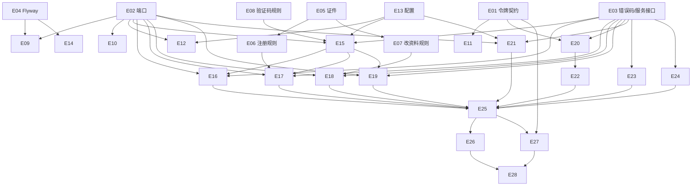

# Exec Plan

> **L4 · 交接点 1:意图 → 工程**。本文件是 `tasks.md` 的下游派生物,单向。

## 1. 任务映射

| tasks.md 条目 | 执行单元 ID | 层 |
|---|---|---|
| `2.1` 令牌契约带版本 | `E01` | L0 |
| `2.6` 端口 | `E02` | L0 |
| `2.7` 错误码与服务接口 | `E03` | L0 |
| `3.1` Flyway 两张表 | `E04` | L0 |
| `2.2` 证件规则 | `E05` | L1 |
| `2.3` 账号模型与注册规则 | `E06` | L1 |
| `2.4` 改资料规则 | `E07` | L1 |
| `2.5` 验证码规则 | `E08` | L1 |
| `3.2` 仓储实现 | `E09` | L1 |
| `3.3` BCrypt | `E10` | L1 |
| `3.4` JJWT 加 `ver` | `E11` | L1 |
| `3.5` 验证码存储与开发模式短信 | `E12` | L1 |
| `3.6` 统一配置 | `E13` | L1 |
| `3.14` 导入脚本 | `E14` | L1 |
| `3.7` 短信应用服务 | `E15` | L2 |
| `3.8` 登录 | `E16` | L2 |
| `3.9` 注册 | `E17` | L2 |
| `3.10` 资料读写 | `E18` | L2 |
| `3.11` 重置密码 | `E19` | L2 |
| `3.12` 前台认证 | `E20` | L2 |
| `3.13` 赛区与模板链接 | `E21` | L2 |
| `4.1` 拦截器改调认证服务 | `E22` | L3 |
| `4.2` `AuthController` | `E23` | L3 |
| `4.3` `CompetCategoryController` | `E24` | L3 |
| `4.4` 自动配置登记 | `E25` | L3 |
| `5.1` 领域单测 | `E05`–`E08` | L1 |
| `5.2` 令牌单测 | `E11` | L1 |
| `5.3` `CqtAccountIT` | `E26` | L4 |
| `5.4` `CqtWebIT` 调整 | `E27` | L4 |
| `5.5` 导入脚本两遍执行 | `E14` | L1 |
| `6.2` 下游文档 | `E28` | L5 |

> 5.1 / 5.2 / 5.5 是测试，跟随对应实现单元（1 条 task → 实现单元的测试部分；5.1 拆到 `E05`–`E08` 四个单元各自的单测）。

### 未映射条目

| 条目 | 不执行的原因 |
|---|---|
| `6.1` 生产保持短信 disabled、切换时执行导入 | 发布动作，合并后在部署环境执行；步骤由 `E28` 写入 `AGENTS.biz.md` |
| `7.1` 验收记录 | 上线后条目 |

### L7 测试基线

- 基线：`main`（`b20acc1`，上一切片归档提交，全量门禁已绿）。L7 用 `openspec/project.json` 的 `commands` 全量跑。

## 2. 依赖图

| 执行单元 | 前置 | 依赖性质 |
|---|---|---|
| `E09` | `E02`、`E04` | 类型 + 数据依赖 |
| `E11` | `E01` | 类型依赖 |
| `E15`–`E21` | `E02`、`E03`（及各自领域规则） | 类型 + 调用依赖 |
| `E22` | `E20` | 调用依赖 |
| `E23`/`E24` | `E03` | 契约依赖（服务接口） |
| `E26`/`E27` | `E25` | 运行时装配 |

## 3. 分层执行计划

### Layer 0 —— 共享层,**串行**,必须先完成

| 执行单元 | 内容 | 涉及文件 |
|---|---|---|
| `E01` | `PortalTokenCodec` 改签名 + `PortalTokenClaims` | `weiran-cqt-domain/.../portal/` |
| `E02` | `AccountRepository`、`RegionRepository`、`PasswordHasher`、`SmsSender`、`SmsCodeStore` | `weiran-cqt-domain/.../{account,region,sms}/` |
| `E03` | `CqtErrors`；`AccountService`、`SmsService`、`RegionService`、`PortalAuthService` 与命令 / 视图 | `weiran-cqt-api/.../{error,account,sms,region,portal}/` |
| `E04` | `V202610041000__cqt_portal_accounts.sql`、`V202610041001__cqt_regions.sql` | `weiran-cqt-infrastructure/src/main/resources/db/migration/cqt/` |

**完成判据**：`./gradlew :weiran-cqt-domain:compileJava :weiran-cqt-api:compileJava` 通过，契约冻结表已填满。

### Layer 1–5

| 层 | 执行单元 |
|---|---|
| L1 | `E05`–`E14`（领域规则 + 单测、基础设施实现、配置、导入脚本） |
| L2 | `E15`–`E21`（应用服务） |
| L3 | `E22`–`E25`（适配层） |
| L4 | `E26`、`E27`（集成测试） |
| L5 | `E28`（文档） |

## 4. 契约冻结

| 契约 | 签名 / 结构 | 定义位置 | 消费方(逐单元列出所读/所写的键) | 冻结 |
|---|---|---|---|---|
| `PortalTokenCodec` | `String issue(long accountId, int version)`；`Optional<PortalTokenClaims> parse(String token)`；`record PortalTokenClaims(long accountId, int version)` | `weiran-cqt-domain/.../portal/` | `E11` 实现；`E16` 调 `issue`；`E20` 调 `parse` 读 `accountId`/`version`；`E26`/`E27` 调 `issue` | ☑ |
| `AccountRepository` | `Optional<Account> findFirstByPhone(String)`；`boolean existsByPhone(String)`；`boolean existsPersonalCredential(CredentialType, String no, @Nullable Long excludeId)`；`long nextLegacyUserId(String source)`；`long insert(Account)`；`Optional<Account> findById(long)`；`void update(Account)`；`int resetPasswordByPhone(String phone, String hash)`（同时 `token_version+1`）；`OptionalInt findTokenVersion(long id)` | `weiran-cqt-domain/.../account/` | `E09` 实现；`E16` 读 `findFirstByPhone`；`E17` 读 `existsByPhone`/`existsPersonalCredential`/`nextLegacyUserId` 写 `insert`；`E18` 读 `findById`/`existsPersonalCredential` 写 `update`；`E19` 写 `resetPasswordByPhone`；`E20` 读 `findTokenVersion` | ☑ |
| `Account` | 字段：`id, sourceDatabase, legacyUserId, name, passwordHash, userType, uniid, phone, schoolId, idCard, credentialType, cityId, sex, school, contact, address, email, auditStatus, licenseFile, commitmentFile, rejectionReason, tokenVersion` | 同上 | `E06` 构造；`E07` 合并；`E09` 映射；`E18` 转视图 | ☑ |
| `RegionRepository` | `List<Region> findAll()`；`Optional<String> findNameByLegacyId(long)`；`record Region(long legacyId, long parentLegacyId, String name, @Nullable String code)` | `weiran-cqt-domain/.../region/` | `E09` 实现；`E21` 读 `findAll`；`E18` 读 `findNameByLegacyId` | ☑ |
| `PasswordHasher` | `String hash(String raw)`；`boolean matches(String raw, String hash)` | `weiran-cqt-domain/.../account/` | `E10` 实现；`E16`/`E17`/`E19` 调用 | ☑ |
| `SmsSender` / `SmsCodeStore` | `void send(String phone, String code)`；`Optional<SmsCode> get(String phone)`、`void put(String phone, SmsCode)`、`void remove(String phone)`；`record SmsCode(String code, Instant sentAt, Instant expiresAt, int failedAttempts)` | `weiran-cqt-domain/.../sms/` | `E12` 实现；`E15` 调用 | ☑ |
| `CqtErrors` | `LOGIN_FAILED(40020)`、`PHONE_NOT_CHANGEABLE(40021)`、`SMS_CODE_INVALID(40120)`、`PHONE_REGISTERED(40920)`、`CREDENTIAL_REGISTERED(40921)`、`SMS_TOO_FREQUENT(42920)`、`SMS_NOT_CONFIGURED(50320)` | `weiran-cqt-api/.../error/CqtErrors.java` | `E05`–`E08`（领域规则抛 `BizException`，所以领域依赖 `weiran-cqt-api`？见下注）、`E15`–`E21` 抛出；`E26` 断言前三位 | ☑ |
| 服务接口 | `SmsService.send(phone) → SmsSendResult(boolean sent, @Nullable String code)`、`verify(phone, code)`；`AccountService.login/autologin → LoginResult(accessToken, tokenType, expiresIn)`、`register(RegisterCommand)`、`profile(long) → AccountProfileView`、`updateProfile(long, UpdateProfileCommand)`、`resetPassword(ResetPasswordCommand)`、`commitmentTemplateUrl()`；`RegionService.list() → List<RegionView>`；`PortalAuthService.authenticate(String) → OptionalLong` | `weiran-cqt-api` | `E15`–`E21` 实现；`E22`–`E24` 调用 | ☑ |

> 注：领域层只依赖 `weiran-common`（CP-1），领域规则用 `BizException` + `CommonErrors.BAD_REQUEST`/自带提示抛校验错误；需要 `CqtErrors` 的判定（冷却、验证码错误、已注册）放在应用层。`CqtErrors` 实现 `weiran-common` 的 `ErrorCode`。

### 契约变更记录

| 时间 | 原签名 | 新签名 | 发起方 | 已通知 |
|---|---|---|---|---|
| 2026-10-04（实现前） | `SmsCode(code, sentAt, expiresAt)` | 加 `failedAttempts` | 用户确认补充「输错 5 次作废」 | ☑（单执行者） |
| 2026-10-04（实现中） | `PortalTokenCodec` 只有 `issue`/`parse` | 增加 `Duration ttl()` | `E16` 登录结果要返回 `expires_in` | ☑（单执行者） |
| 2026-10-04（实现中） | `CqtErrors` 含 `PHONE_NOT_CHANGEABLE(40021)` | 去掉：改手机号由领域规则抛 `BizException.badRequest`（领域不依赖 api，CP-1），前台 code 同为 400 | `E07` | ☑（单执行者） |

## 5. 并行判据与文件所有权

| ID | 场景 | 能否与他人并行 | 原因 |
|---|---|---|---|
| WT-0 | **工作区已有他人在推进的 change** | ❌ **必须先问这一条** | 开工时核对：`git status` 干净、无其它未归档 change、`git log` 只有本人提交 —— 未命中 |
| WT-1 | 纯文档 / spec / openspec 流水线自身的改动 | ✅ 可与代码改动交替推进(仍受 WT-0 约束) | 本 change 不改流水线本体 |
| WT-2 | 涉及 `weiran-common`,**或流水线本体** | ❌ 必须排队 | 未命中 |
| WT-3 | 单模块、3~5 个文件的小改动 | ✅ 可与他人交替推进(仍受 WT-0 约束) | 单业务模块 |

**单执行者、串行推进，内部无并行。**

| 执行单元 | 拥有(可写) | 只读 | 禁止触碰 |
|---|---|---|---|
| `E01`–`E25` | `weiran4j/weiran-cqt/**` | `weiran-common/**`、`weiran-framework/**`、`weiran-base/**` | 任何上游已有文件、`web/**`、`uniapp/**` |
| `E14` | `scripts/biz/import/**` | `常青藤20260929/cqtxj2026.sql` | 同上 |
| `E26`/`E27` | `weiran-app/src/test/java/com/weiran/app/Cqt*IT.java`、`weiran-app/src/test/resources/application-biz-test.yml` | `IntegrationTestSupport.java` | `weiran-app/src/main/**`、上游已有测试文件 |
| `E28` | `AGENTS.biz.md`、`openspec/state/bizs/{cqt_portal_accounts.md,cqt_regions.md,README.biz.md}` | — | `AGENTS.md`、`openspec/rules/**` |

## 6. 测试归属

| 执行单元 | 测试范围 | 测试文件 |
|---|---|---|
| `E05` | 身份证长度 / 出生日期 / 校验位 / X、类型别名 | `weiran-cqt-domain/src/test/.../account/CredentialTest.java` |
| `E06` | 注册输入校验、初始审核状态 | `.../account/AccountTest.java` |
| `E07` | 白名单、手机号不可改、驳回回审核中 | `.../account/AccountTest.java` |
| `E08` | 过期、一次性、冷却 | `.../sms/SmsCodePolicyTest.java` |
| `E11` | 带 `ver` 往返、缺 `ver` 无效 | `JjwtPortalTokenCodecTest.java` |
| `E14` | 一次性 MySQL 两遍执行 | 收尾笔记 |
| `E26` | 三个新能力全部场景 | `CqtAccountIT.java` |
| `E27` | `cqt-portal-api` FR-003/FR-004 修改后的场景 | `CqtWebIT.java` |

## 7. 失败与降级

| 场景 | 处置 |
|---|---|
| subagent 超时 | 不使用 subagent；单执行者 |
| 重试后仍失败 | 同一检查重试一次仍红 → 停下报告用户 |
| 产出不可用(编译不过/答非所问) | 丢弃 diff,重做该单元 |
| 同层两个单元产生文件冲突 | 不适用（串行） |
| 契约需要变更 | 记入第 4 节变更记录；若影响 design 则回 L3 |

## 8. 收尾要求

单执行者串行推进，收尾笔记合并写在 `exec/notes/E-all-实现记录.md`。

## Gate

- [x] 每条 task 都已映射,或已在「未映射条目」声明并写明原因
- [x] `explore.md` 的共享层清单已逐项比对,命中项全部落在 Layer 0
- [x] 若涉及数据库结构变更,已按 `rules/enforced/constitution.md` CP-7 与 `weiran-v1` 核对（D-008 后对照 `cqtxj2026` 原表，只新增脚本）
- [x] 依赖图无环,且「前后端」这类隐性契约依赖已识别(不是并行,是契约依赖)
- [x] Layer 0 的契约冻结表已列出待填项
- [x] 无独立的测试执行单元(测试跟随实现)
- [x] 同层执行单元的「拥有(可写)文件集」两两不相交
- [x] 每个执行单元的「禁止触碰」已写明
- [x] 失败与降级策略已填(第 7 节)
- [x] 已确认本文件未产生任何对 `tasks.md` / `design.md` / `specs/**` 的回写
