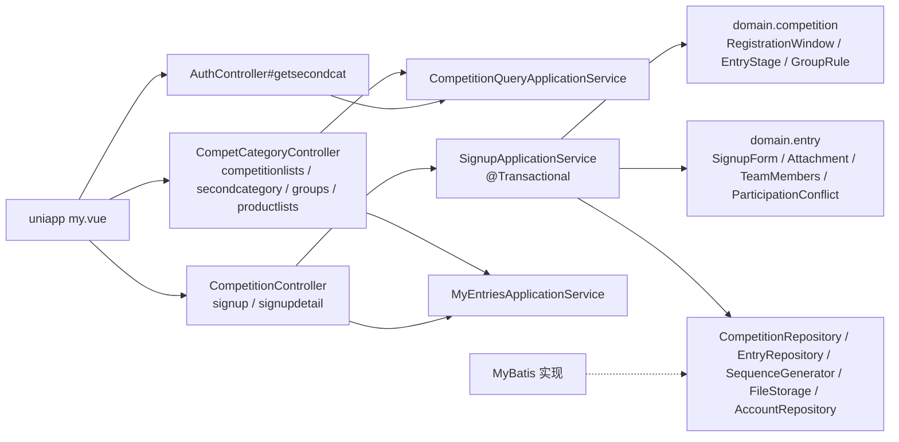

# Design

> 保持**意图粒度**:描述「行为如何」,不写逐文件的实现步骤。

## Context

- 需求来源:`interview.md`
- 现有实现调研:`explore.md`
- 关键约束:
  - 单库多届；表结构 = FastAPI 2026 最终结构 + 只加不改的 2027 列；沿用 `legacy_id`
  - 接口与字段照 uniapp / FastAPI；全部 `/api-web`、HTTP 恒 200
  - 同阶段重复参赛由唯一键兜底；报名全部写入一个事务

## 宪法对照

<!-- openspec:required-table mark=2 note=3 -->
| 原则 | 判定 | 说明 |
|---|---|---|
| CP-1 领域层不依赖框架 | ☑ | 报名窗口、阶段、重复冲突判定、附件、团队成员、组别匹配规则均为 domain 纯函数（时间、配置作参数传入） |
| CP-2 依赖方向单向向内 | ☑ | 仓储 / 序列 / 存储端口在 domain，infrastructure 实现 |
| CP-3 持久化类型不跨层 | ☑ | DO / Mapper 只在 infrastructure；查询结果以领域记录或 api 视图返回 |
| CP-4 版本号只有一个来源 | ☐ | 无新依赖 |
| CP-5 质量规则只在 build-logic 里配置 | ☑ | 不新增质量配置 |
| CP-6 豁免必须最小且带理由 | ☐ | 无豁免 |
| CP-7 表结构只经 Flyway 迁移变更，已发布的迁移永不修改 | ☑ | 新增 `V202610051000__cqt_competitions.sql`、`V202610051001__cqt_entries.sql`；数据走导入 / 种子脚本 |
| CP-8 密码只用 BCrypt，令牌吊销只走 token_version | ☐ | 不涉及 |
| CP-9 凭据不进版本库、不进日志 | ☑ | 日志不记证件号、手机号 |
| CP-10 认证失败不泄露账号存在性 | ☐ | 不涉及 |
| CP-11 错误码归属决定 HTTP 状态，不靠 Controller 判断 | ☑ | 沿用 `/api-web` 已批准偏离；用 `CommonErrors.{BAD_REQUEST,NOT_FOUND,FORBIDDEN,CONFLICT}` + 具体提示（前台 400/404/403/409），不新增错误码 |
| CP-12 依赖只能业务 → 基座 → 框架，反向与同层横向禁止 | ☑ | 只依赖框架 |
| CP-13 业务只经基座的 weiran-base-api 接触基座 | ☐ | 不涉及基座 |
| CP-14 错误码按号段分配，业务不得占用框架与基座的号段 | ☐ | 不新增错误码 |
| CP-15 权限码、菜单 id 与 Flyway 模块段按层隔离 | ☑ | 表全部 `cqt_` 前缀，脚本在 `db/migration/cqt/` |

## Architecture

## Data Flow

**报名（`SignupApplicationService.signup`，`@Transactional`）**
1. 读账号 → 解析表单（作品名、赛事、一级 / 二级赛项、附件、组别、团体成员）
2. 赛事存在 → `RegistrationWindow.check(赛事, now)`
3. 一级赛项（`parent_legacy_id=0`、启用）→ 二级赛项（`parent=一级`、启用）
4. 附件：`Attachment.parse(type, url, name, required, fileStorage::isStoredUrl)`
5. 参赛人：个人取账号（证件按 `Credentials` 规范化）；团体按 `TeamMembers.parse` 校验
6. 组别：每位成员的组别须在 `CompetitionRepository.findGroups(赛事, 一级, 二级)` 名称集中
7. 阶段 = `EntryStage.of(赛事.national_entry_mode)`；对每位成员 `EntryRepository.findConflict(赛事, 一级, 证件类型, 证件号, 阶段)`（`k.stage='BOTH' OR :stage='BOTH' OR k.stage=:stage`）→ 有则 409
8. 序号 = `SequenceGenerator.next("fastapi_signup_entry")` → 报名号；写作品 → 人员 + 参赛人 → 唯一键（`DuplicateKeyException` → 409「“<姓名>”已在本届同一赛项报名，请勿重复报名」，事务回滚）→ 评审对象
9. 返回 `{productid, entry_no}`，记 info 日志（不含证件 / 手机号）

**序列**：`cqt_app_sequences(sequence_name PK, current_value)`；
`INSERT … VALUES(:name, LAST_INSERT_ID(1)) ON DUPLICATE KEY UPDATE current_value = LAST_INSERT_ID(current_value + 1)` 后同连接 `SELECT LAST_INSERT_ID()`（在同一事务、同一连接内执行）。

**我的报名**：账号 → `(source_database, legacy_user_id)` → `EntryRepository.findByParticipantAccount` / `isParticipant(entryId, …)`；详情再取赛区名、赛项名、团队。

## 跨模块契约变更(DS-1)

| 对象 | 文件 | 动作 | 消费方 |
|---|---|---|---|
| 无 | `weiran-common/.../error/WeiranErrors.java` | 不改 | — |
| 无 | `weiran-common/.../page/{PageQuery,PageResult}.java` | 不涉及 | — |

模块内契约（L4 冻结项）：`FileStorage#isStoredUrl`（**签名变更**，两个实现与 `cqt-file-storage` MODIFIED）；`CompetitionRepository`、`EntryRepository`、`SequenceGenerator` 端口；
`CompetitionQueryService`、`SignupService`、`MyEntriesService` 接口与视图。

## API Design(DS-2)

| 路由 | 方法 | 所属模块 | 请求关键字段 | 返回关键字段 | 权限点 |
|---|---|---|---|---|---|
| `/api-web/competcategory/competitionlists` | GET/POST | adapter | `status`、`name` | `[{id,legacy_id,name,edition,year,description,status}]` | 公开 |
| `/api-web/auth/getsecondcat` | GET | adapter | `id`（赛事） | 一级赛项 `[{id,pid,name,sort,status,fujian}]` | 公开 |
| `/api-web/competcategory/secondcategory` | GET/POST | adapter | `id`（一级）、`competition_id`（忽略） | 二级赛项（同上字段） | 公开 |
| `/api-web/competcategory/groups` | GET | adapter | `competition_id`、`firstcatid`、`secondcatid` | `[{id,name,sort}]` | 公开 |
| `/api-web/competition/signup` | POST JSON | adapter | `title, competitionid/competition_id, firstcatid, secaodcatid/secondcatid/majorid, zubie, istuandui, team_members, regionsid, schoolid, teachername, description, major, purl, purlname, attachment_type` | `{productid, entry_no}` | 前台登录 |
| `/api-web/competcategory/productlists` | GET | adapter | — | `{data:[…], total}` | 前台登录 |
| `/api-web/competition/signupdetail` | GET | adapter | `productid` | `{productinfo, region_name, msg, step, shengAward, guoAward, team}` | 前台登录 + 本人 |

- 入参数字字段按字符串宽松解析（同账号切片的 `PortalParams`）；`team_members` 接受 JSON 数组或 JSON 字符串
- 列表 / 详情的字段名为下划线或旧名（`productid`、`teantype`、`purl`…），适配层组装 `Map` 输出

## Database Design(DS-3)

| 表 | 动作 | 关键字段 | 索引 | 备注 |
|---|---|---|---|---|
| `cqt_competitions` | 新增 | 2026 最终列 + `national_entry_mode ENUM('SHARED','SEPARATE') DEFAULT 'SHARED'` | `uk_competition_year_edition` | |
| `cqt_competition_categories` | 新增 | 2026 最终列（全局，`legacy_id` 唯一） | `uk_category_legacy`、`idx_category_parent` | |
| `cqt_competition_groups` | 新增 | 同最终结构 | `uk_competition_group`、`idx_competition_group_lookup` | |
| `cqt_entries` | 新增 | 最终列 + `stage_scope`、`province_entry_id`、`attachment_type ENUM('ZIP','LINK') NULL`、`declared_group_size INT NULL` | 最终索引 + `idx_entry_stage_scope(competition_id,stage_scope,status)` | 不建外键（同 2026） |
| `cqt_people` | 新增 | 最终列 + `credential_type ENUM('ID_CARD','OTHER') NOT NULL DEFAULT 'ID_CARD'` | 最终索引 | |
| `cqt_entry_participants` | 新增 | 同最终结构 | 同 | |
| `cqt_competition_participation_keys` | 新增 | 最终列 + `credential_type`、`stage_scope` | 唯一键改为 `(competition_id, category_legacy_id, credential_type, normalized_id_card, stage_scope)` | 同 2027 |
| `cqt_evaluation_targets` | 新增 | 同最终结构（含生成列 `entry_target_guard`） | 同 | 本次只写 `ENTRY` 型 |
| `cqt_app_sequences` | 新增 | `sequence_name PK, current_value` | — | 同 FastAPI 001 |

- 导入（`scripts/biz/import/`，两库同实例、可重复执行、按主键 `ON DUPLICATE KEY UPDATE` 或 `INSERT IGNORE`）：赛事 → 赛项 → 人员（`credential_type` 按 18 位格式推断）→ 作品（`stage_scope='BOTH'`、`attachment_type` 按 URL 推断：`.zip` 结尾为 ZIP，否则有值为 LINK）→ 参赛人 → 评审对象 → 参赛唯一键回填（**按一级赛项**，`INSERT IGNORE`）→ 序列表初始化为历史最大序号
- 种子（`scripts/biz/seed/competition_next.sql`）：新一届赛事（`status=0`、`national_entry_mode` 与报名时间写成脚本顶部变量）+ 5 个通用组别，`INSERT … WHERE NOT EXISTS`
- 不对照 `weiran-v1`

## 权限与已知缺口(DS-4)

| 项 | 设计 |
|---|---|
| 权限点(`pam_permission`) | 无，前台登录 |
| 菜单挂载 | 无 |
| 是否新增写接口却漏标 `@OperationLog` | 前台接口不标；以 info 日志替代 |

已知缺口（verify 时登记到 `state/bizs/cqt_entries.md`）：赛项全局共用、报名不可修改 / 撤回、奖项字段暂空、国赛提交入口未做、2026 历史重复参赛未清理。

## 分层与装配(DS-5)

| 项 | 设计 |
|---|---|
| 依赖方向 | `adapter → application → domain`,`infrastructure → domain` |
| 新领域包 | `domain.competition`、`domain.entry`；`domain.file.FileStorage` 增 `isStoredUrl` |
| 序列 | infrastructure `MybatisSequenceGenerator`（Mapper 两条语句，事务内同连接） |
| 装配 | 三个自动配置追加 `@Import`；无新配置项 |
| 时间 | 报名窗口用注入 `Clock` 的 `LocalDateTime.now(clock)`（`Asia/Shanghai`，与库中 `datetime` 一致） |

## 前端设计(DS-6)

| 项 | 内容 |
|---|---|
| 页面/路由 | 无（uniapp 不改） |
| 菜单挂载 | 无 |
| 数据请求方式 | uniapp 现有调用 |
| 复用组件 | 无 |
| 权限控制点 | 无 |

## Observability

- 日志关键字段：报名成功 `account, entryId, entryNo, competition, firstCategory, stage, members`；冲突与校验失败不记 info
- 指标：无新增
- 审计：不入库
- 告警 / 排障入口：报名号可在库中直接定位作品

## Test Plan

| 层级 | 范围 | 命令 |
|---|---|---|
| 单元 | 报名窗口三种提示与窗口内、阶段推导、冲突判定矩阵（BOTH/PROVINCIAL/NATIONAL）、附件规则、团队成员规则、组别匹配、报名号格式；`isStoredUrl`（OSS / 本地） | `./gradlew :weiran-cqt-domain:test :weiran-cqt-infrastructure:test` |
| 集成 | `CqtSignupIT`：赛事 / 赛项 / 组别读取；个人与团体报名成功并查库；重复报名 409；`SEPARATE` 阶段；赛项 / 组别 / 附件拒绝；列表与详情、越权 403 | `./gradlew :weiran-app:test` |
| 脚本 | 导入（两遍、行数、唯一键回填）、种子（两遍） | 一次性 MySQL 容器 |
| 全量门禁 | build / test / lint | `openspec/project.json` 的 commands |

## Rollout Plan

1. 应用启动，Flyway 建 9 张表
2. 按序执行导入脚本（赛事 → … → 唯一键回填 → 序列初始化）
3. 编辑并执行新届种子脚本；确认报名时间与 `national_entry_mode` 后把新赛事 `status` 改为 1
4. 用测试账号报一次名

## Rollback Plan

1. revert 锚点：本 change 的提交
2. 迁移回滚策略：9 张新表可整体删除并清理 `flyway_schema_history` 对应两条记录；不修改既有表
3. 止血：把新赛事 `status` 改回 0 即停止报名（`getsecondcat` 返回空、报名返回「所选赛事尚未启用」）

## Open Questions

- 无
