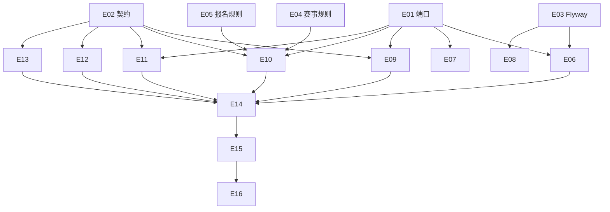

# Exec Plan

> **L4 · 交接点 1:意图 → 工程**。本文件是 `tasks.md` 的下游派生物,单向。

## 1. 任务映射

| tasks.md 条目 | 执行单元 ID | 层 |
|---|---|---|
| `2.3` 端口与 `isStoredUrl` 签名 | `E01` | L0 |
| `2.4` 对外契约 | `E02` | L0 |
| `3.1` Flyway | `E03` | L0 |
| `2.1` 赛事规则 | `E04` | L1 |
| `2.2` 报名规则 | `E05` | L1 |
| `3.2` 持久化、仓储、序列 | `E06` | L1 |
| `3.3` `isStoredUrl` 实现 | `E07` | L1 |
| `3.7` 导入与种子脚本 | `E08` | L1 |
| `3.4` 赛事查询服务 | `E09` | L2 |
| `3.5` 报名服务 | `E10` | L2 |
| `3.6` 我的报名服务 | `E11` | L2 |
| `4.1` 赛事分类与赛项接口 | `E12` | L3 |
| `4.2` 报名与详情接口 | `E13` | L3 |
| `4.3` 自动配置 | `E14` | L3 |
| `5.1` 领域单测 | `E04`、`E05` | L1 |
| `5.2` 基础设施单测 | `E07` | L1 |
| `5.3` `CqtSignupIT` | `E15` | L4 |
| `5.4` 脚本容器验证 | `E08` | L1 |
| `6.2` 文档 | `E16` | L5 |

### 未映射条目

| 条目 | 不执行的原因 |
|---|---|
| `6.1` 执行导入 / 种子、启用新赛事 | 发布动作；步骤由 `E16` 写入 `AGENTS.biz.md` |
| `7.1` 验收记录 | 上线后条目 |

### L7 测试基线

- 基线：`main`（`171bc43`）。L7 用 `openspec/project.json` 的 `commands` 全量跑。

## 2. 依赖图

| 执行单元 | 前置 | 依赖性质 |
|---|---|---|
| `E06` | `E01`、`E03` | 类型 + 数据依赖 |
| `E10` | `E01`、`E02`、`E04`、`E05` | 类型 + 调用依赖 |
| `E12`/`E13` | `E02` | 契约依赖 |
| `E15` | 全部实现 | 运行时装配 |

## 3. 分层执行计划

### Layer 0 —— 共享层,**串行**,必须先完成

| 执行单元 | 内容 | 涉及文件 |
|---|---|---|
| `E01` | `CompetitionRepository`、`EntryRepository`、`SequenceGenerator`、领域记录；`FileStorage#isStoredUrl` | `weiran-cqt-domain/.../{competition,entry,file}/` |
| `E02` | `CompetitionQueryService`、`SignupService`、`MyEntriesService` 与视图 / 命令 | `weiran-cqt-api/.../{competition,entry}/` |
| `E03` | `V202610051000__cqt_competitions.sql`、`V202610051001__cqt_entries.sql` | `weiran-cqt-infrastructure/.../db/migration/cqt/` |

**完成判据**：`./gradlew :weiran-cqt-domain:compileJava :weiran-cqt-api:compileJava` 通过。

### Layer 1–5

| 层 | 执行单元 |
|---|---|
| L1 | `E04`–`E08` |
| L2 | `E09`–`E11` |
| L3 | `E12`–`E14` |
| L4 | `E15` |
| L5 | `E16` |

## 4. 契约冻结

| 契约 | 签名 / 结构 | 定义位置 | 消费方(逐单元列出所读/所写的键) | 冻结 |
|---|---|---|---|---|
| `FileStorage#isStoredUrl` | `boolean isStoredUrl(String url)` | `domain/file/FileStorage.java` | `E07` 实现（OSS / 本地）；`E10` 调用 | ☑ |
| `CompetitionRepository` | `List<Competition> list(@Nullable Integer status, @Nullable String name)`；`Optional<Competition> findById(long id)`；`Optional<Category> findCategory(long legacyId)`；`List<Category> findEnabledChildren(long parentLegacyId)`；`List<Group> findEnabledGroups(long competitionId, long firstLegacyId, long secondLegacyId)` | `domain/competition/` | `E06` 实现；`E09` 读全部；`E10` 读 `findById`/`findCategory`/`findEnabledGroups` | ☑ |
| 赛事领域记录 | `Competition(id, legacyId, name, edition, year, description, status, registrationStart, registrationEnd, nationalEntryMode)`；`Category(legacyId, parentLegacyId, name, sortOrder, status, attachmentRequired)`；`Group(id, name)`；`EntryStage{BOTH,PROVINCIAL,NATIONAL}` | `domain/competition/` | `E04` 规则；`E06` 映射；`E09`/`E10` 读 | ☑ |
| `EntryRepository` | `Optional<ParticipationConflict> findConflict(long competitionId, long categoryLegacyId, CredentialType type, String idCard, EntryStage stage)`；`long insertEntry(NewEntry)`；`long insertPerson(NewPerson)`；`long insertParticipant(NewParticipant)`；`void insertParticipationKey(NewParticipationKey)` 冲突抛 `DuplicateParticipationException`；`void insertEntryTarget(long entryId)`；`List<MyEntryRow> findByAccount(String source, long legacyUserId)`；`boolean isParticipant(long entryId, String source, long legacyUserId)`；`Optional<EntryDetailRow> findDetail(long entryId)`；`List<TeamMemberRow> findTeam(long entryId)` | `domain/entry/` | `E06` 实现；`E10` 写；`E11` 读 | ☑ |
| `SequenceGenerator` | `long next(String name)` | `domain/entry/` | `E06` 实现；`E10` 调用 `fastapi_signup_entry` | ☑ |
| 服务接口 | `CompetitionQueryService`：`competitions(status,name)`、`firstCategories(competitionId)`、`secondCategories(parentLegacyId)`、`groups(competitionId, first, second)`；`SignupService.signup(long accountId, SignupCommand) → SignupResult(productId, entryNo)`；`MyEntriesService.list(accountId) → List<MyEntryView>`、`detail(accountId, entryId) → EntryDetailView` | `weiran-cqt-api` | `E09`–`E11` 实现；`E12`/`E13` 调用 | ☑ |

### 契约变更记录

| 时间 | 原签名 | 新签名 | 发起方 | 已通知 |
|---|---|---|---|---|
| 2026-10-05（实现中） | `insertParticipant(entryId, participant, legacyUserId, …)` | 加 `accountSourceDatabase`：人员来源库随报名账号 | `E10`（修正原系统固定写 zhongxi 导致渠道账号看不到自己报名的缺陷） | ☑（单执行者） |

## 5. 并行判据与文件所有权

| ID | 场景 | 能否与他人并行 | 原因 |
|---|---|---|---|
| WT-0 | **工作区已有他人在推进的 change** | ❌ **必须先问这一条** | 开工时核对：`git status` 干净、无其它未归档 change —— 未命中 |
| WT-1 | 纯文档 / spec / openspec 流水线自身的改动 | ✅ 可与代码改动交替推进(仍受 WT-0 约束) | 不改流水线本体 |
| WT-2 | 涉及 `weiran-common`,**或流水线本体** | ❌ 必须排队 | 未命中 |
| WT-3 | 单模块、3~5 个文件的小改动 | ✅ 可与他人交替推进(仍受 WT-0 约束) | 单业务模块 |

**单执行者、串行推进，内部无并行。**

| 执行单元 | 拥有(可写) | 只读 | 禁止触碰 |
|---|---|---|---|
| `E01`–`E07`、`E09`–`E14` | `weiran4j/weiran-cqt/**` | `weiran-common/**`、`weiran-framework/**` | 上游文件、`web/**`、`uniapp/**` |
| `E08` | `scripts/biz/import/**`、`scripts/biz/seed/**` | `常青藤20260929/**` | 同上 |
| `E15` | `weiran-app/src/test/java/com/weiran/app/Cqt*` | `IntegrationTestSupport.java` | 上游已有测试文件 |
| `E16` | `AGENTS.biz.md`、`openspec/state/bizs/{cqt_*.md,README.biz.md}` | — | `AGENTS.md`、`openspec/rules/**` |

## 6. 测试归属

| 执行单元 | 测试范围 | 测试文件 |
|---|---|---|
| `E04` | 报名窗口、阶段推导与冲突矩阵 | `CompetitionRulesTest.java`、`EntryStageTest.java` |
| `E05` | 附件、团队成员、组别、报名号 | `AttachmentTest.java`、`TeamMembersTest.java`、`EntryNumbersTest.java` |
| `E07` | `isStoredUrl` | `OssFileStorageTest`、`LocalFileStorageTest` 增用例 |
| `E08` | 脚本两遍执行 | 收尾笔记 |
| `E15` | spec 全部场景 | `CqtSignupIT.java` |

## 7. 失败与降级

| 场景 | 处置 |
|---|---|
| subagent 超时 | 不使用 subagent；单执行者 |
| 重试后仍失败 | 同一检查重试一次仍红 → 停下报告用户 |
| 产出不可用(编译不过/答非所问) | 丢弃 diff,重做该单元 |
| 同层两个单元产生文件冲突 | 不适用（串行） |
| 契约需要变更 | 记入第 4 节变更记录；若影响 design 则回 L3 |

## 8. 收尾要求

单执行者串行推进，收尾笔记合并写在 `exec/notes/E-all-实现记录.md`。

## Gate

- [x] 每条 task 都已映射,或已在「未映射条目」声明并写明原因
- [x] `explore.md` 的共享层清单已逐项比对,命中项全部落在 Layer 0
- [x] 若涉及数据库结构变更,已按 `rules/enforced/constitution.md` CP-7 与 `weiran-v1` 核对（只新增脚本；对照 FastAPI 2026 最终结构）
- [x] 依赖图无环,且「前后端」这类隐性契约依赖已识别(不是并行,是契约依赖)
- [x] Layer 0 的契约冻结表已列出待填项
- [x] 无独立的测试执行单元(测试跟随实现)
- [x] 同层执行单元的「拥有(可写)文件集」两两不相交
- [x] 每个执行单元的「禁止触碰」已写明
- [x] 失败与降级策略已填(第 7 节)
- [x] 已确认本文件未产生任何对 `tasks.md` / `design.md` / `specs/**` 的回写
