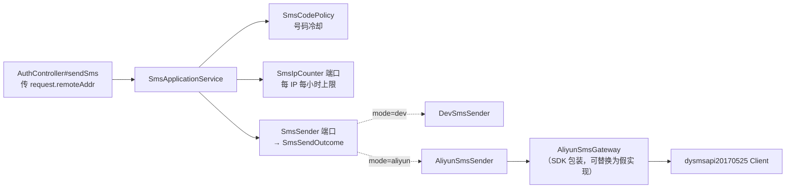

# Design

> 保持**意图粒度**:描述「行为如何」,不写逐文件的实现步骤。

## Context

- 需求来源:`interview.md`
- 现有实现调研:`explore.md`
- 关键约束:
  - **前置依赖**：上游 weiran4j `downstream-dependency-versions`（下游依赖版本扩展点）合入 main 并 `git merge upstream/main`；SDK 版本只登记在它指定的下游文件
  - 阿里云 SendSms 不幂等、业务错误为 HTTP 200 + `Code`
  - 框架 `ClientIpResolver` 不可用于限流（信任可伪造头）

## 宪法对照

<!-- openspec:required-table mark=2 note=3 -->
| 原则 | 判定 | 说明 |
|---|---|---|
| CP-1 领域层不依赖框架 | ☑ | 发送结果、IP 计数端口、限流规则在 domain，纯 Java；SDK 只出现在 infrastructure |
| CP-2 依赖方向单向向内 | ☑ | infrastructure 实现 domain 的 `SmsSender` / `SmsIpCounter` |
| CP-3 持久化类型不跨层 | ☐ | 不涉及持久化 |
| CP-4 版本号只有一个来源 | ☑ | SDK 版本只写在上游扩展点指定的下游依赖清单（上游 change 会同步修订 CP-4 的表述）；业务模块 `implementation` 不写版本 |
| CP-5 质量规则只在 build-logic 里配置 | ☑ | 不新增质量配置 |
| CP-6 豁免必须最小且带理由 | ☑ | SDK 方法 `throws Exception`：只在 SDK 包装类的一个方法里捕获 `Exception`（Error Prone / SpotBugs 若要求豁免，只在该方法上标并写理由） |
| CP-7 表结构只经 Flyway 迁移变更，已发布的迁移永不修改 | ☐ | 无表结构变更 |
| CP-8 密码只用 BCrypt，令牌吊销只走 token_version | ☐ | 不涉及 |
| CP-9 凭据不进版本库、不进日志 | ☑ | AccessKey ID / Secret 只走环境变量，`application-biz.yml` 只写占位；Secret 不进日志与异常信息；测试用假值；人工验收凭据只在本地环境变量 |
| CP-10 认证失败不泄露账号存在性 | ☐ | 发送接口不查账号（与现状一致） |
| CP-11 错误码归属决定 HTTP 状态，不靠 Controller 判断 | ☑ | 沿用 `/api-web` 已批准的偏离；新码 `SMS_SEND_FAILED` 定义在 `CqtErrors`，映射在应用层 |
| CP-12 依赖只能业务 → 基座 → 框架，反向与同层横向禁止 | ☑ | 只依赖框架与第三方 SDK |
| CP-13 业务只经基座的 weiran-base-api 接触基座 | ☐ | 不涉及基座 |
| CP-14 错误码按号段分配，业务不得占用框架与基座的号段 | ☑ | 新增 `50321`（序号 21，号段 20–39） |
| CP-15 权限码、菜单 id 与 Flyway 模块段按层隔离 | ☐ | 不涉及 |

## Architecture

## Data Flow

1. `AuthController#sendSms` 取 `HttpServletRequest#getRemoteAddr()`（经 Tomcat `RemoteIpValve` 处理后的可信客户端 IP）连同手机号交给 `SmsService#send(phone, clientIp)`。
2. 应用服务：手机号格式 → 无发送实现 503 → 号码冷却 429 → IP 上限已满 429 → 生成验证码并存储 → 调 `SmsSender#send` 得到 `SmsSendOutcome`：
   - `SENT`：IP 计数 +1，返回 `{sent:true}`（仅开发模式回显）
   - `RATE_LIMITED`：删除验证码，抛 `SMS_TOO_FREQUENT`(42920)
   - `INVALID_NUMBER`：删除验证码，抛 400「手机号格式不正确」
   - `FAILED`：删除验证码，抛 `SMS_SEND_FAILED`(50321)「短信发送失败，请稍后再试」
   失败不计入 IP 上限（阿里云只对成功发送计费）。整个过程在实例锁内（与现状一致）。
3. `AliyunSmsSender`：组装 `TemplateParam`（Jackson 序列化 `{name: code}`）→ 调 `AliyunSmsGateway#send(phone, sign, template, param)` 得 `(code, requestId)` 或异常 → 分类；记 info（成功）/ warn（失败）日志：掩码手机号、`Code`、`RequestId`。
4. `AliyunSmsGateway` 的 SDK 实现：启动时用配置构造 `Client`（endpoint、连接 / 读超时）；发送用 `RuntimeOptions(autoretry=false)`；SDK 抛出的任何异常都转成「其它失败」并只记异常类名与消息（不含凭据）。

## 跨模块契约变更(DS-1)

| 对象 | 文件 | 动作 | 消费方 |
|---|---|---|---|
| 无 | `weiran-common/.../error/WeiranErrors.java` | 不改 | — |
| 无 | `weiran-common/.../page/{PageQuery,PageResult}.java` | 不涉及 | — |

模块内契约（L4 冻结项）：
- `SmsSender#send(phone, code)` 返回 `SmsSendOutcome`（`SENT` / `RATE_LIMITED` / `INVALID_NUMBER` / `FAILED`）——**签名变更**，`DevSmsSender` 恒返回 `SENT`
- 新端口 `SmsIpCounter`：`int sentWithinHour(String ip)`、`void recordSent(String ip)`
- `SmsService#send(String phone, String clientIp)`——**签名变更**，消费方 `AuthController`、测试
- `CqtErrors.SMS_SEND_FAILED(50321, 503, "短信发送失败，请稍后再试")`

## API Design(DS-2)

| 路由 | 方法 | 所属模块 | 请求关键字段 | 返回关键字段 | 权限点 |
|---|---|---|---|---|---|
| `/api-web/auth/sendSms` | GET | `weiran-cqt-adapter` | `phone` | `{sent:true}`；新增错误：429（IP 上限 / 服务商频控）、503（发送失败） | 公开 |

## Database Design(DS-3)

| 表 | 动作 | 关键字段 | 索引 | 备注 |
|---|---|---|---|---|
| 无 | — | — | — | — |

## 权限与已知缺口(DS-4)

| 项 | 设计 |
|---|---|
| 权限点(`pam_permission`) | 无 |
| 菜单挂载 | 无 |
| 是否新增写接口却漏标 `@OperationLog` | 无写接口 |

已知缺口：IP 计数与验证码都在进程内，多实例部署失效（沿用 `AGENTS.biz.md` 的单实例前提）。

## 分层与装配(DS-5)

| 项 | 设计 |
|---|---|
| 依赖方向 | `adapter → application → domain`,`infrastructure → domain` |
| 依赖 | `weiran-cqt-infrastructure`：`implementation("com.aliyun:dysmsapi20170525")`（无版本）；版本 `4.6.0` 登记在上游扩展点指定的下游文件 |
| 自动配置 | `AliyunSmsSender` 与 SDK 网关 `@ConditionalOnProperty(mode=aliyun)`；`SmsIpCounter`（Caffeine）总是注册 |
| 配置 `weiran.cqt.sms.*` | `ip-hourly-limit`（默认 10）；`aliyun.{access-key-id, access-key-secret, sign-name, template-code, template-param-name=code, endpoint=dysmsapi.aliyuncs.com, connect-timeout=3s, read-timeout=5s}`；`application-biz.yml` 只写环境变量占位 |
| 可信 IP | `application-biz.yml` 增 `server.forward-headers-strategy: native`：Tomcat `RemoteIpValve` 只在请求来自内网 / 回环地址（默认 `internalProxies`）时采信 `X-Forwarded-For`。部署要求反向代理位于内网；否则配置 `server.tomcat.remoteip.internal-proxies` |
| IP 计数实现 | Caffeine：每 IP 一个时间戳队列（最近一小时成功发送时刻），`expireAfterAccess(1h)` 回收；按 `Clock` 判断窗口 |
| 测试配置 | `application-biz-test.yml` 保持 `mode=dev`，`ip-hourly-limit` 设大值（如 1000），避免上游与下游 IT 从回环地址大量发送时触发上限；上限用例放单独上下文的 `CqtSmsLimitIT`（`@TestPropertySource(ip-hourly-limit=2)`） |

## 前端设计(DS-6)

| 项 | 内容 |
|---|---|
| 页面/路由 | 无（uniapp 已按 `code != 200` 弹 `message`，新错误码无需改前端） |
| 菜单挂载 | 无 |
| 数据请求方式 | 不变 |
| 复用组件 | 无 |
| 权限控制点 | 无 |

## Observability

- 日志关键字段：`phone`（掩码）、`ip`、`aliyunCode`、`requestId`；成功 info、失败 warn；SDK 异常记类名与消息
- 指标：无新增
- 审计：不入库
- 告警 / 排障入口：阿里云控制台的发送记录可按 `RequestId` / `BizId` 追查；建议在控制台开启余额告警与发送频率限制（部署文档写明）

## Test Plan

| 层级 | 范围 | 命令 |
|---|---|---|
| 单元 | domain：IP 上限判定；application：失败回滚与错误映射、IP 上限、失败不计数、冷却不被失败占用；infrastructure：`AliyunSmsSender` 参数组装与 `Code` 分类（假网关）、配置不全报错信息（不含 Secret）、Caffeine IP 计数窗口 | `./gradlew :weiran-cqt-*:test` |
| 集成 | `CqtSmsLimitIT`（上限 2，按 `X-Forwarded-For` 区分 IP）；现有 `CqtAccountIT` / `CqtWebIT` 全绿（dev 模式不变） | `./gradlew :weiran-app:test` |
| 人工 | 用真实 AccessKey、签名、模板，本地 `mode=aliyun` 向测试手机发一条（AC-8） | 本地 `bootRun` + curl |
| 全量门禁 | build / test / lint | `openspec/project.json` 的 commands |

## Rollout Plan

1. 阿里云控制台：短信签名、验证码模板（变量 `${code}`、有效期 10 分钟）审核通过；创建只授短信发送权限的 RAM 子账号 AccessKey；开启余额告警
2. 部署环境配置 `WEIRAN_CQT_SMS_MODE=aliyun` 与 `WEIRAN_CQT_SMS_ALIYUN_*` 四项；确认反向代理在内网并设置 `X-Forwarded-For`
3. 发布后用测试手机走一遍注册 / 重置密码
4. 关闭 `cqt_portal_accounts.md#05`

## Rollback Plan

1. revert 锚点：本 change 的提交
2. 迁移回滚策略：无表结构变更
3. 紧急止血：把 `WEIRAN_CQT_SMS_MODE` 改回 `disabled` 重启即可停止发短信（发送接口回到 503）

## Open Questions

- 无
