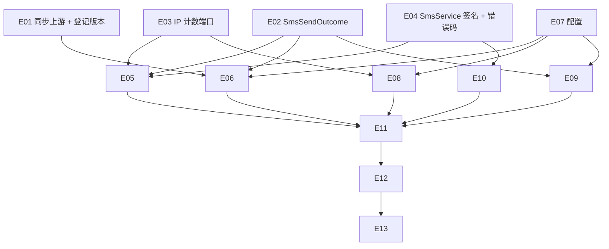

# Exec Plan

> **L4 · 交接点 1:意图 → 工程**。本文件是 `tasks.md` 的下游派生物,单向。

## 1. 任务映射

| tasks.md 条目 | 执行单元 ID | 层 |
|---|---|---|
| `0.1` 同步上游并登记 SDK 版本 | `E01` | L0 |
| `2.1` `SmsSendOutcome` / `SmsSender` 签名 | `E02` | L0 |
| `2.2` `SmsIpCounter` 与上限判定 | `E03` | L0 |
| `2.3` `SmsService#send` 加 IP、`SMS_SEND_FAILED` | `E04` | L0 |
| `3.1` 应用服务 | `E05` | L1 |
| `3.2` `AliyunSmsSender` 与 SDK 网关 | `E06` | L1 |
| `3.3` 阿里云配置与启动校验 | `E07` | L1 |
| `3.4` Caffeine IP 计数 | `E08` | L1 |
| `3.5` `application-biz.yml`、`DevSmsSender` 适配 | `E09` | L1 |
| `4.1` `sendSms` 传 IP | `E10` | L2 |
| `5.1` 领域 / 应用单测 | `E03`、`E05` | L0/L1 |
| `5.2` 基础设施单测 | `E06`、`E07`、`E08` | L1 |
| `5.3` `CqtSmsLimitIT` | `E11` | L3 |
| `6.2` 文档 | `E13` | L4 |

### 未映射条目

| 条目 | 不执行的原因 |
|---|---|
| `6.1` 阿里云控制台准备与部署环境变量 | 由用户在阿里云控制台与部署环境完成；步骤由 `E13` 写入 `AGENTS.biz.md` |
| `5.4` 人工真实发送 | 需要用户在本机用真实凭据执行（凭据不进仓库、不交给 agent）；用户要求先出 verify，结果在 L9 前补记 |
| `7.1` 验收记录 | 上线后条目 |

### L7 测试基线

- 基线：`main`（`bdbf0e7` 合并上游扩展点之后的提交）。L7 用 `openspec/project.json` 的 `commands` 全量跑。

## 2. 依赖图

| 执行单元 | 前置 | 依赖性质 |
|---|---|---|
| `E05` | `E02`、`E03`、`E04` | 类型 + 调用依赖 |
| `E06` | `E01`（SDK 可用）、`E02`、`E07` | 编译依赖 + 类型依赖 |
| `E10` | `E04` | 契约依赖 |
| `E11` | 全部实现 | 运行时装配 |

## 3. 分层执行计划

### Layer 0 —— 共享层,**串行**,必须先完成

| 执行单元 | 内容 | 涉及文件 |
|---|---|---|
| `E01` | `git merge upstream/main`；在上游扩展点指定的下游文件登记 `dysmsapi20170525:4.6.0` | 上游指定的下游依赖清单 |
| `E02` | `SmsSendOutcome` 枚举、`SmsSender#send` 返回它 | `weiran-cqt-domain/.../sms/` |
| `E03` | `SmsIpCounter` 端口、`SmsCodePolicy`（或新类）的 IP 上限判定 | `weiran-cqt-domain/.../sms/` |
| `E04` | `SmsService#send(phone, clientIp)`、`CqtErrors.SMS_SEND_FAILED` | `weiran-cqt-api` |

**完成判据**：`./gradlew :weiran-cqt-domain:check :weiran-cqt-api:check` 通过，且 `./gradlew :weiran-cqt-infrastructure:dependencies` 能解析出 `dysmsapi20170525:4.6.0`。

### Layer 1–4

| 层 | 执行单元 |
|---|---|
| L1 | `E05`–`E09` |
| L2 | `E10` |
| L3 | `E11`、`E12` |
| L4 | `E13` |

## 4. 契约冻结

| 契约 | 签名 / 结构 | 定义位置 | 消费方(逐单元列出所读/所写的键) | 冻结 |
|---|---|---|---|---|
| `SmsSendOutcome` | `enum { SENT, RATE_LIMITED, INVALID_NUMBER, FAILED }` | `weiran-cqt-domain/.../sms/SmsSendOutcome.java` | `E06` 产出四种；`E09` 产出 `SENT`；`E05` 消费四种 | ☑ |
| `SmsSender` | `SmsSendOutcome send(String phone, String code)`；`default boolean exposesCode()` | `weiran-cqt-domain/.../sms/SmsSender.java` | `E06`、`E09` 实现；`E05` 调用 | ☑ |
| `SmsIpCounter` | `int sentWithinHour(String ip)`；`void recordSent(String ip)` | `weiran-cqt-domain/.../sms/SmsIpCounter.java` | `E08` 实现；`E05` 调用 | ☑ |
| `SmsService` | `SmsSendResult send(@Nullable String phone, String clientIp)`；`verify` 不变 | `weiran-cqt-api/.../sms/SmsService.java` | `E05` 实现；`E10` 调用 | ☑ |
| `CqtErrors.SMS_SEND_FAILED` | `(50321, 503, "短信发送失败，请稍后再试")` | `weiran-cqt-api/.../error/CqtErrors.java` | `E05` 抛出；`E11` 不直接断言（dev 不会失败） | ☑ |
| 配置键 | `weiran.cqt.sms.ip-hourly-limit`；`weiran.cqt.sms.aliyun.{access-key-id,access-key-secret,sign-name,template-code,template-param-name,endpoint,connect-timeout,read-timeout}` | `CqtProperties.Sms` | `E06`/`E07`/`E08` 读；`E09` 写默认值；`E11` 覆盖上限 | ☑ |

### 契约变更记录

| 时间 | 原签名 | 新签名 | 发起方 | 已通知 |
|---|---|---|---|---|
| — | — | — | — | — |

## 5. 并行判据与文件所有权

| ID | 场景 | 能否与他人并行 | 原因 |
|---|---|---|---|
| WT-0 | **工作区已有他人在推进的 change** | ❌ **必须先问这一条** | 开工时核对 `git status`、未归档 change、`git log` —— 未命中（上游改动在 weiran4j 仓库，不在本工作区） |
| WT-1 | 纯文档 / spec / openspec 流水线自身的改动 | ✅ 可与代码改动交替推进(仍受 WT-0 约束) | 不改流水线本体 |
| WT-2 | 涉及 `weiran-common`,**或流水线本体** | ❌ 必须排队 | 未命中 |
| WT-3 | 单模块、3~5 个文件的小改动 | ✅ 可与他人交替推进(仍受 WT-0 约束) | 单业务模块 |

**单执行者、串行推进，内部无并行。**

| 执行单元 | 拥有(可写) | 只读 | 禁止触碰 |
|---|---|---|---|
| `E01` | 上游扩展点指定的下游依赖清单 | 上游合入内容 | 任何上游已有文件（含 `weiran-dependencies/build.gradle.kts`） |
| `E02`–`E10` | `weiran4j/weiran-cqt/**` | `weiran-common/**`、`weiran-framework/**` | 上游文件、`web/**`、`uniapp/**` |
| `E11` | `weiran-app/src/test/java/com/weiran/app/Cqt*`、`weiran-app/src/test/resources/application-biz-test.yml` | `IntegrationTestSupport.java` | 上游已有测试文件 |
| `E13` | `AGENTS.biz.md`、`openspec/state/bizs/cqt_portal_accounts.md` | — | `AGENTS.md`、`openspec/rules/**` |

## 6. 测试归属

| 执行单元 | 测试范围 | 测试文件 |
|---|---|---|
| `E03` | IP 上限判定 | `weiran-cqt-domain/src/test/.../sms/` |
| `E05` | 失败回滚与映射、IP 上限、失败不计数 | `SmsApplicationServiceTest.java` |
| `E06`/`E07` | 参数组装、`Code` 分类、配置不全报错 | `AliyunSmsSenderTest.java` |
| `E08` | 一小时窗口 | `CaffeineSmsIpCounterTest.java` |
| `E11` | IP 上限端到端 | `CqtSmsLimitIT.java` |
| `E12` | 真实发送 | 人工，结论写收尾笔记（凭据不落盘） |

## 7. 失败与降级

| 场景 | 处置 |
|---|---|
| subagent 超时 | 不使用 subagent；单执行者 |
| 重试后仍失败 | 同一检查重试一次仍红 → 停下报告用户 |
| 产出不可用(编译不过/答非所问) | 丢弃 diff,重做该单元 |
| 同层两个单元产生文件冲突 | 不适用（串行） |
| 契约需要变更 | 记入第 4 节变更记录；若影响 design 则回 L3 |
| 上游扩展点未合入 | `E01` 阻塞，整个 L5 等待，不在下游临时改上游 BOM |
| SDK 传递依赖与现有依赖冲突 | 先看 `dependencies` 报告；在下游依赖清单约束或排除，记入收尾笔记 |

## 8. 收尾要求

单执行者串行推进，收尾笔记合并写在 `exec/notes/E-all-实现记录.md`。

## Gate

- [x] 每条 task 都已映射,或已在「未映射条目」声明并写明原因
- [x] `explore.md` 的共享层清单已逐项比对,命中项全部落在 Layer 0
- [x] 若涉及数据库结构变更,已按 `rules/enforced/constitution.md` CP-7 与 `weiran-v1` 核对（无表结构变更）
- [x] 依赖图无环,且「前后端」这类隐性契约依赖已识别(不是并行,是契约依赖)
- [x] Layer 0 的契约冻结表已列出待填项
- [x] 无独立的测试执行单元(测试跟随实现)
- [x] 同层执行单元的「拥有(可写)文件集」两两不相交
- [x] 每个执行单元的「禁止触碰」已写明
- [x] 失败与降级策略已填(第 7 节)
- [x] 已确认本文件未产生任何对 `tasks.md` / `design.md` / `specs/**` 的回写
