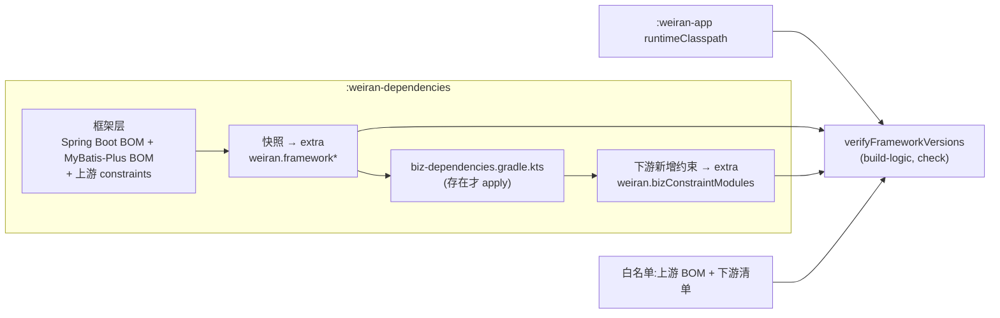

# Design

> 保持**意图粒度**:描述「行为如何」,不写逐文件的实现步骤。

## Context

- 需求来源:`interview.md`
- 现有实现调研:`explore.md`
- 关键约束:applied 脚本无 `api(...)` 访问器;`platform()` 冲突取高;现有上游已有 2 处传递漂移;质量规则只在 build-logic(CP-5)。

## 宪法对照

<!-- openspec:required-table mark=2 note=3 -->
| 原则 | 判定 | 说明 |
|---|---|---|
| CP-1 领域层不依赖框架 | ☐ | 不改 Java 代码 |
| CP-2 依赖方向单向向内 | ☐ | 不改模块间依赖 |
| CP-3 持久化类型不跨层 | ☐ | 不涉及 |
| CP-4 版本号只有一个来源 | ⚠ | **偏离并连带修订宪法**:版本来源由一处变为两处——框架版本只在 `weiran-dependencies/build.gradle.kts`,业务版本只在下游独占的 `biz-dependencies.gradle.kts`,各自仍只有一处,模块脚本仍不得写版本。代价:多一处会过期的事实,由 `verifyFrameworkVersions` 守住两处不重叠(下游不得约束框架已管理的模块)。本 change 同步改写 CP-4 |
| CP-5 质量规则只在 build-logic 里配置 | ☑ | 检查任务写在 build-logic 的 boot-app 约定插件,`weiran-app` 脚本不加任何配置 |
| CP-6 豁免必须最小且带理由 | ☑ | 漂移白名单逐条 `g:a → 理由`,理由为空即失败;不再漂移的条目告警提示清理 |
| CP-7 表结构只经 Flyway 迁移变更，已发布的迁移永不修改 | ☐ | 不涉及 |
| CP-8 密码只用 BCrypt，令牌吊销只走 token_version | ☐ | 不涉及 |
| CP-9 凭据不进版本库、不进日志 | ☐ | 不涉及 |
| CP-10 认证失败不泄露账号存在性 | ☐ | 不涉及 |
| CP-11 错误码归属决定 HTTP 状态，不靠 Controller 判断 | ☐ | 不涉及 |
| CP-12 依赖只能业务 → 基座 → 框架，反向与同层横向禁止 | ☐ | 只管版本,不改依赖关系 |
| CP-13 业务只经基座的 weiran-base-api 接触基座 | ☐ | 不涉及 |
| CP-14 错误码按号段分配，业务不得占用框架与基座的号段 | ☐ | 不涉及 |
| CP-15 权限码、菜单 id 与 Flyway 模块段按层隔离 | ☐ | 不涉及 |

## Architecture



## Data Flow

1. **配置期(BOM)**:声明两个框架 BOM 与上游 constraints → 把这些坐标(`g:a:v`,不含 `com.weiran:*` 本仓模块)记入 extra →
   若 `biz-dependencies.gradle.kts` 存在则 apply → 对比 apply 前后 `api` 配置的约束,得到下游新增约束的 `g:a` 集合记入 extra。
   上游白名单以 `Map<g:a, 理由>` 记入 extra;下游白名单由下游清单写入另一个 extra 键。
2. **执行期(`verifyFrameworkVersions`,`weiran-app`)**:
   - 解析 `runtimeClasspath`,取全部外部模块的 `g:a → 实际版本`;
   - 建 detached configuration:框架 BOM 以 `platform` 引入(保持传递,否则约束丢失)、上游 constraints 作为约束、每个 `g:a` 以**非传递**、不带版本的依赖请求;
     解析成功的即框架管理的 `g:a → 框架版本`;同一 detached configuration 也请求下游新增约束的 `g:a`,解析成功即「下游约束了框架依赖」;
   - 判定:①下游约束了框架依赖 → 失败(不可豁免);②实际 ≠ 框架且不在两份白名单 → 失败;③白名单理由为空 → 失败;④白名单条目已不漂移 → warning。
   - 失败信息逐条列出,并说明怎么处理(去掉下游约束 / 在下游清单加白名单写理由)。

## 跨模块契约变更(DS-1)

| 对象 | 文件 | 动作 | 消费方 |
|---|---|---|---|
| — | `weiran-common/**` | 不改 | — |
| `:weiran-dependencies` 的 extra:`weiran.frameworkPlatforms: List<String>`、`weiran.frameworkConstraints: List<String>`、`weiran.bizConstraintModules: List<String>`、`weiran.versionDriftAllowlist: Map<String,String>`、`weiran.bizVersionDriftAllowlist: Map<String,String>` | `weiran-dependencies/build.gradle.kts`(下游键由下游清单写) | 新增(先冻结) | build-logic `verifyFrameworkVersions` |
| 下游清单写法 | 契约 §2.2 | 新增 | 下游 |

下游清单示例(契约 §2.2 同步):

```kotlin
// weiran4j/weiran-dependencies/biz-dependencies.gradle.kts —— 下游独占,上游永不创建
// applied 脚本里没有 api(...) 访问器,配置名写成字符串
dependencies {
    constraints {
        add("api", "com.aliyun:dysmsapi20170525:<版本>")
    }
    add("api", platform("<第三方 BOM 坐标>:<版本>"))   // 需要时
}
// 业务库把框架依赖传递拉高、且确认可接受时才写;理由必填
extra["weiran.bizVersionDriftAllowlist"] = mapOf(
    "com.squareup.okhttp3:okhttp" to "dysmsapi 需要 4.12,已验证与框架兼容",
)
```

## API Design(DS-2)

| 路由 | 方法 | 所属模块 | 请求关键字段 | 返回关键字段 | 权限点 |
|---|---|---|---|---|---|
| — | — | — | 不涉及 | — | — |

## Database Design(DS-3)

| 表 | 动作 | 关键字段 | 索引 | 备注 |
|---|---|---|---|---|
| — | 无 | — | — | — |

## 权限与已知缺口(DS-4)

| 项 | 设计 |
|---|---|
| 权限点 | 不涉及 |
| 菜单挂载 | 不涉及 |
| 是否新增写接口却漏标 `@OperationLog` | 不涉及 |

## 分层与装配(DS-5)

| 项 | 设计 |
|---|---|
| 依赖方向 | 不变 |
| 新模块的 `@AutoConfiguration` | 不涉及 |
| `weiran-app` 依赖聚合 | 不变;`check` 经约定插件多一个依赖任务 |
| 上游白名单初始内容 | `org.yaml:snakeyaml`(Spring Boot BOM 内 jackson-dataformat-yaml 2.21.4 需要 2.5,BOM 管 2.4)、`org.apache.commons:commons-lang3`(springdoc → swagger-core-jakarta 需要 3.20.0,BOM 管 3.17.0) |

## 前端设计(DS-6)

| 项 | 内容 |
|---|---|
| 页面/路由 | 不涉及 |
| 菜单挂载 | 不涉及 |
| 数据请求方式 | 不涉及 |
| 复用组件 | 不涉及 |
| 权限控制点 | 不涉及 |

## Observability

- 日志关键字段:任务输出「检查了 N 个运行时模块,其中 M 个由框架管理,豁免 K 条」
- 指标:无
- 审计:不涉及
- 告警 / 排障入口:失败信息含 `g:a`、框架版本、实际版本、处理办法;可用 `dependencyInsight` 追来源

## Test Plan

| 层级 | 范围 | 命令 |
|---|---|---|
| 构建手工验证 | 无清单:`runtimeClasspath` 前后一致、任务通过;临时清单四场景(未管理依赖可解析 / 钉高失败 / 钉低失败 / 空理由失败);验完删除 | `:weiran-app:dependencies`、`:weiran-app:verifyFrameworkVersions` |
| 全量门禁 | 含新任务 | `project.json` 的 build / test / lint |

## Rollout Plan

1. 合入 main;下游 merge 后创建 `biz-dependencies.gradle.kts` 登记阿里云 SDK

## Rollback Plan

1. revert 锚点:本 change 的合入 commit
2. 迁移回滚策略:无迁移
3. 回滚后下游清单不再被 apply,下游依赖将缺版本、解析失败——下游需同步移除或改回上游 BOM

## Open Questions

- 无
