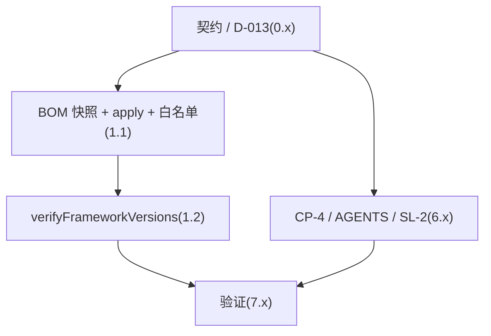

# Exec Plan

## 1. 任务映射

| tasks.md 条目 | 执行单元 ID | 层 |
|---|---|---|
| `0.1-0.2` 契约 / 决策 | `E1` | L0 |
| `1.1-1.2` BOM 与检查任务 | `E1` | L0 |
| `6.1-6.2` 规则与文档 | `E1` | L0 |
| `7.1-7.3` 测试与验证 | `E1` | L0 |

### 未映射条目

| 条目 | 不执行的原因 |
|---|---|
| `8.1` 通知下游 | 合入 main 后的发布动作 |
| `9.1` 写 `artifacts.md` | 上线后动作,L8 通过后、归档前写 |

### L7 测试基线

- 基线:`main`(`f711fb1`),全量 `project.json` 三条命令。

## 2. 依赖图

| 执行单元 | 前置 | 依赖性质 |
|---|---|---|
| `E1` | 无 | 单元内:检查任务读 BOM 冻结的 extra 键(契约依赖) |

## 3. 分层执行计划

### Layer 0 —— 共享层,**串行**,必须先完成

| 执行单元 | 内容 | 涉及文件 |
|---|---|---|
| `E1` | 全部任务 | 见第 5 节 |

**完成判据**:7.1-7.3 完成。

## 4. 契约冻结

| 契约 | 签名 / 结构 | 定义位置 | 消费方(逐单元列出所读/所写的键) | 冻结 |
|---|---|---|---|---|
| BOM extra | `weiran.frameworkPlatforms: List<String>`(`g:a:v`)、`weiran.frameworkConstraints: List<String>`(`g:a:v`,不含 `com.weiran:*`)、`weiran.bizConstraintModules: List<String>`(`g:a`)、`weiran.versionDriftAllowlist: Map<String,String>`、`weiran.bizVersionDriftAllowlist: Map<String,String>`(下游写,可缺省) | `weiran-dependencies/build.gradle.kts` | `E1` BOM 写前四个;下游清单写第五个;`verifyFrameworkVersions` 读全部 | ☑ |
| 下游清单路径 | `weiran4j/weiran-dependencies/biz-dependencies.gradle.kts` | 同上 | 下游 | ☑ |

### 契约变更记录

| 时间 | 原签名 | 新签名 | 发起方 | 已通知 |
|---|---|---|---|---|
| — | — | — | — | — |

## 5. 并行判据与文件所有权

| ID | 场景 | 能否与他人并行 | 原因 |
|---|---|---|---|
| WT-0 | **工作区已有他人在推进的 change** | ❌ **必须先问这一条** | 开工时 `git status` 干净、无其他活跃 change —— 未命中 |
| WT-1 | 纯文档 / spec / openspec 流水线自身的改动 | ✅ 可与代码改动交替推进(仍受 WT-0 约束) | 含规则文档改动 |
| WT-2 | 涉及 `weiran-common`,**或流水线本体** | ❌ 必须排队 | 改宪法 CP-4(`rules/**`),期间不与其他改流水线的 change 同时推进 |
| WT-3 | 单模块、3~5 个文件的小改动 | ✅ 可与他人交替推进(仍受 WT-0 约束) | 不适用 |

**单执行单元,内部无并行。**

| 执行单元 | 拥有(可写) | 只读 | 禁止触碰 |
|---|---|---|---|
| `E1` | `weiran4j/weiran-dependencies/build.gradle.kts`、`weiran4j/build-logic/src/main/kotlin/com/weiran/gradle/**`、`weiran4j/docs/{00-决策记录,01-架构与接口契约}.md`、`openspec/rules/enforced/{constitution,project}.md`、`AGENTS.md`、本 change 目录 | `weiran-app/**`、`settings.gradle.kts` | `weiran4j/weiran-{common,framework,base}/**`、`web/**`、`openspec/{check.mjs,guards,schemas}/**` |

临时 `biz-dependencies.gradle.kts` 只在 7.2 中存在,验完删除。

## 6. 测试归属

| 执行单元 | 测试范围 | 测试文件 |
|---|---|---|
| `E1` | 构建手工验证(build-logic 无测试目录) | 无,记录在 notes / verify |

## 7. 失败与降级

| 场景 | 处置 |
|---|---|
| subagent 超时 | 不适用:orchestrator 亲自做 |
| 重试后仍失败 | 同一检查重试一次仍红 → 停下展示日志给用户 |
| 产出不可用(编译不过/答非所问) | 回退该文件改动重做 |
| 同层两个单元产生文件冲突 | 不适用 |
| 契约需要变更 | 更新第 4 节;影响 design 则回 L3 |

## 8. 收尾要求

完成时写 `exec/notes/E1-dependency-versions.md`。

## Gate

- [x] 每条 task 都已映射,或已在「未映射条目」声明并写明原因
- [x] `explore.md` 的共享层清单已逐项比对,命中项全部落在 Layer 0
- [x] 若涉及数据库结构变更,已按 `rules/enforced/constitution.md` CP-7 与 `weiran-v1` 核对(不涉及)
- [x] 依赖图无环,且「前后端」这类隐性契约依赖已识别(不是并行,是契约依赖)
- [x] Layer 0 的契约冻结表已列出待填项
- [x] 无独立的测试执行单元(测试跟随实现)
- [x] 同层执行单元的「拥有(可写)文件集」两两不相交
- [x] 每个执行单元的「禁止触碰」已写明
- [x] 失败与降级策略已填(第 7 节)
- [x] 已确认本文件未产生任何对 `tasks.md` / `design.md` / `specs/**` 的回写
