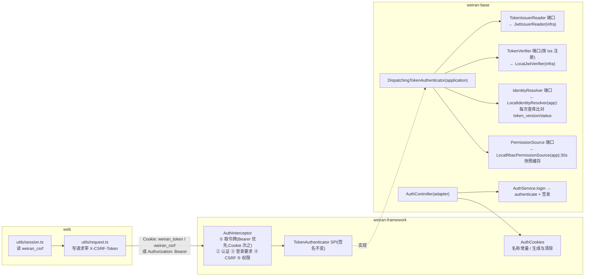

# Design

> 保持**意图粒度**:描述「行为如何」,不写逐文件的实现步骤。

## Context

- 需求来源:`interview.md`(7 条问题,3 项人工决策:登录响应按请求头切换、Strict + 双提交 CSRF、写死同源)
- 现有实现调研:`explore.md`
- 关键约束:
  - 框架不能依赖基座(CP-12),所以 Cookie 和 CSRF 机制放在框架,签发放在基座;
  - `*-domain` 不依赖框架,端口签名只用领域类型;
  - 拦截器在全部检查通过之前不能写入 `CurrentUser`;
  - 无下游、无生产部署,配置键和契约可以直接改,不留兼容层;
  - 不加任何依赖,本次没有 Flyway 迁移。

## 宪法对照

<!-- openspec:required-table mark=2 note=3 -->
| 原则 | 判定 | 说明 |
|---|---|---|
| CP-1 领域层不依赖框架 | ☑ | 新端口 `TokenVerifier` / `TokenIssuerReader` / `IdentityResolver` / `PermissionSource` 与值对象 `VerifiedToken` / `AuthState` / `PrincipalSnapshot` 只用 JDK 类型与领域类型;`LoginUser`(框架类型)只在 application 层组装 |
| CP-2 依赖方向单向向内 | ☑ | `DispatchingTokenAuthenticator`(application)依赖 domain 端口;`LocalJwtVerifier`、`JwtIssuerReader`、`MybatisUserRepository.findAuthState`(infrastructure)实现 domain 端口;adapter 只调用 `AuthService` 与框架的 `AuthCookies` |
| CP-3 持久化类型不跨层 | ☑ | `findAuthState` 在 infrastructure 内部用 Mapper 只查两列,对外返回领域值对象 `AuthState`,不暴露 `*DO` / `Wrappers` |
| CP-4 版本号只有一个来源 | ☐ | 不新增依赖、不改 BOM;`jjwt` 的 `requireIssuer` / `requireAudience` 来自已钉的 0.13.0;CI 中的 Action 版本属于 GitHub 工作流,不在 Gradle 版本体系内 |
| CP-5 质量规则只在 build-logic 里配置 | ☐ | 不改 `build-logic`;CI 直接调用现有的 `./gradlew check`,不在工作流里另配质量规则 |
| CP-6 豁免必须最小且带理由 | ☑ | 只沿用 `JwtTokenCodec` 已有的 jjwt `Date` 边界 `@SuppressForbidden`(方法级、带理由);新增代码不加新的豁免 |
| CP-7 表结构只经 Flyway 迁移变更，已发布的迁移永不修改 | ☐ | 本次没有表结构与种子数据变更;`findAuthState` 只读已有的 `token_version`、`status` 列 |
| CP-8 密码只用 BCrypt，令牌吊销只走 token_version | ⚠ | **连带修订宪法**。本地令牌部分保持不变并加强:吊销仍只走 `token_version`,且判定改为每次请求查库(不再经过 30s 缓存)。偏离点在于条文本身:原文「不得用黑名单表或延长/缩短 TTL 代替吊销」无差别适用于所有令牌,会让将来由外部签发方签发的联邦令牌无法落地(它们没有本地 `token_version`,只能靠短 TTL 加签发方吊销)。修订方式:原条款限定为「本地签发的令牌」;新增一段「联邦令牌」条款,规定短 TTL 上限与签发方吊销方式,并明确**在实现联邦校验的 change 落地前,`TokenVerifier` 只能有本地实现**。代价:宪法动态被 `L2c` 读取,本 change 改动后需复核自身的 design 表(标题不变,不受影响) |
| CP-9 凭据不进版本库、不进日志 | ☑ | 拦截器的 CSRF 失败日志与 `JwtIssuerReader` 的解析失败日志只记失败类型,不记令牌、CSRF 值或 Cookie 原文;CSRF 随机串用 `SecureRandom` 生成;CI 不引用任何密钥(集成测试的 JWT 密钥是测试 profile 里的假值) |
| CP-10 认证失败不泄露账号存在性 | ☑ | `authenticate` 保留 `DUMMY_HASH` 空跑与统一的 40101 + 同一提示语;`login` 复用它,不再自带一份凭据校验 |
| CP-11 错误码归属决定 HTTP 状态，不靠 Controller 判断 | ☑ | CSRF 失败在拦截器里抛 `BizException(CommonErrors.CSRF_REJECTED)`,状态码 403 由错误码决定;登录接口只决定交付方式(写 Cookie 或返回令牌),不手写状态码 |
| CP-12 依赖只能业务 → 基座 → 框架，反向与同层横向禁止 | ☑ | Cookie 名称、CSRF 校验、`AuthCookieProperties` 都在 `weiran-framework`;基座 adapter 调用框架的 `AuthCookies` 下发 Cookie;框架不引用基座的任何类型 |
| CP-13 业务只经基座的 weiran-base-api 接触基座 | ☑ | 新能力 `authenticate` 加在 `weiran-base-api` 的 `AuthService` 上,符合「业务需要的基座能力先在 api 增加接口」的路径;本次没有业务模块 |
| CP-14 错误码按号段分配，业务不得占用框架与基座的号段 | ☑ | 新错误码 `40302` 的序号 `02` 位于框架与基座段(`00`–`19`),登记在 `CommonErrors`;契约 §4 的错误码表同步 |
| CP-15 权限码、菜单 id 与 Flyway 模块段按层隔离 | ☐ | 不新增权限码、菜单行和 Flyway 脚本 |

## Architecture

## Data Flow

1. **浏览器登录**:`POST /api/auth/login`(不带 `X-Auth-Mode`)→ `AuthService.login`:
   - 先 `authenticate`:校验凭据,失败写日志并抛异常;
   - 再 `recordLogin`、签发带 `iss`/`aud` 的 JWT、写成功日志;
   - 返回 `LoginResult(accessToken, tokenType, expiresIn, userId)`。

   Controller 看到不是令牌模式,用 `AuthCookies.issue(token, ttl, userId)` 写两个 `Set-Cookie`,然后返回把 `accessToken` 置空的 `LoginResult`。前端收到成功响应后,通知会话 store 重新读取 Cookie。
2. **令牌模式登录**:带 `X-Auth-Mode: token` → 原样返回含 `accessToken` 的 `LoginResult`,不写 Cookie。
3. **请求认证**(拦截器,只拦 `/api/**`):
   1. 有 `Authorization: Bearer` 就用它(来源记为 BEARER);否则读 `weiran_token` Cookie(来源记为 COOKIE);
   2. `TokenAuthenticator.authenticate(token)`;
   3. 非 `@PublicApi` 且未认证 → 40100;
   4. 非 `@PublicApi`、来源为 COOKIE、方法为 POST/PUT/PATCH/DELETE 时,要求 `X-CSRF-Token` 头与 `weiran_csrf` Cookie 都存在、两者常量时间比较相等、且 Cookie 值的 userId 前缀等于当前用户 id,否则 40302;
   5. 检查 `@RequiresPermission` → 40300;
   6. 写入 `CurrentUser`。
4. **认证内部**(`DispatchingTokenAuthenticator`):
   1. `TokenIssuerReader` 不验签,只读出 `iss`;读不出就无效;
   2. 按 `iss` 取 `TokenVerifier`,取不到就无效;
   3. verifier 验签、验 `exp`/`aud`,产出 `VerifiedToken(issuer, subject, version)`;
   4. `IdentityResolver` 把它映射为 userId,同时判定吊销:本地实现每次 `findAuthState(id)`,要求用户存在、`status=enabled`、`token_version == ver`;
   5. `PermissionSource.load(userId)` 取用户名、昵称、角色、权限的快照(本地实现走 30s 缓存,`evict` 语义不变);
   6. 组装 `LoginUser`。

   任何一步失败都返回 `Optional.empty()`,由拦截器统一输出 401。
5. **登出**:`POST /api/auth/logout` 照常写登出日志;Controller 再用 `AuthCookies.clear()` 写两个 `Max-Age=0`。
6. **前端会话失效**:请求层遇到 40100 → `clearSession()` 删除 `weiran_csrf`(JS 删不掉 HttpOnly 的 `weiran_token`,它本就已失效)→ 订阅方重渲染 → 路由守卫回到登录页。

<!-- openspec:slot design-sections -->

## 跨模块契约变更(DS-1)

| 对象 | 文件 | 动作 | 消费方 |
|---|---|---|---|
| `CommonErrors.CSRF_REJECTED(40302, 403, "请求校验失败，请刷新页面后重试")` | `weiran-common/.../error/CommonErrors.java` | 新增 | `weiran-framework` 拦截器;前端只当作普通业务错误 Toast(不清会话) |
| `AuthCookies`:常量 `TOKEN_COOKIE="weiran_token"`、`CSRF_COOKIE="weiran_csrf"`、`CSRF_HEADER="X-CSRF-Token"`、`AUTH_MODE_HEADER="X-Auth-Mode"`、`AUTH_MODE_TOKEN="token"`;`issue(token, ttl, userId)` / `clear()` 返回 `List<ResponseCookie>`;`csrfUserId(value)` 解析前缀 | `weiran-framework/.../auth/AuthCookies.java`(新) | 新增 | 框架拦截器、基座 `AuthController`、集成测试;前端按同名常量硬编码 |
| `AuthCookieProperties`(`weiran.auth.cookie.secure`,默认 `true`) | `weiran-framework/.../auth/AuthCookieProperties.java`(新) | 新增 | 框架自动配置 |
| `TokenAuthenticator` SPI | `weiran-framework/.../auth/TokenAuthenticator.java` | **不变**(只把参数名、Javadoc 从「bearerToken」改为「token」) | 基座 |
| `AuthService.authenticate(String username, String password, ClientContext client) → AuthenticatedUser(long id, String username)` | `weiran-base-api/.../auth/` | 新增 | 基座 adapter;将来的外部登录与 IAM |
| `LoginResult(@Nullable String accessToken, String tokenType, long expiresIn, long userId)` | `weiran-base-api/.../auth/LoginResult.java` | 改造:`accessToken` 可空,新增 `userId` | `AuthController`、前端 `types/api.ts`、集成测试 |
| 领域端口与值对象:`TokenIssuerReader`、`TokenVerifier { String issuer(); Optional<VerifiedToken> verify(String) }`、`IdentityResolver { Optional<Long> resolve(VerifiedToken) }`、`PermissionSource { Optional<PrincipalSnapshot> load(long userId) }`、`VerifiedToken(String issuer, String subject, @Nullable Integer version)`、`AuthState(int tokenVersion, boolean enabled)`、`PrincipalSnapshot(String username, String nickname, Set<String> roles, Set<String> permissions)`;`TokenCodec` 收窄为 `issue` + `ttl`(不再负责解析);`TokenClaims` 不变 | `weiran-base-domain/.../auth/` | 新增 / 改造 | 基座 application、infrastructure |
| `UserRepository.findAuthState(long id) → Optional<AuthState>` | `weiran-base-domain/.../user/UserRepository.java` | 新增 | `LocalIdentityResolver` |

> 改动后需 `./gradlew :weiran-common:check :weiran-framework:check` 通过;以上契约在 L4 冻结。

## API Design(DS-2)

| 路由 | 方法 | 所属模块 | 请求关键字段 | 返回关键字段 | 权限点 |
|---|---|---|---|---|---|
| `/api/auth/login` | POST | `weiran-base-adapter/.../web/AuthController` | `{username, password}`;可选请求头 `X-Auth-Mode: token` | 默认:`{tokenType:"Bearer", expiresIn, userId}` + 两个 `Set-Cookie`;令牌模式:`{accessToken, tokenType, expiresIn, userId}`,不写 Cookie | 🔓(不做 CSRF 校验) |
| `/api/auth/logout` | POST | 同上 | —(Cookie 认证时需带 `X-CSRF-Token`) | `null` + 两个清除 Cookie 的 `Set-Cookie` | 🔑 |
| 其余全部 `/api/**` | — | — | 认证方式:Bearer 头**或** `weiran_token` Cookie;Cookie 认证的写请求必须带 `X-CSRF-Token` | 不变 | 不变 |

- 统一响应包络由 `weiran-framework` 的 `ApiResponseBodyAdvice` 产生(`code` 为数字 `0`);本次不改包络。
- 新错误码:`40302`(403)CSRF 校验失败。
- **部署约定**(写入契约 §4):前端页面与 `/api` 必须同源(开发用 vite 代理,线上用反向代理),不提供 CORS。
- **Cookie 属性**:
  - `weiran_token`:`HttpOnly; SameSite=Strict; Path=/api; Max-Age=<ttl 秒>`;
  - `weiran_csrf`:`SameSite=Strict; Path=/; Max-Age=<ttl 秒>`,值为 `<userId>.<32 字节随机数的 base64url>`;
  - 两者都按配置加 `Secure`。
- **JWT**:HS256,载荷 `sub`(userId)、`username`、`ver`、`iss`、`aud`、`iat`、`exp`。`iss`/`aud` 取自 `weiran.auth.jwt.issuer|audience`,默认均为 `weiran4j`。
- **配置键**:`weiran.auth.jwt.secret|ttl|issuer|audience`,对应环境变量 `WEIRAN_JWT_SECRET|TTL|ISSUER|AUDIENCE`;`weiran.auth.cookie.secure`,对应 `WEIRAN_COOKIE_SECURE`;`weiran.system.bcrypt-strength` 不变。

## Database Design(DS-3)

| 表 | 动作 | 关键字段 | 索引 | 备注 |
|---|---|---|---|---|
| `sys_user` | 只读(新查询) | `id`、`token_version`、`status` | 主键 | `findAuthState` 每次请求执行 `SELECT token_version, status FROM sys_user WHERE id = ?`(`sys_user` 物理删除,查不到即视为用户已删除);**不新增 Flyway 脚本** |

## 权限与已知缺口(DS-4)

| 项 | 设计 |
|---|---|
| 权限点 | 不新增。`@RequiresPermission` 的判定仍是 `LoginUser.hasPermissions`;权限集合由 `LocalRbacPermissionSource` 产出,与现有 `AuthorizationResolver` 的结果完全一致 |
| 菜单挂载 | 不涉及 |
| 是否新增写接口却漏标 `@OperationLog` | 不新增写接口。登录 / 登出仍只写登录日志(`sys_login_log`),不记操作日志(沿用现状) |
| 已知缺口 | 角色、权限变更在多节点下仍有最多 30s 的窗口(artifact.md#02 剩余部分);CSRF 只覆盖非 `@PublicApi` 的写接口(登录接口是公开接口,跨站 JSON POST 会被浏览器的 CORS 预检挡住) |

## 分层与装配(DS-5)

| 项 | 设计 |
|---|---|
| 依赖方向 | domain 定义端口;application 实现 `DispatchingTokenAuthenticator`、`LocalIdentityResolver`、`LocalRbacPermissionSource`(依赖 domain 端口与 `AuthorizationResolver`);infrastructure 实现 `LocalJwtVerifier`、`JwtIssuerReader`(都由改造后的 `JwtTokenCodec` 或其同包类承担)和 `findAuthState`;adapter 依赖 `AuthService` 与框架的 `AuthCookies` |
| 自动配置 | `SystemApplicationAutoConfiguration` 的 `@Import`:去掉 `SystemTokenAuthenticator`,加入上述三个类;`SystemInfrastructureAutoConfiguration` 注册 `TokenCodec`、`TokenVerifier`、`TokenIssuerReader` Bean,并启用新的 `AuthJwtProperties("weiran.auth.jwt")`;框架的 `WeiranFrameworkAutoConfiguration` 启用 `AuthCookieProperties`,并注入到 `AuthInterceptor` |
| 多个 verifier | `DispatchingTokenAuthenticator` 收集全部 `TokenVerifier` Bean,按 `issuer()` 建映射;发现重复 issuer 时启动失败 |
| `weiran-app` | 只改 `application.yml`(配置键)与测试;`application-local.yml.example`(如果存在)把 `weiran.auth.cookie.secure` 设为 `false` |

## 前端设计(DS-6)

| 项 | 内容 |
|---|---|
| 页面/路由 | 不新增页面、不改路由。登录页、锁屏、个人中心的界面不变 |
| 菜单挂载 | 不涉及 |
| 会话 store | `utils/token.ts` 替换为 `utils/session.ts`:<ul><li>`useSession()` / `getSession()` 读 `document.cookie` 里的 `weiran_csrf`;</li><li>`sessionUserId(session)` 解析 userId;</li><li>`clearSession()` 写 `weiran_csrf=; Max-Age=0; Path=/` 并通知订阅方;</li><li>`refreshSession()` 在登录成功后通知订阅方;</li><li>订阅时监听窗口 `focus` / `visibilitychange`,用于跨标签页同步。</li></ul>沿用 `useSyncExternalStore` |
| 数据请求方式 | `request.ts`:<ul><li>不再发 `Authorization` 头;</li><li>`fetch` 显式 `credentials: 'same-origin'`;</li><li>非 GET 请求在有会话时加 `X-CSRF-Token: <weiran_csrf>`;</li><li>会话失效时调用 `clearSession()`;</li><li>40302 按普通业务错误 Toast,不清会话。</li></ul> |
| 登录态消费方 | `useAuth`、`hooks/queries/auth.ts`、`PreferencesProvider` 把 `token` 换成 `session`,含义不变:是否登录、按会话隔离的 query key、偏好缓存归属(`sessionUserId`)。`useAuth.login` 不再 `setToken`,改为调用 `refreshSession()`;`clearSession`(useAuth 内的同名函数)改为调用 session 模块的 `clearSession()` |
| 类型 | `types/api.ts`:`LoginResult { accessToken?: string; tokenType: string; expiresIn: number; userId: number }` |
| 同源约束 | `vite.config.ts` 在 `VITE_API_BASE_URL` 以 `http://` 或 `https://` 开头时抛错并说明原因(dev 与 build 都会报);`config.ts` 的注释同步 |
| 测试 | 新增测试 helper `src/test/session.ts`(`signIn(userId)` 写 `weiran_csrf` Cookie,`signOut()` 清除);把现有测试里的 `setToken` / `getToken` 机械替换为它;`token.test.ts` 改为 `session.test.ts` |
| 复用组件 / 权限控制点 | 不变 |

<!-- /openspec:slot design-sections -->

## 宪法与决策文档的改动

- **CP-8 修订**(标题不变,正文分两段):
  - **本地签发的令牌**:原条款不变,并补一句「认证时 `token_version` 与账号状态必须从库中读取,不得经过跨请求缓存」。
  - **联邦令牌**(由其他签发方签发、经 `TokenVerifier` 校验的令牌):
    - 吊销由签发方负责,本地依靠短有效期(≤ 15 分钟)与签发方的吊销 / 自省机制;
    - 不得自建黑名单表;
    - 在实现联邦校验的 change 通过 L3 之前,系统 `MUST` 只注册本地 `TokenVerifier`。

  「为什么」一段同步补上「多节点下缓存会让『立即失效』有窗口」。
- **D-014**(写入 `weiran4j/docs/00-决策记录.md`),四条结论各附理由:
  1. 认证拆成验令牌 / 认身份 / 定权限三段,按 `iss` 分发;
  2. 外部身份(CAS / OIDC / 钉钉等)统一通过将来的 `sys_user_identity` 绑定表映射到本地用户,不按用户名直接对应;
  3. 统一身份平台先采购现成产品(Keycloak / IDaaS),确有需要再以 weiran4j 的 fork 自研;
  4. 如果将来引入 Spring Authorization Server,Spring Security 过滤器链只匹配 `/oauth2/**`、`/.well-known/**` 和托管登录页,`/api/**` 仍走 `AuthInterceptor`。

  另记录本次的两项附带决定:令牌改用 HttpOnly Cookie + 双提交 CSRF;前后端写死同源。

## CI 设计(第 ⑦ 条)

- **文件**:`.github/workflows/ci.yml`。
- **触发**:`pull_request`(branches: main)和 `push`(branches: main)。
- **并发**:`concurrency: ci-${{ github.ref }}`,同一分支新提交取消旧运行。
- **权限**:`contents: read`。
- **三个并行 job**:
  - **backend**:`actions/checkout` → `actions/setup-java`(temurin 21,`cache: gradle`)→ 在 `weiran4j/` 下执行 `./gradlew check --no-daemon`。不加 `--configuration-cache`;测试 profile 自带假 JWT 密钥,不需要 secrets。
  - **web**:`actions/checkout` → `pnpm/action-setup`(版本读 `package.json` 的 `packageManager`)→ `actions/setup-node`(22,`cache: pnpm`)→ `pnpm install --frozen-lockfile` → `pnpm lint` → `pnpm test` → `pnpm build`。
  - **openspec**:`actions/checkout` → `actions/setup-node`(22)→ `node openspec/check.mjs`。
- **校验**:本机有 `actionlint` 就用它校验,没有就退回 YAML 解析校验,并在 verify 里注明。

## Observability

- **日志关键字段**:
  - CSRF 失败:`WARN`,记录请求方法、路径、失败原因(缺少头 / 值不等 / userId 不符),**不记**任何 Cookie 或头的值;
  - 令牌解析或分发失败:沿用现有的 `debug` 级别,只记异常类名;
  - 重复 issuer 注册:启动时异常信息里给出 issuer 名称。
- **指标**:不新增。
- **审计**:登录、登出仍写 `sys_login_log`;`authenticate` 失败写失败日志;CSRF 被拒的请求不进业务,所以没有操作日志(这是预期行为)。
- **排障入口**:
  - 前端出现「请求校验失败,请刷新页面后重试」→ 检查 `weiran_csrf` Cookie 是否存在、`X-CSRF-Token` 是否被代理层剥掉;
  - 登录后立刻掉线 → 检查 `Secure` 配置与访问协议是否匹配。

## Test Plan

| 层级 | 范围 | 命令 |
|---|---|---|
| 单元(domain / application) | `DispatchingTokenAuthenticator`:按 iss 分发、未知 iss、重复 issuer 启动失败;`LocalIdentityResolver`:版本不符、禁用、用户不存在;`LocalRbacPermissionSource`:缓存命中与失效;`AuthApplicationService.authenticate`:成功无令牌无成功日志、两类失败都是 40101 且都写日志、禁用 40301;`login` 复用 `authenticate` | `./gradlew :weiran-base-application:test :weiran-base-domain:test` |
| 单元(infrastructure) | `JwtTokenCodec`/`LocalJwtVerifier`:签发含 `iss`/`aud`;缺 `iss`、`iss` 不符、`aud` 不符时验签失败;`JwtIssuerReader`:非 JWT、载荷损坏 | `./gradlew :weiran-base-infrastructure:test` |
| 单元(framework) | `AuthInterceptor`(`WebLayerTest`):Bearer 优先;Cookie 认证;Cookie 认证的写请求缺头 / 值不等 / userId 不符时返回 40302;GET 不查;Bearer 认证的写请求不查;公开接口不查。`AuthCookies` 的属性与 `Secure` 开关 | `./gradlew :weiran-framework:test` |
| 集成(Testcontainers) | `IntegrationTestSupport` 的登录 helper 改为带 `X-Auth-Mode: token`,现有 IT 全部继续使用 Bearer。新增 `CookieAuthIT`,覆盖 FR-010 / FR-011 的全部场景、FR-009 的 `iss`/`aud`、FR-003 的「直接改库吊销」(`token_version` 与 `status` 两种) | `./gradlew :weiran-app:test` |
| 前端 | `session.test.ts`;`request.test.ts`(写请求带头、GET 不带、40100 时 `clearSession`、40302 不清会话);`LoginPage.test.tsx`(登录成功后会话可见);`PreferencesProvider.test.tsx`(按 `sessionUserId` 判定归属);其余测试换用 helper 后保持通过 | `pnpm test` |
| 构建约束 | `VITE_API_BASE_URL=https://x pnpm build` 必须失败 | 手动执行,结果记进 verify |
| CI | `actionlint` 或 YAML 解析 | 手动执行,结果记进 verify |
| 全量门禁 | 编译 + 测试 + Checkstyle + SpotBugs + Forbidden APIs + Error Prone/NullAway + 覆盖率 | `openspec/project.json` 的 build / test / lint |
| 真实浏览器 | 登录 → 刷新 → 改资料 → 锁屏解锁 → 登出(AC-20) | `pnpm dev` 后手动操作,并截图或记录 |

## Rollout Plan

1. 没有数据库变更。
2. 部署前确认反向代理把前端页面与 `/api` 放在同一个 origin 下,并且透传 `Cookie` / `Set-Cookie` / `X-CSRF-Token`;HTTPS 环境保持 `WEIRAN_COOKIE_SECURE` 默认的 `true`。
3. 配置迁移:把 `weiran.system.jwt.*` 改为 `weiran.auth.jwt.*`(环境变量名不变,只用环境变量的部署无需改动)。
4. 上线后所有旧令牌失效(没有 `iss`),用户需要重新登录。目前没有下游和生产环境,影响为零。
5. 合入后在 GitHub 上确认第一次 CI 运行三个 job 全绿。

## Rollback Plan

1. **revert 锚点**:本 change 的合并提交,`git revert <merge-commit>` 可以整体回退,代码、配置键、宪法、契约一起回到原状。
2. **迁移回滚策略**:无迁移,不涉及。
3. 回滚后前端回到 `localStorage` 令牌模式,用户需要重新登录一次。浏览器里残留的 `weiran_token` / `weiran_csrf` Cookie 对旧版无害,会自然过期。
4. CI 工作流可以单独删除文件来回滚,与认证改动互不依赖。

## Open Questions

- 无(L0 的三项决策已在 `interview.md` 落定;其余技术决策见 interview 的「由 agent 判定」一节,请在本次审阅时一并确认)
