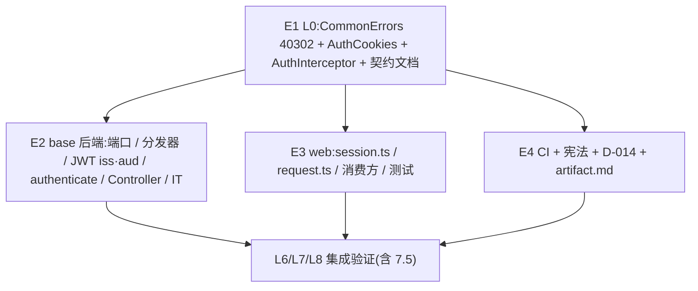

# Exec Plan

> **L4 · 交接点 1:意图 → 工程**。
>
> **不变量:本文件是 `tasks.md` 的下游派生物,单向。**

## 1. 任务映射

| tasks.md 条目 | 执行单元 ID | 层 |
|---|---|---|
| `1.1-1.3` 错误码 / `AuthCookies` / 拦截器 | `E1` | L0 |
| `1.4` 契约文档 | `E1` | L0 |
| `8.1` 发布说明(写进契约的部分) | `E1` | L0 |
| `2.1-2.3` 领域端口 / 仓储方法 / api 契约 | `E2` | L1 |
| `3.1-3.5` JWT、仓储实现、分发器、authenticate、配置 | `E2` | L1 |
| `4.1-4.2` 登录 / 登出 Controller | `E2` | L1 |
| `7.2-7.3` base 单测与集成测试 | `E2` | L1 |
| `7.1` framework 单测 | `E1` | L0 |
| `5.1-5.5` 前端会话、请求层、消费方、类型、同源约束 | `E3` | L1 |
| `7.4` 前端测试 | `E3` | L1 |
| `6.1` CI 工作流 | `E4` | L1 |
| `6.2-6.4` 宪法 CP-8 / D-014 / artifact.md | `E4` | L1 |
| `8.1` 发布说明(写进 D-014 的部分) | `E4` | L1 |

### 未映射条目

| 条目 | 不执行的原因 |
|---|---|
| `7.5` 手动验证(构建约束、actionlint、真实浏览器) | 跨 E2/E3/E4 的集成验证,在全部单元合并后由 orchestrator 在 L6/L8 执行,结果写入 `exec/verify.md` |
| `9.1` 写 `artifacts.md` | 上线后动作,在 L8 通过后、归档前写 |

### L7 测试基线

- 基线:`main`(`0b6abe1`),全量 `./gradlew check` + 前端 test / lint / build(`openspec/project.json` 的三条命令)。改动前工作区干净,且最近一次 main 上的全量门禁为绿(上个 change 归档时的证据),不另取基线。

## 2. 依赖图

| 执行单元 | 前置 | 依赖性质 |
|---|---|---|
| `E2` | `E1` | 类型依赖(`AuthCookies`、`CSRF_REJECTED`)+ 契约依赖(Cookie 名称与属性) |
| `E3` | `E1` | 契约依赖:Cookie / 请求头名称、`LoginResult` 形状、40302 语义(来自冻结的契约文档,不读 Java 代码) |
| `E4` | `E1` | 契约依赖:D-014 与 CP-8 的措辞引用契约文档中的配置键与 Cookie 约定 |

E2 / E3 / E4 之间没有类型、数据、调用依赖:前后端之间唯一的耦合是 E1 冻结的 HTTP 契约。

## 3. 分层执行计划

### Layer 0 —— 共享层,**串行**,必须先完成

| 执行单元 | 内容 | 涉及文件 |
|---|---|---|
| `E1` | 新增 40302;新增 `AuthCookies` / `AuthCookieProperties`;改造 `AuthInterceptor`(取令牌顺序 + CSRF)与框架自动配置;写 framework 单测;改契约 §3 / §4 / §6.1 | `weiran-common/.../error/CommonErrors.java`、`weiran-framework/src/main/java/com/weiran/framework/{auth,autoconfigure}/**`、`weiran-framework/src/test/**`、`weiran4j/docs/01-架构与接口契约.md` |

**完成判据**:`./gradlew :weiran-common:check :weiran-framework:check` 通过,且第 4 节契约冻结表全部勾选。

### Layer 1 —— 并行

> 本仓库没有 worktree。E3 交给 subagent,与 orchestrator 自己做的 E2、E4 交替进行;三者的可写文件集两两不相交(见第 5 节)。

| 执行单元 | 内容 |
|---|---|
| `E2` | `weiran-base-*` 与 `weiran-app` 的全部后端改动和测试(orchestrator) |
| `E3` | `web/` 的全部改动和测试(subagent `executor`) |
| `E4` | `.github/workflows/ci.yml`、宪法 CP-8、D-014、artifact.md(orchestrator) |

## 4. 契约冻结

| 契约 | 签名 / 结构 | 定义位置 | 消费方(逐单元列出所读/所写的键) | 冻结 |
|---|---|---|---|---|
| 错误码 | `CSRF_REJECTED(40302, 403, "请求校验失败，请刷新页面后重试")` | `weiran-common/.../error/CommonErrors.java` | `E1` 拦截器抛出;`E2` IT 断言 `code == 40302`;`E3` `request.ts` 把它当普通业务错误(不清会话) | ☑ |
| Cookie / 请求头名称 | `weiran_token`、`weiran_csrf`、`X-CSRF-Token`、`X-Auth-Mode`(值 `token`) | `weiran-framework/.../auth/AuthCookies.java` 常量 + 契约 §4 | `E2` Controller 读 `X-Auth-Mode`、调用 `issue` / `clear`,IT 读 `Set-Cookie`;`E3` 读 `weiran_csrf`、写 `X-CSRF-Token` | ☑ |
| `AuthCookies.issue(String token, Duration ttl, long userId) → List<ResponseCookie>` / `clear() → List<ResponseCookie>` / `static OptionalLong csrfUserId(String value)` | — | 同上 | `E2` `AuthController` 调用 `issue` / `clear`;`E1` 拦截器调用 `csrfUserId` | ☑ |
| Cookie 属性 | `weiran_token`:`HttpOnly; SameSite=Strict; Path=/api; Max-Age=ttl`;`weiran_csrf`:`SameSite=Strict; Path=/; Max-Age=ttl`,值 `<userId>.<base64url(32 字节)>`;`Secure` 由 `weiran.auth.cookie.secure` 决定 | 契约 §4 | `E2` IT 断言属性;`E3` 只读 `weiran_csrf` 的值,清除时写 `weiran_csrf=; Max-Age=0; Path=/` | ☑ |
| `LoginResult` JSON | `{accessToken?: string, tokenType: "Bearer", expiresIn: number, userId: number}`;默认模式下没有 `accessToken` 字段(值为 null,由 Jackson 序列化规则决定是 null 还是省略,前端两种都按「没有」处理) | 契约 §6.1 | `E2` 后端产出;`E3` `types/api.ts` 读 `userId`(不读 `accessToken`) | ☑ |
| CSRF 校验口径 | 非 `@PublicApi` + Cookie 认证 + 方法 ∈ {POST, PUT, PATCH, DELETE} → 头存在、等于 Cookie、userId 前缀等于当前用户 | 契约 §4 | `E1` 实现;`E3` 所有非 GET 请求在有会话时都带头 | ☑ |
| `TokenAuthenticator` SPI | `Optional<LoginUser> authenticate(String token)`(只改参数名) | `weiran-framework/.../auth/TokenAuthenticator.java` | `E2` `DispatchingTokenAuthenticator` 实现它 | ☑ |
| 配置键 | `weiran.auth.jwt.{secret,ttl,issuer,audience}`、`weiran.auth.cookie.secure` | 契约 §6.1 / §4 | `E1` 定义 cookie 键;`E2` 定义 jwt 键与 yml;`E4` 在 D-014 中引用 | ☑ |

### 契约变更记录

| 时间 | 原签名 | 新签名 | 发起方 | 已通知 |
|---|---|---|---|---|
| 2026-10-05 | `LoginResult(@Nullable String accessToken, …)`(api 层) | api 层 `LoginResult(String accessToken, String tokenType, long expiresIn, long userId)` 保持非空;adapter 新增 `LoginResponse`(`accessToken` 为 null 时 JSON 省略该字段)。**HTTP JSON 契约不变**(Cookie 模式仍是「没有 accessToken」,且从「null 或省略」收紧为「省略」) | `E2` | `E3` 不受影响(`accessToken?: string \| null` 两种都兼容);记入 `E2` 笔记 |

## 5. 并行判据与文件所有权

<!-- openspec:slot worktree-tradeoffs -->

> **本仓库没有 worktree 工具,所有 change 都在同一个工作区主检出里推进。**

| ID | 场景 | 能否与他人并行 | 原因 |
|---|---|---|---|
| WT-0 | **工作区已有他人在推进的 change** | ❌ **必须先问这一条** | 开工时核对:`git status` 只有本 change 的文件;`openspec/changes/` 下只有本 change;`git log` 最近几条都是本人提交 → 未命中 |
| WT-1 | 纯文档 / spec / openspec 流水线自身的改动 | ✅ 可与代码改动交替推进(仍受 WT-0 约束) | E4 改的 `rules/enforced/constitution.md` 属于流水线本体,而本 change 自己的 design 已经落章——CP-8 **标题不变**,`L2c/constitution-check` 不受影响 |
| WT-2 | 涉及 `weiran-common`,**或流水线本体** | ❌ 必须排队 | 本 change 命中(E1 改 `CommonErrors`,E4 改宪法):期间不与其他 change 同时推进 |
| WT-3 | 单模块、3~5 个文件的小改动 | ✅ 可与他人交替推进(仍受 WT-0 约束) | 不适用(本 change 跨多模块) |

<!-- /openspec:slot worktree-tradeoffs -->

| 执行单元 | 拥有(可写) | 只读 | 禁止触碰 |
|---|---|---|---|
| `E1` | `weiran4j/weiran-common/src/**/error/CommonErrors.java`、`weiran4j/weiran-framework/src/**`、`weiran4j/docs/01-架构与接口契约.md` | 其余全部 | `web/**`、`weiran4j/weiran-base/**` |
| `E2` | `weiran4j/weiran-base/**`(不含 `db/migration/**`)、`weiran4j/weiran-app/src/**`、`weiran4j/config/*.example`、`weiran4j/.env.example` | `weiran4j/weiran-framework/**`、`weiran4j/weiran-common/**`、契约文档 | `web/**`、`.github/**`、`openspec/rules/**`、`weiran4j/docs/00-决策记录.md`、`db/migration/**` |
| `E3` | `web/**` | 契约文档 | `weiran4j/**`、`.github/**`、`openspec/**` |
| `E4` | `.github/workflows/ci.yml`、`openspec/rules/enforced/constitution.md`、`weiran4j/docs/00-决策记录.md`、`openspec/state/bizs/artifact.md` | 契约文档 | `web/**`、`weiran4j/weiran-*/**` |

## 6. 测试归属

| 执行单元 | 测试范围 | 测试文件 |
|---|---|---|
| `E1` | 拦截器取令牌顺序、CSRF 的各种分支、`AuthCookies` 属性(7.1) | `weiran-framework/src/test/.../web/WebLayerTest.java`(扩充)、`.../auth/AuthCookiesTest.java`(新) |
| `E2` | 分发器、身份解析、权限源、`authenticate`、JWT `iss`/`aud`、issuer 读取(7.2);集成测试(7.3) | `weiran-base-*/src/test/**`、`weiran-app/src/test/.../{IntegrationTestSupport,AuthIT,CookieAuthIT}.java` |
| `E3` | 会话 store、请求层、登录页、偏好归属,以及其余受影响的测试(7.4) | `web/src/**/__tests__/**`、`web/src/test/session.ts`(新) |
| `E4` | 无代码测试;`ci.yml` 的语法校验归入 7.5 | — |

集成测试归 L7 硬闸门,不属于任何单个执行单元。

## 7. 失败与降级

| 场景 | 处置 |
|---|---|
| subagent 超时 | 重试 1 次 |
| 重试后仍失败 | 降级串行,由 orchestrator 亲自做该单元 |
| 产出不可用(编译不过/答非所问) | 丢弃 diff,降级串行 |
| 同层两个单元产生文件冲突 | 视为分层错误,停止并行,回第 3 节重切 |
| 契约需要变更 | 暂停依赖该契约的全部单元,更新第 4 节后恢复 |

## 8. 收尾要求

每个执行单元完成时,必须在 `exec/notes/<单元ID>-<简述>.md` 写收尾笔记后才能结束。

## Gate

- [x] 每条 task 都已映射,或已在「未映射条目」声明并写明原因
- [x] `explore.md` 的共享层清单已逐项比对,命中项全部落在 Layer 0
- [x] 若涉及数据库结构变更,已按 `rules/enforced/constitution.md` CP-7 与 `weiran-v1` 核对(不涉及)
- [x] 依赖图无环,且「前后端」这类隐性契约依赖已识别(不是并行,是契约依赖)
- [x] Layer 0 的契约冻结表已列出待填项
- [x] 无独立的测试执行单元(测试跟随实现)
- [x] 同层执行单元的「拥有(可写)文件集」两两不相交
- [x] 每个执行单元的「禁止触碰」已写明
- [x] 失败与降级策略已填(第 7 节)
- [x] 已确认本文件未产生任何对 `tasks.md` / `design.md` / `specs/**` 的回写
