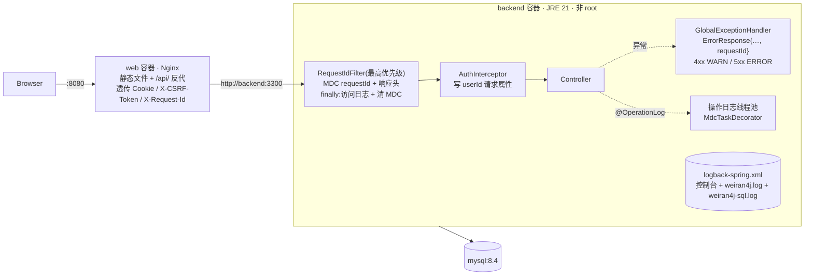

# Design

## Context

- 需求来源:`interview.md`。用户决定:拆 change;requestId 放在响应头,失败体里也带;日志输出到控制台 + 滚动文件;用 Docker Compose 部署;`.env.example` 整份重写。
- 现有实现调研:`explore.md`。4xx 业务异常现在完全不打日志;Boot 3.5 默认已是优雅停机;仓库根没有忽略 `.env`。
- 关键约束:`weiran-common` 不依赖 Jackson / Spring;不加依赖;成功包络不变;日志不得出现凭据。

## 宪法对照

<!-- openspec:required-table mark=2 note=3 -->
| 原则 | 判定 | 说明 |
|---|---|---|
| CP-1 领域层不依赖框架 | ☐ | 不改任何 `*-domain` |
| CP-2 依赖方向单向向内 | ☑ | 新类型都在 `weiran-framework`;基座 application 引用框架的 `MdcTaskDecorator`,方向是基座 → 框架 |
| CP-3 持久化类型不跨层 | ☐ | 不涉及持久化 |
| CP-4 版本号只有一个来源 | ☑ | 不加 Maven / npm 依赖。Docker 基础镜像的标签写在 Dockerfile 和 Compose 里,不在 Gradle 版本体系内;在部署文档列出这些标签,升级时一起改 |
| CP-5 质量规则只在 build-logic 里配置 | ☐ | 不改 build-logic |
| CP-6 豁免必须最小且带理由 | ☑ | 不新增豁免;如果过滤器需要 `@SuppressWarnings`,写在方法级并附理由 |
| CP-7 表结构只经 Flyway 迁移变更，已发布的迁移永不修改 | ☐ | 没有表结构变更 |
| CP-8 密码只用 BCrypt，令牌吊销只走 token_version | ☐ | 不涉及 |
| CP-9 凭据不进版本库、不进日志 | ☑ | `.env.example` 与 Compose 不写真实密钥,密钥全部取自被 gitignore 的 `weiran4j/.env`;根 `.gitignore` 补上 `.env`;访问日志不记请求体和查询值;入站 requestId 走白名单,不合法的值不进日志;部署文档提醒首次部署后修改 admin 密码 |
| CP-10 认证失败不泄露账号存在性 | ☐ | 不涉及(40101 的提示语不变,新增的 WARN 日志只记错误码与提示语,不记用户名) |
| CP-11 错误码归属决定 HTTP 状态，不靠 Controller 判断 | ☑ | `ErrorResponse` 仍由 `GlobalExceptionHandler` 按 `ErrorCode.httpStatus()` 产出;日志分级也按它判定 |
| CP-12 依赖只能业务 → 基座 → 框架，反向与同层横向禁止 | ☑ | 框架不引用基座;基座只用框架公开的装饰器 |
| CP-13 业务只经基座的 weiran-base-api 接触基座 | ☐ | 没有业务模块 |
| CP-14 错误码按号段分配，业务不得占用框架与基座的号段 | ☐ | 不新增错误码 |
| CP-15 权限码、菜单 id 与 Flyway 模块段按层隔离 | ☐ | 不涉及 |

## Architecture

## Data Flow

1. 请求进入 `RequestIdFilter`(`OncePerRequestFilter`,`Ordered.HIGHEST_PRECEDENCE`):
   - 取入站 `X-Request-Id`;合法就沿用,否则生成 `UUID` 去掉连字符;
   - `MDC.put("requestId", id)`,并在 `chain.doFilter` **之前**设置响应头 `X-Request-Id`(响应提交之后就无法再加头)。
2. `AuthInterceptor` 认证通过后,把 `userId` 写进请求属性 `AuthInterceptor.USER_ID_ATTRIBUTE`(`CurrentUser` 会在 `afterCompletion` 清掉,过滤器读不到,所以要另存)。
3. 正常返回时,`ApiResponseBodyAdvice` 照旧包装,成功体不变。抛出异常时,`GlobalExceptionHandler`:
   - 构造 `ErrorResponse(code, message, null, MDC.get("requestId"))`;
   - 按状态分级记日志;
   - `ApiResponseBodyAdvice` 看到 `ErrorResponse` 时原样放行。
4. 被 `@OperationLog` 标记的接口,切面把事件提交到操作日志线程池。线程池的 `MdcTaskDecorator` 在提交时拷贝 MDC,执行时还原,执行完恢复工作线程原先的 MDC。
5. `RequestIdFilter` 的 `finally`:
   - 路径以 `/api/` 开头时,以 logger `com.weiran.access` 打一行:`{method} {path} {status} {ms}ms user={userId|-} ip={ip}`;`/api/health` 用 DEBUG;
   - 最后 `MDC.remove("requestId")`。
6. 停机:收到 SIGTERM 后,Tomcat 停止接收新请求,等进行中的请求完成,最多 `timeout-per-shutdown-phase`;之后容器销毁,操作日志线程池最多再等 10 秒,把已提交的写完。

<!-- openspec:slot design-sections -->

## 跨模块契约变更(DS-1)

| 对象 | 文件 | 动作 | 消费方 |
|---|---|---|---|
| 失败响应 JSON `{code, message, data: null, requestId: string}` | `weiran-framework/.../web/ErrorResponse.java`(新,`record ErrorResponse(int code, String message, @Nullable Object data, String requestId)`,带 `static of(ErrorCode, String)`,`requestId` 从 MDC 读,缺失时给 `-`) | 新增 | `GlobalExceptionHandler`;`ApiResponseBodyAdvice`(放行);集成测试;前端 `request.ts` / `types/api.ts` |
| 响应头 `X-Request-Id` | `RequestIdFilter.HEADER`;MDC 键 `RequestIdFilter.MDC_KEY = "requestId"` | 新增 | 前端(不读)、Nginx(透传)、`logback-spring.xml`(`%X{requestId}`)、部署文档 |
| `AuthInterceptor.USER_ID_ATTRIBUTE` 请求属性 | `weiran-framework/.../auth/AuthInterceptor.java` | 新增常量 | `RequestIdFilter` |
| `MdcTaskDecorator` | `weiran-framework/.../log/MdcTaskDecorator.java`(新,`implements TaskDecorator`) | 新增 | `PlatformApplicationAutoConfiguration` |
| 环境变量 | `application.yml`、`logback-spring.xml` | 新增 `WEIRAN_LOG_DIR`(默认 `logs`)、`WEIRAN_LOG_MAX_HISTORY`(默认 `30`)、`WEIRAN_SHUTDOWN_TIMEOUT`(默认 `30s`) | `.env.example`、Compose、部署文档 |
| `weiran-common` `ApiResponse` | — | **不变** | — |

## API Design(DS-2)

不新增接口。所有 `/api/**`(以及其它路径)的响应都多一个 `X-Request-Id` 头;失败响应体多一个 `requestId` 字段。契约 §4 更新统一响应示例和这两条约定;§3 登记 `RequestIdFilter`、`ErrorResponse`、`MdcTaskDecorator`。

## Database Design(DS-3)

无。

## 权限与已知缺口(DS-4)

| 项 | 设计 |
|---|---|
| 权限点 | 不涉及 |
| 菜单挂载 | 不涉及 |
| 写接口漏标 `@OperationLog` | 不新增写接口 |
| 已知缺口 | 访问日志里的 IP 仍来自 `ClientIpResolver`,可以被 `X-Forwarded-For` 伪造(#03,部署文档提示);requestId 只在单个服务内串联,没有跨服务追踪 |

## 分层与装配(DS-5)

| 项 | 设计 |
|---|---|
| 依赖方向 | 新类全部在 `weiran-framework`;基座 application 只引用 `MdcTaskDecorator` |
| 自动配置 | `WeiranFrameworkAutoConfiguration.WebConfiguration` 注册 `FilterRegistrationBean<RequestIdFilter>`(`@ConditionalOnMissingBean`,`HIGHEST_PRECEDENCE`,作用于全部路径);`PlatformApplicationAutoConfiguration` 的线程池加 `setTaskDecorator(new MdcTaskDecorator())`,并在注释写明等待时长 10s ≤ 停机阶段 30s |
| 日志配置 | `weiran-app/src/main/resources/logback-spring.xml`:`<springProfile name="local | test">` 只用 CONSOLE;其它 profile 用 CONSOLE + FILE(`SizeAndTimeBasedRollingPolicy`,按天、单文件 100MB、`maxHistory=${WEIRAN_LOG_MAX_HISTORY}`)+ SQL 文件(logger 为 `com.weiran.system.infrastructure.persistence.mapper` 与 `com.weiran.platform.infrastructure.persistence.mapper`,`additivity=false`)。`contextName` 为 `weiran4j`;`logging.level` 仍由 `application.yml` 控制 |

## 前端设计(DS-6)

| 项 | 内容 |
|---|---|
| 页面/路由 | 不变 |
| 数据请求方式 | `request.ts`:`ApiError` 增加可选字段 `requestId`;从失败体的 `requestId` 读取,读不到时退回响应头 `X-Request-Id`(网络错误时没有);`fail()` 的 Toast 文案为 `${message}(请求号 ${requestId.slice(0, 8)})`,并 `console.warn` 输出完整 requestId |
| 类型 | `types/api.ts` 新增 `ApiErrorBody = { code: number; message: string; data: null; requestId?: string }` |
| 测试 | `request.test.ts` 增加:失败体带 requestId 时 Toast 含前 8 位、`ApiError.requestId` 是完整值;成功响应不受影响 |

<!-- /openspec:slot design-sections -->

## 部署产物设计(#18)

| 文件 | 设计 |
|---|---|
| `weiran4j/Dockerfile` | 多阶段构建:<ul><li>`eclipse-temurin:21-jdk` 构建:`./gradlew :weiran-app:bootJar -x test --no-daemon`。不跑测试:测试由 L7 和 CI 负责,镜像构建里也没有 Docker 可供 Testcontainers 使用;</li><li>`eclipse-temurin:21-jre` 运行:建 `weiran` 用户(uid 10001)、`USER weiran`、`EXPOSE 3300`、`ENTRYPOINT ["java", "-XX:MaxRAMPercentage=75", "-jar", "/app/app.jar"]`;日志目录 `/app/logs` 归属 weiran 用户。</li></ul> |
| `web/Dockerfile` | 多阶段构建:`node:22-alpine` + corepack pnpm 构建,执行 `pnpm install --frozen-lockfile` 和 `pnpm --filter @weiran/web build`;构建上下文是仓库根,因为 pnpm 工作区需要根目录的 lockfile。运行阶段用 `nginx:1.27-alpine` 拷贝 `dist` 和 `nginx.conf` |
| `web/nginx.conf` | <ul><li>`location /api/` 用 `proxy_pass http://backend:3300`,设置 `X-Forwarded-For` / `X-Forwarded-Proto` / `X-Real-IP` / `Host`,`proxy_set_header X-Request-Id $request_id`(没有入站值时,Nginx 生成的 32 位十六进制值正好符合白名单);</li><li>`Cookie` / `Set-Cookie` / 自定义头默认透传,不需要额外配置,配置注释里写明不要用 `proxy_hide_header` 剥掉它们;</li><li>`location /` 用 `try_files $uri /index.html`(SPA),`index.html` 不缓存,`/assets/` 长缓存;</li><li>`client_max_body_size 10m`。</li></ul> |
| `docker-compose.yml`(仓库根) | 三个服务:<ul><li>`mysql`(`mysql:8.4`,库 `weiran4j`,密码取自 `${WEIRAN_DB_PASSWORD}`,健康检查,数据卷);</li><li>`backend`(`env_file: weiran4j/.env`,`WEIRAN_DB_URL` 覆盖为指向 `mysql`,依赖 `mysql` healthy,日志卷挂到 `/app/logs`,`stop_grace_period: 40s`,大于停机阶段的 30s);</li><li>`web`(端口 `${WEIRAN_WEB_PORT:-8080}:80`,依赖 `backend`)。</li></ul>用法:`docker compose --env-file weiran4j/.env up -d --build`。本地 http 试运行需要在 `.env` 里设 `WEIRAN_COOKIE_SECURE=false`,文档醒目提示 |
| `.dockerignore`(仓库根) | 排除 `node_modules`、`**/build`、`.gradle`、`.git`、`dist`、`**/.env`、`weiran4j/config/*.yml`(本地密钥) |
| `.gitignore`(仓库根) | 补 `.env`、`.env.*`、`!.env.example` |
| `weiran4j/.env.example` | 按 `application.yml` 的占位符分组(数据库、服务、认证、Cookie、日志、停机),再加上 Compose 专用的 `WEIRAN_WEB_PORT`。Compose 专用变量不出现在 `application.yml`,一致性测试只比对 `application.yml` 的子集,另把 `WEIRAN_WEB_PORT` 列为允许的额外项,写在测试常量里 |
| `weiran4j/docs/02-部署.md` | 章节:前置条件 / 快速开始(Compose)/ 环境变量 / 同源与反向代理 / HTTPS 与 Cookie / 日志与排障(requestId)/ 优雅停机与升级 / 首次部署检查清单(改 admin 密码、`WEIRAN_JWT_SECRET` 至少 32 字节)/ 已知风险(#03)/ 镜像版本 |

> deployment FR-001 的口径(已同步到 delta spec):`.env.example` 的变量集合 = `application.yml` 的占位符集合 ∪ {`WEIRAN_WEB_PORT`}。只多出 Compose 专用的那一个,测试里显式列出。

## Observability

- **日志关键字段**:requestId(MDC);访问日志的方法、路径、状态码、耗时、userId、IP。
- **指标**:不新增。
- **审计**:操作日志行为不变,异步线程带上 requestId。
- **排障入口**:用户报出 Toast 里的 8 位请求号 → 在 `weiran4j.log` 里 `grep` 这个前缀,找到完整 ID → 再用完整 ID 串起访问日志、异常日志和 SQL 日志。部署文档写明这套操作。

## Test Plan

| 层级 | 范围 | 命令 |
|---|---|---|
| framework 单测 | `RequestIdFilter`(沿用 / 生成 / 非法、响应头、MDC 清理、访问日志内容与级别、不含查询值);`MdcTaskDecorator`;`GlobalExceptionHandler` 的日志分级与 `ErrorResponse`(`WebLayerTest` 扩展,用 Logback `ListAppender` 捕获) | `./gradlew :weiran-framework:test` |
| 集成测试 | 失败体 `requestId` 等于响应头(400 / 401 / 403 / 404 / 500 中可构造的几类);成功体没有 `requestId`;入站 ID 沿用;停机配置值;`.env.example` 一致性 | `./gradlew :weiran-app:test` |
| 前端 | `request.test.ts` | `pnpm test` |
| 全量门禁 | — | `openspec/project.json` 的 build / test / lint |
| 容器 | `docker compose build`、`up`、经 Nginx 走 curl 登录 → `/me`、`exec id -u`、读日志文件格式、`stop` 时出现优雅停机日志 | 手动执行,记入 verify |

## Rollout Plan

1. 没有数据库变更。
2. 合并后,其他开发者本机不受影响:`local` profile 只输出到控制台。
3. 需要部署时按 `02-部署.md`:复制 `weiran4j/.env.example` 为 `weiran4j/.env` 并填写,然后 `docker compose --env-file weiran4j/.env up -d --build`。

## Rollback Plan

1. revert 锚点:本 change 的合并提交,`git revert` 即可整体回退。
2. 迁移回滚策略:无迁移。
3. 回退之后,失败体不再带 `requestId`,前端读不到时照常只显示 message,两个方向都兼容。

## Open Questions

- 无
