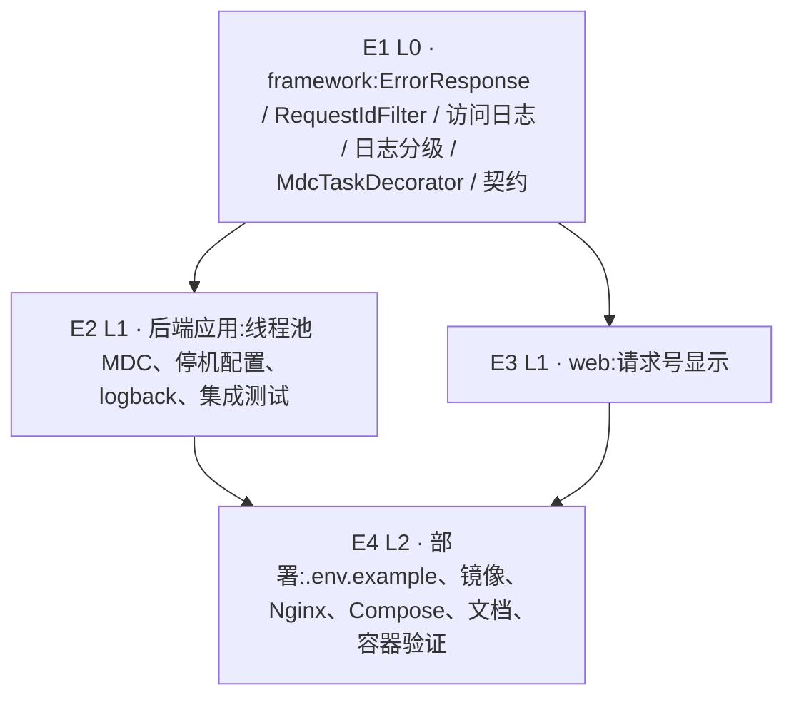

# Exec Plan

> **L4 · 交接点 1:意图 → 工程**。本文件是 `tasks.md` 的下游派生物,单向。

## 1. 任务映射

| tasks.md 条目 | 执行单元 ID | 层 |
|---|---|---|
| `1.1-1.5` 框架组件 | `E1` | L0 |
| `1.6` 契约文档 | `E1` | L0 |
| `5.1` framework 单测 | `E1` | L0 |
| `2.1-2.3` 线程池 / 停机 / logback | `E2` | L1 |
| `5.2-5.3` 集成测试与一致性测试 | `E2` | L1 |
| `3.1` 前端请求号 | `E3` | L1 |
| `5.4` 前端测试 | `E3` | L1 |
| `4.1-4.3` `.env.example` / Docker / 部署文档 | `E4` | L2 |
| `5.5` 容器验证 | `E4` | L2 |
| `6.1` 发布说明 | `E4` | L2 |
| `4.4` artifact.md | `E4` | L2 |

### 未映射条目

| 条目 | 不执行的原因 |
|---|---|
| `7.1` 写 `artifacts.md` | 上线后动作,在 L9 签字后、归档前写 |

### L7 测试基线

- 基线:`main`(`e5740db`),全量 `./gradlew check` + 前端 test / lint / build(`openspec/project.json` 的三条命令);上一个 change 合并时 GitHub CI 全绿。

## 2. 依赖图

| 执行单元 | 前置 | 依赖性质 |
|---|---|---|
| `E2` | `E1` | 类型依赖(`MdcTaskDecorator`)+ 契约依赖(失败体、MDC 键) |
| `E3` | `E1` | 契约依赖:失败体 JSON 与 `X-Request-Id`(来自冻结的契约文档,不读 Java) |
| `E4` | `E2`、`E3` | 数据依赖:`.env.example` 依赖 E2 定下的全部占位符;容器验证依赖前后端都完成 |

## 3. 分层执行计划

### Layer 0 —— 共享层,**串行**

| 执行单元 | 内容 | 涉及文件 |
|---|---|---|
| `E1` | 框架组件 + 单测 + 契约 §3 / §4 | `weiran4j/weiran-framework/src/**`、`weiran4j/docs/01-架构与接口契约.md` |

**完成判据**:`./gradlew :weiran-framework:check` 通过,且第 4 节契约冻结表全部勾选。

### Layer 1 —— 并行

| 执行单元 | 内容 |
|---|---|
| `E2` | 后端应用层(orchestrator) |
| `E3` | 前端(subagent `executor`) |

### Layer 2

| 执行单元 | 内容 |
|---|---|
| `E4` | 部署产物、文档、容器验证(orchestrator) |

## 4. 契约冻结

| 契约 | 签名 / 结构 | 定义位置 | 消费方(逐单元列出所读/所写的键) | 冻结 |
|---|---|---|---|---|
| 失败响应体 | `{code: number, message: string, data: null, requestId: string}`;成功体仍为 `{code, message, data}`,没有 `requestId` 键 | `ErrorResponse` + 契约 §4 | `E1` 产出;`E2` IT 断言 `$.requestId` 等于响应头、成功体没有该键;`E3` 读 `requestId`(可选) | ☑ |
| 响应头 | `X-Request-Id`,值为合法入站值或 32 位小写十六进制 | `RequestIdFilter.HEADER` + 契约 §4 | `E2` IT 读;`E3` 在失败体没有该字段时退回读它;`E4` Nginx 设置 `X-Request-Id $request_id` | ☑ |
| MDC 键 | `requestId` | `RequestIdFilter.MDC_KEY` | `E2` `logback-spring.xml` 的 `%X{requestId}`;`E1` `ErrorResponse` | ☑ |
| `MdcTaskDecorator` | `public final class MdcTaskDecorator implements TaskDecorator`,无参构造 | `weiran-framework/.../log/` | `E2` 操作日志线程池 | ☑ |
| 访问日志 logger | `com.weiran.access`;格式 `{method} {path} {status} {ms}ms user={id\|-} ip={ip}` | `RequestIdFilter` | `E2` 集成测试可捕获;`E4` 部署文档的排障说明 | ☑ |
| 环境变量 | 新增 `WEIRAN_LOG_DIR`(默认 `logs`)、`WEIRAN_LOG_MAX_HISTORY`(默认 `30`)、`WEIRAN_SHUTDOWN_TIMEOUT`(默认 `30s`);Compose 专用 `WEIRAN_WEB_PORT`(默认 `8080`) | `application.yml` / `logback-spring.xml` | `E2` 定义;`E4` 写进 `.env.example`、Compose 和文档 | ☑ |

### 契约变更记录

| 时间 | 原签名 | 新签名 | 发起方 | 已通知 |
|---|---|---|---|---|
|  |  |  |  |  |

## 5. 并行判据与文件所有权

<!-- openspec:slot worktree-tradeoffs -->

> **本仓库没有 worktree 工具,所有 change 都在同一个工作区主检出里推进。**

| ID | 场景 | 能否与他人并行 | 原因 |
|---|---|---|---|
| WT-0 | **工作区已有他人在推进的 change** | ❌ **必须先问这一条** | 开工时核对:工作区干净;`openspec/changes/` 下只有本 change;最近的提交都是本人 → 未命中 |
| WT-1 | 纯文档 / spec / openspec 流水线自身的改动 | ✅ 可与代码改动交替推进(仍受 WT-0 约束) | 本 change 不改流水线本体 |
| WT-2 | 涉及 `weiran-common`,**或流水线本体** | ❌ 必须排队 | 未命中(不改 common,不改流水线本体) |
| WT-3 | 单模块、3~5 个文件的小改动 | ✅ 可与他人交替推进(仍受 WT-0 约束) | 不适用 |

<!-- /openspec:slot worktree-tradeoffs -->

| 执行单元 | 拥有(可写) | 只读 | 禁止触碰 |
|---|---|---|---|
| `E1` | `weiran4j/weiran-framework/src/**`、`weiran4j/docs/01-架构与接口契约.md` | 其余 | `web/**`、`weiran4j/weiran-base/**`、`weiran4j/weiran-app/**` |
| `E2` | `weiran4j/weiran-base/**/platform/application/**`、`weiran4j/weiran-app/src/**` | framework、契约 | `web/**`、Docker 相关文件、`.env.example` |
| `E3` | `web/src/**` | 契约 | `weiran4j/**`、`web/Dockerfile`、`web/nginx.conf` |
| `E4` | `weiran4j/.env.example`、`weiran4j/Dockerfile`、`web/Dockerfile`、`web/nginx.conf`、`docker-compose.yml`、`.dockerignore`、`.gitignore`、`weiran4j/docs/02-部署.md`、`AGENTS.md`、`openspec/state/bizs/artifact.md` | 其余 | `weiran4j/weiran-*/src/**`、`web/src/**` |

## 6. 测试归属

| 执行单元 | 测试范围 | 测试文件 |
|---|---|---|
| `E1` | 5.1 | `weiran-framework/src/test/.../web/{WebLayerTest,RequestIdFilterTest}.java`、`.../log/MdcTaskDecoratorTest.java` |
| `E2` | 5.2、5.3 | `weiran-app/src/test/.../{ObservabilityIT,EnvExampleTest}.java` |
| `E3` | 5.4 | `web/src/utils/__tests__/request.test.ts` |
| `E4` | 5.5(手动) | — |

## 7. 失败与降级

| 场景 | 处置 |
|---|---|
| subagent 超时 | 重试 1 次 |
| 重试后仍失败 | 降级串行,由 orchestrator 亲自做该单元 |
| 产出不可用 | 丢弃 diff,降级串行 |
| 同层两个单元产生文件冲突 | 视为分层错误,停止并行,回第 3 节重切 |
| 契约需要变更 | 暂停依赖该契约的全部单元,更新第 4 节后恢复 |
| 镜像拉取 / 构建因网络失败 | 重试一次;仍失败就在 verify 如实记录,5.5 不勾选,交 L9 决定 |

## 8. 收尾要求

每个执行单元完成时写 `exec/notes/<单元ID>-<简述>.md`。

## Gate

- [x] 每条 task 都已映射,或已在「未映射条目」声明并写明原因
- [x] `explore.md` 的共享层清单已逐项比对,命中项全部落在 Layer 0
- [x] 若涉及数据库结构变更,已按 CP-7 核对(不涉及)
- [x] 依赖图无环,且「前后端」这类隐性契约依赖已识别
- [x] Layer 0 的契约冻结表已列出待填项
- [x] 无独立的测试执行单元(测试跟随实现)
- [x] 同层执行单元的「拥有(可写)文件集」两两不相交
- [x] 每个执行单元的「禁止触碰」已写明
- [x] 失败与降级策略已填(第 7 节)
- [x] 已确认本文件未产生任何对 `tasks.md` / `design.md` / `specs/**` 的回写
