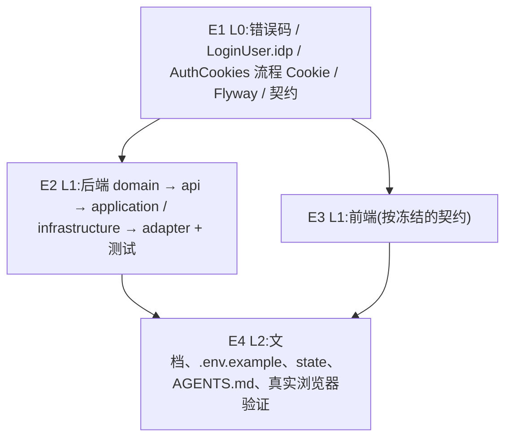

# Exec Plan

> **L4 · 交接点 1:意图 → 工程**。本文件是 `tasks.md` 的下游派生物,单向。

## 1. 任务映射

| tasks.md 条目 | 执行单元 ID | 层 |
|---|---|---|
| `1.1-1.4` 错误码 / LoginUser / AuthCookies / 迁移 / 契约 | `E1` | L0 |
| `2.1-2.3` 领域与 api | `E2` | L1 |
| `3.1-3.6` 应用与基础设施 | `E2` | L1 |
| `4.1-4.3` 适配层 | `E2` | L1 |
| `7.1-7.2` 后端单测与集成测试 | `E2` | L1 |
| `5.1-5.6` 前端 | `E3` | L1 |
| `7.3` 前端测试 | `E3` | L1 |
| `6.1-6.4` 文档与状态 | `E4` | L2 |
| `8.1` 发布说明 | `E4` | L2 |
| `7.4` 真实浏览器验证 | `E4` | L2 |

### 未映射条目

| 条目 | 不执行的原因 |
|---|---|
| `9.1` 写 `artifacts.md` | 上线后动作,在 L9 签字后、归档前写 |

### L7 测试基线

- 基线:`main`(`47374e5`),全量门禁;上一次合并时 GitHub CI 全绿。

## 2. 依赖图

| 执行单元 | 前置 | 依赖性质 |
|---|---|---|
| `E2` | `E1` | 类型依赖(错误码、`LoginUser`、`AuthCookies`)+ 数据依赖(新表) |
| `E3` | `E1` | 契约依赖:接口路径、DTO、`ssoError` 取值(契约文档,不读 Java) |
| `E4` | `E2`、`E3` | 文档描述实现;浏览器验证需要前后端都完成 |

## 3. 分层执行计划

### Layer 0 —— 串行

| 执行单元 | 内容 | 涉及文件 |
|---|---|---|
| `E1` | 1.1-1.4 | `CommonErrors.java`、`LoginUser.java`、`AuthCookies.java`(+ 测试)、`db/migration/system/V202610060001__system_user_identity.sql`、契约 |

**完成判据**:`./gradlew :weiran-common:check :weiran-framework:check` 通过;契约冻结表全部勾选。

### Layer 1 —— 并行

| 执行单元 | 内容 |
|---|---|
| `E2` | 后端(orchestrator) |
| `E3` | 前端(subagent `executor`,opus) |

### Layer 2

| 执行单元 | 内容 |
|---|---|
| `E4` | 文档、状态、浏览器验证(orchestrator) |

## 4. 契约冻结

| 契约 | 签名 / 结构 | 定义位置 | 消费方(逐单元列出所读/所写的键) | 冻结 |
|---|---|---|---|---|
| `GET /api/auth/providers` | `{passwordLoginEnabled: boolean, providers: [{id: string, type: "oidc"\|"cas", name: string}]}` | 契约 §6.1 | `E2` 产出;`E3` 读全部键 | ☑ |
| authorize | `GET /api/auth/sso/{id}/authorize?redirect=<站内路径>&mode=login\|bind` → 302 | 契约 §6.1 | `E3` 用 `location.assign` 跳转 | ☑ |
| 回调结果 | 成功:302 到 `redirect`(bind 模式为 `/profile?bound=<id>`);失败:302 到 `/login?ssoError=<code>`(bind 模式为 `/profile?ssoError=<code>`),`code` ∈ {40102, 40303, 40301, 40100, 40901} | 契约 §6.1 | `E3` 读 `ssoError` / `bound` 并提示后清理 URL | ☑ |
| `GET /api/auth/identities` | `[{id: number, provider: string, providerName: string, externalId: string, displayName: string \| null, createdAt: string}]` | 契约 §6.1 | `E3` 个人中心 | ☑ |
| `DELETE /api/auth/identities/{id}` | null;最后一个且无密码时 40901 | 契约 §6.1 | `E3` | ☑ |
| `GET/POST/DELETE /api/users/{id}/identities[/{identityId}]` | GET 同上;POST `{provider, externalId, displayName?}` → `{id}`;权限 `system:user:identity` | 契约 §6.2 | `E3` 用户管理弹窗 | ☑ |
| `/me` | 新增 `hasPassword: boolean` | 契约 §6.1 | `E3` 个人中心、锁屏 | ☑ |
| 登出 | `data = {ssoLogoutUrl: string \| null}` | 契约 §6.1 | `E3` `useAuth.logout` | ☑ |
| 错误码 | `40102` 外部身份校验失败、`40303` 账号未开通、`40304` 密码登录已关闭 | 契约 §4 | `E2` 抛出;`E3` 提示文案 | ☑ |
| `LoginUser.idp`、`AuthCookies.SSO_COOKIE` / `ssoState()` / `clearSsoState()` | 见 design DS-1 | framework | `E2` | ☑ |
| 配置键 | `weiran.auth.public-base-url`(`WEIRAN_PUBLIC_BASE_URL`)、`weiran.auth.password-login.enabled`(`WEIRAN_PASSWORD_LOGIN_ENABLED`)、`weiran.auth.providers.<id>.{type,name,enabled,issuer,client-id,client-secret,scopes,server-url,auto-provision,default-roles,logout}` | design DS-2 | `E2` 定义;`E4` 写进文档与 `.env.example` | ☑ |

### 契约变更记录

| 时间 | 原签名 | 新签名 | 发起方 | 已通知 |
|---|---|---|---|---|
|  |  |  |  |  |

## 5. 并行判据与文件所有权

<!-- openspec:slot worktree-tradeoffs -->

> **本仓库没有 worktree 工具,所有 change 都在同一个工作区主检出里推进。**

| ID | 场景 | 能否与他人并行 | 原因 |
|---|---|---|---|
| WT-0 | **工作区已有他人在推进的 change** | ❌ **必须先问这一条** | 开工时:工作区干净,只有本 change,最近的提交都是本人 → 未命中 |
| WT-1 | 纯文档 / spec / openspec 流水线自身的改动 | ✅ 可与代码改动交替推进(仍受 WT-0 约束) | 本 change 不改流水线本体 |
| WT-2 | 涉及 `weiran-common`,**或流水线本体** | ❌ 必须排队 | 命中(`CommonErrors`):期间不与其他 change 同时推进 |
| WT-3 | 单模块、3~5 个文件的小改动 | ✅ 可与他人交替推进(仍受 WT-0 约束) | 不适用 |

<!-- /openspec:slot worktree-tradeoffs -->

| 执行单元 | 拥有(可写) | 只读 | 禁止触碰 |
|---|---|---|---|
| `E1` | `weiran4j/weiran-common/**/CommonErrors.java`、`weiran4j/weiran-framework/src/**`、`weiran4j/weiran-base/weiran-base-infrastructure/src/main/resources/db/migration/system/V202610060001__system_user_identity.sql`、`weiran4j/docs/01-架构与接口契约.md` | 其余 | `web/**` |
| `E2` | `weiran4j/weiran-base/**`(除 E1 的迁移脚本)、`weiran4j/weiran-app/src/**` | framework、common、契约 | `web/**`、文档 |
| `E3` | `web/src/**`、`openspec/rules/advisory/components.md` | 契约 | `weiran4j/**` |
| `E4` | `weiran4j/docs/{00-决策记录,02-部署}.md`、`weiran4j/.env.example`、`openspec/state/bizs/**`、`AGENTS.md` | 其余 | 源码 |

## 6. 测试归属

| 执行单元 | 测试范围 | 测试文件 |
|---|---|---|
| `E1` | `AuthCookies` 流程 Cookie | `AuthCookiesTest` |
| `E2` | 7.1、7.2 | base 各模块的 `src/test/**`;`weiran-app/src/test/.../{OidcKeycloakIT,CasLoginIT,IdentityAdminIT}.java` 与 Keycloak realm 资源 |
| `E3` | 7.3 | `web/src/**/__tests__/**` |
| `E4` | 7.4(手动) | — |

## 7. 失败与降级

| 场景 | 处置 |
|---|---|
| subagent 超时 | 重试 1 次 |
| 重试后仍失败 | 降级串行,由 orchestrator 亲自做该单元 |
| 产出不可用 | 丢弃 diff,降级串行 |
| 同层两个单元产生文件冲突 | 视为分层错误,停止并行,回第 3 节重切 |
| 契约需要变更 | 暂停依赖该契约的全部单元,更新第 4 节后恢复 |
| Keycloak 镜像拉取失败 | 重试;仍失败就在 verify 记录,由 L9 决定 |

## 8. 收尾要求

每个执行单元完成时写 `exec/notes/<单元ID>-<简述>.md`。

## Gate

- [x] 每条 task 都已映射,或已在「未映射条目」声明并写明原因
- [x] `explore.md` 的共享层清单已逐项比对,命中项全部落在 Layer 0
- [x] 涉及数据库结构变更,已按 CP-7 只追加脚本
- [x] 依赖图无环,隐性契约依赖已识别
- [x] Layer 0 的契约冻结表已列出待填项
- [x] 无独立的测试执行单元
- [x] 同层执行单元的「拥有(可写)文件集」两两不相交
- [x] 每个执行单元的「禁止触碰」已写明
- [x] 失败与降级策略已填
- [x] 已确认本文件未产生任何对 `tasks.md` / `design.md` / `specs/**` 的回写
