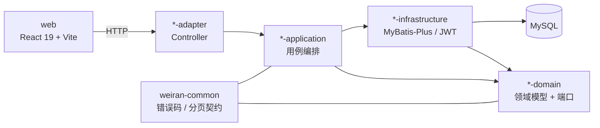

# Design

> 保持**意图粒度**:描述「行为如何」,不写逐文件的实现步骤。
> 实现细节属于 `exec/plan.md`,且**不得回写本文件** —— 需求侧到执行侧是单向的。
> 发现设计有问题时,唯一合法路径是停下来回 L2 重开设计并重新走人类审阅。

## Context

- 需求来源:`interview.md`
- 现有实现调研:`explore.md`
- 关键约束:

## 宪法对照

> 逐条对照 `openspec/rules/enforced/constitution.md`。**这是本流水线唯一一处「跨 change 不变量」的落地点** ——
> 项目级约定只在宪法里断言一次,不在每个 change 里重新推导。
>
> 判定标记(三选一,`L2c/constitution-check` 会校验每条原则都有标记且说明非空):
> · **☑ 符合** —— 本次设计遵守该原则,说明列写「怎么遵守的」(一句话,能被 review 核对)
> · **☐ 不涉及** —— 本次改动碰不到该原则的范围,说明列写「为什么碰不到」
> · **⚠ 偏离** —— 本次有意违反,说明列必须写清**为什么必须偏离、代价是什么、
>   是否要连带修订宪法**。偏离是允许的,不写理由不是。
>
> 出现 ⚠ 时,L3 人类审阅的重点就在这一行。

<!-- openspec:required-table mark=2 note=3 -->
| 原则 | 判定 | 说明 |
|---|---|---|
| CP-1 领域层不依赖框架 | ☐ | |
| CP-2 依赖方向单向向内 | ☐ | |
| CP-3 持久化类型不跨层 | ☐ | |
| CP-4 版本号只有一个来源 | ☐ | |
| CP-5 质量规则只在 build-logic 里配置 | ☐ | |
| CP-6 豁免必须最小且带理由 | ☐ | |
| CP-7 pam_* 表结构改动必须双向核对 | ☐ | |
| CP-8 历史密码算法只用于校验，永不用于生成 | ☐ | |
| CP-9 凭据不进版本库、不进日志 | ☐ | |
| CP-10 认证失败不泄露账号存在性 | ☐ | |
| CP-11 错误码归属决定 HTTP 状态，不靠 Controller 判断 | ☐ | |

## Architecture

## Data Flow

1. 

<!-- openspec:slot design-sections
  【项目特定 · 换项目必须重写本槽内的章节集合】
  问:本项目的技术设计,必须回答哪些问题才算完整?
  为什么问:design.md 是 L3 人闸唯一的审阅对象,也是 L4 契约冻结的来源。
           章节缺一块,那块就不会被审,也不会进契约表。
  答案要求:按本项目的技术栈列出必填章节,每节给出「填什么 + 本项目的既定做法/踩过的坑」。
  下面这套是 Java 21 / Gradle 多模块(DDD 五层 + MyBatis-Plus + JWT + wuli3 底座)的版本;
  换栈时整体替换,但有两节任何项目都要保留:
    · 跨模块契约变更(它会成为 exec/plan.md 的 Layer 0 与契约冻结项)
    · Rollout / Rollback(Rollback 必须写 revert 锚点)

  本项目的权威版本住在 `openspec/rules/enforced/project.md` 的 `DS-N` 条目 —— 改必填章节先改那里,
  再同步下面标题末尾的 ID。两边 ID 不一致会被 `TEMPLATE/profile-rows` 拦。
-->

## 跨模块契约变更(DS-1)

> `weiran-common` 是所有模块的公共依赖,这里的变更会成为 `exec/plan.md` 的 Layer 0 与契约冻结项。

| 对象 | 文件 | 动作 | 消费方 |
|---|---|---|---|
|  | `weiran-common/.../error/WeiranErrors.java` | 新增/改造(需确认真的是跨模块概念) | 所有依赖 weiran-common 的模块 |
|  | `weiran-common/.../page/{PageQuery,PageResult}.java` | 分页契约变更 | 各模块 adapter 层 + 前端 |

> 改动后需 `./gradlew :weiran-common:check` 通过,并检查所有消费方是否需要同步。

## API Design(DS-2)

| 路由 | 方法 | 所属模块 | 请求关键字段 | 返回关键字段 | 权限点 |
|---|---|---|---|---|---|
|  | GET/POST | `weiran-system-adapter/.../web/` |  |  |  |

- 统一响应包络由 wuli3 底座的 `ApiResponseBodyAdvice` 产生,**不在本仓库自行定义**——
  design 里只需声明业务字段,不需要重新设计包络本身(`{code, message, timestamp, requestId, data}`,
  **code 是字符串 `"0"`**)
- 分页:复用 `weiran-common` 的 `PageQuery`/`PageResult`,不自定义分页协议
- 端口签名不得出现框架类型(`*DO`/`BaseMapper`/`IPage`/`Wrappers` 只允许出现在 infrastructure 层)

## Database Design(DS-3)

| 表 | 动作 | 关键字段 | 索引 | 备注 |
|---|---|---|---|---|
|  | 新增/改造 |  |  |  |

- **本仓库没有 migration 工具**(无 Flyway/Liquibase),数据库结构变更依赖手写 SQL
- 迁移期两套系统并行读写同一套 `pam_*` 表:改这些表结构前**必须**去 `weiran-v1` 核对
  迁移文件与 Model,并说明对 PHP 侧是否破坏性(宪法 CP-7)
- 兼容性:只加不删,灰度期保持向前兼容;删列拆成后续 change

## 权限与已知缺口(DS-4)

| 项 | 设计 |
|---|---|
| 权限点(`pam_permission`) |  |
| 菜单挂载(前端硬编码,`web/src/layouts/AdminLayout.tsx`,无后端表) |  |
| 是否新增写接口却漏标 `@OperationLog`(操作日志,见 `rules/enforced/project.md` CC-5) |  |

> 数据范围 / 多租户 / 幂等 / 导出任务中心 / 工作流绑定当前均**尚未引入或不适用**
> (见 `rules/enforced/project.md` 「三、横切关注点」)。涉及时需在本节说明是否借此机会引入,
> 或明确本次不涉及。

## 分层与装配(DS-5)

| 项 | 设计 |
|---|---|
| 依赖方向 | `adapter → application → domain`,`infrastructure → domain` |
| 新模块的 `@AutoConfiguration` | 参照 `weiran-system-adapter`/`weiran-system-infrastructure` 已有的 `.imports` 登记方式 |
| `weiran-app` 依赖聚合 | 新增模块时追加对其 adapter/infrastructure 层的依赖 |

## 前端设计(DS-6)

| 项 | 内容 |
|---|---|
| 页面/路由 | `web/src/App.tsx` |
| 菜单挂载 | `web/src/layouts/AdminLayout.tsx`(含权限点字符串) |
| 数据请求方式 |  |
| 复用组件 |  |
| 权限控制点 |  |

<!-- /openspec:slot design-sections -->

## Observability

- 日志关键字段:
- 指标:
- 审计(**新增写接口须标 `@OperationLog`;涉及登录须说明登录日志 `sys_login_log` 是否覆盖**):
- 告警 / 排障入口:

## Test Plan

| 层级 | 范围 | 命令 |
|---|---|---|
| 单元 | domain / application | `./gradlew :<module>:test` |
| 前端 | 组件 / hook | `pnpm test` |
| 全量门禁 | 编译 + 测试 + Checkstyle + SpotBugs + Forbidden APIs + Error Prone/NullAway + 覆盖率 | `./gradlew check` |

## Rollout Plan

1. 数据库变更(若有,按宪法 CP-7 与 `weiran-v1` 核对后手工执行)
2. 
3. 

## Rollback Plan

1. revert 锚点(merge commit / tag):
2. 迁移回滚策略:
3. 

## Open Questions

- [ ] 
