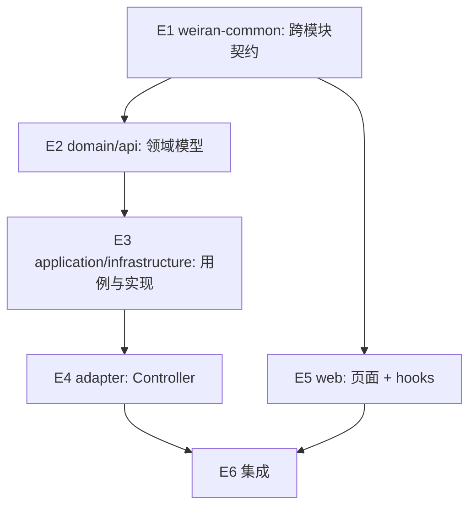

# Exec Plan

> **L4 · 交接点 1:意图 → 工程**。
>
> **不变量:本文件是 `tasks.md` 的下游派生物,单向。**
> 允许:`tasks.md` → 本文件。禁止:本文件的实现细节回写 `tasks.md` / `design.md`。
> 违反这条,spec 会退化成工单,失去描述意图的能力。
>
> 完成后逐条回填文末的 **Gate(10 项)** —— 那是本层的验收标准。

## 1. 任务映射

> `tasks.md` 的条目 → 执行单元。允许 1 条拆成多个执行单元;**禁止**把多条合并成一个执行单元
> (合并会让 L8 无法逐条追溯)。每条 task 必须有归宿:要么进本表,要么进「未映射条目」并写明原因。
>
> **第一列必须写 `tasks.md` 的编号**,覆盖校验靠编号做 —— 只写章节标题或留空,等于没映射。
> 三种合法写法:单个编号 `2.1`、连续区间 `3.1-3.3`(编号与连字符之间不要插反引号)、整组 `§6`。

| tasks.md 条目 | 执行单元 ID | 层 |
|---|---|---|
| `1.1` `weiran-common` 契约改动 | `E1` | L0 |
| `2.1` 领域模型与端口 | `E2` | L1 |
| `3.1` service/route 实现 | `E3` | L1 |
| `4.1` 前端页面/hook | `E4` | L1 |

### 未映射条目

> `tasks.md` 里本轮不执行的条目,必须显式列出并说明原因,不能静默丢弃。

| 条目 | 不执行的原因 |
|---|---|
|  |  |

### L7 测试基线

> `project.json` 的 `commands` 跑的是 `./gradlew check`(全量门禁)或按模块的
> `./gradlew :<module>:check`(迭代时用)—— **本 change 用哪个,写在这里**,
> 否则 L8 无法复核当时的验证范围。分支不是从 `main` 切出来的(如叠在另一个分支上)时**必须**写。

- 基线:`main`(或:`TEST_BASE=<commit>`,理由:)

## 2. 依赖图

| 执行单元 | 前置 | 依赖性质 |
|---|---|---|
| `E2` | `E1` | 需要 E1 冻结的类型签名 |

## 3. 分层执行计划

### Layer 0 —— 共享层,**串行**,必须先完成

> 所有后续执行单元都会读写的文件集中在这一层一次性做完。
> 这一层不并行,是整个方案能并行的前提。

| 执行单元 | 内容 | 涉及文件 |
|---|---|---|
| `E1` |  | `weiran-common/src/main/java/com/weiran/common/...` |

**完成判据**:`./gradlew :weiran-common:check` 通过,且下方「契约冻结」表已填满。

### Layer 1 —— 并行

> 本仓库没有 worktree,「并行」指同一层内多个执行单元的文件集不相交,可交替编写、
> 一起提交,不代表可以真的同时有两个人在改。

| 执行单元 | 内容 |
|---|---|
| `E2` |  |
| `E3` |  |

### Layer N

| 执行单元 | 内容 |
|---|---|
|  |  |

## 4. 契约冻结

> Layer 0 完成后填写并**锁定**。后续并行单元照此实现,不得自行改签名。
> 需要改 → 停下,回到 orchestrator 走变更流程,不允许单个执行单元私自调整。
>
> **「消费方」列必须逐个单元写清它到底读/写哪几个字段,不能只写单元名。**
> 只写整体形状 + 单元名,会让「某个消费方需要的字段其实不在契约里」这类矛盾拖到
> 该单元动手时才暴露 —— 而它在填这张表时就该被发现。
> `workflow-approval-project-routing`(2026-08-22)踩过:`C1` 只写了 formData 的三键形状,
> 直到 L5 写摘要块时才发现「要展示项目负责人姓名,契约里却只有数字 ID」,被迫在执行中改契约
> 并重走 L3 落章。

| 契约 | 签名 / 结构 | 定义位置 | 消费方(逐单元列出所读/所写的键) | 冻结 |
|---|---|---|---|---|
|  |  | `weiran-common/.../XxxDto.java:NN` | `E2` 写 `a`/`b`;`E3` 读 `a` | ☐ |

### 契约变更记录

| 时间 | 原签名 | 新签名 | 发起方 | 已通知 |
|---|---|---|---|---|
|  |  |  |  |  |

## 5. 并行判据与文件所有权

<!-- openspec:slot worktree-tradeoffs
  【项目特定 · 换项目必须重写本槽】
  问:本项目有没有 worktree 隔离?如果没有,同一工作区里,哪些改动仍然不能同时推进?
  为什么问:没有隔离时,「能不能并行」就不再是"要不要多花一次环境搭建成本"的问题,
           而是"两个人同时改同一个共享的工作区状态,谁的证据会被谁污染"的问题。
  答案要求:一张场景 → 能否并行 → 原因的表。本项目**没有** worktree 工具
           (`.claude/skills/devops-ff-workflow/SKILL.md` Phase 0 已明确不发明、不照抄上游的
           `scripts/wt.mjs` 流程),所以下表回答的始终是"能不能与他人在同一工作区交替/同时推进",
           不存在"开不开 worktree"这个维度。
  其他技术栈的成本项举例(仅供换栈参考,本项目不适用):
    Laravel → vendor/ 、.env 、storage/ 权限
    Node/TS  → 包管理器安装产物是否跟着 git 走,是否需要单独 build 步骤

  本项目的权威版本住在 `openspec/rules/enforced/project.md` 的 `WT-N` 条目 —— 改判据先改那里,
  再同步下面这张表(ID 列对应 `WT-N`)。两边 ID 不一致会被 `TEMPLATE/profile-rows` 拦。
-->

> **本仓库没有 worktree 工具,所有 change 都在同一个工作区主检出里推进。**
> 下表回答的**不是**「要不要隔离」——没有这个选项——
> 而是「**这个 change 能不能与别的 change 同时/交替推进**」。
>
> 正因为没有 worktree,WT-0 的三条后果**没有退路**:一旦撞上,唯一的办法是等对方收尾,
> 不能靠"反正各自 worktree 互不影响"来豁免。

| ID | 场景 | 能否与他人并行 | 原因 |
|---|---|---|---|
| WT-0 | **工作区已有他人在推进的 change** | ❌ **必须先问这一条** | 别人的红灯会染红你的 `./gradlew check`、别人的 diff 会让 L9 无法单独签字、别人改流水线文件会让你已落章的 design 被判缺行。三条判据(他人未提交改动 / 第二个 change **有文件且近期活跃** / `git log` 有他人提交)见 `rules/enforced/project.md` WT-0 |
| WT-1 | 纯文档 / spec / openspec 流水线自身的改动 | ✅ 可与代码改动交替推进(仍受 WT-0 约束) | `node openspec/check.mjs` 零依赖,不需要 Gradle 构建。⚠️ 改**流水线本体**命中 WT-0 第 3 条动态读取风险 |
| WT-2 | 涉及 `weiran-common`,**或流水线本体** | ❌ 必须排队 | `weiran-common` 是所有模块的公共依赖,改了签名要同步检查所有消费方;`rules/**` `schemas/**` `config.yaml` `check.mjs` `guards/**` 被检查**动态读取**,对方一改,你已落章的 design 立刻被判缺行 |
| WT-3 | 单模块、3~5 个文件的小改动 | ✅ 可与他人交替推进(仍受 WT-0 约束) | 改动小不改变"同一工作区同一时刻只能有一个人在改"这条约束——决定能不能并行的是 WT-0/WT-2 是否命中,不是改动大小 |

> **「本 change 内部无并行」是常见且合法的结论。** 本节写「单执行单元,内部无并行」
> 完全合格,不要为了并行而并行。
>
> 内部确实要拆并行,再往下填:同一层内,两个执行单元的「拥有文件」不得相交。
> 相交即说明分层错了,退回第 3 节重切,不要靠「小心点别改同一行」硬上。
>
> **两级验证,不要写成「验证回主干」**:lane 内自测就在该阶段跑(结论落收尾笔记);
> **L7 硬闸门证据在全部合并之后产生一次,且必须是代码改动的最后一步**——
> 没有 worktree 意味着**任何**后续改动(哪怕是另一个人的)都可能让先产生的证据过期,
> 提交前务必确认工作区在你自己的改动之外是干净的。

<!-- /openspec:slot worktree-tradeoffs -->

> 本仓库没有 worktree,下表按**执行单元**记录文件所有权(同一工作区内,靠这张表避免
> 两个执行单元同时改同一文件,不是靠物理隔离)。

| 执行单元 | 拥有(可写) | 只读 | 禁止触碰 |
|---|---|---|---|
| `E3` | `weiran-system-application/src/...` `weiran-system-adapter/src/...` | `weiran-common/**` | `web/**` |
| `E4` | `web/src/pages/...` | `weiran-common/**` | `weiran-system-*/**` |

## 6. 测试归属

> **测试不单独成执行单元**。测试跟随它验证的实现,同一执行单元、同一 agent。
> 拆开会导致:实现方全程没有测试反馈回路,测试方对着没写过的代码补测试,结果是给实现盖章而非发现问题。

| 执行单元 | 测试范围 | 测试文件 |
|---|---|---|
| `E2` | 单元 + 接口 |  |

集成测试归 L7 硬闸门,不属于任何单个执行单元。

## 7. 失败与降级

| 场景 | 处置 |
|---|---|
| subagent 超时 | 重试 1 次 |
| 重试后仍失败 | 降级串行,由 orchestrator 亲自做该单元 |
| 产出不可用(编译不过/答非所问) | 丢弃 diff,降级串行 |
| 同层两个单元产生文件冲突 | 视为分层错误,停止并行,回第 3 节重切 |
| 契约需要变更 | 暂停依赖该契约的全部单元,更新第 4 节后恢复 |

## 8. 收尾要求

每个执行单元完成时,必须在 `exec/notes/<单元ID>-<简述>.md` 写收尾笔记后才能结束
(骨架复制 `templates/exec-note.md`)。
**subagent 上下文一销毁,未落盘的实现知识永久丢失**,而 L6 集成恰恰需要它。

## Gate

> 从 `tasks.md` 派生本文件时**逐条过**。十条全绿才算交接完成。

- [ ] 每条 task 都已映射,或已在「未映射条目」声明并写明原因
- [ ] `explore.md` 的共享层清单已逐项比对,命中项全部落在 Layer 0
- [ ] 若涉及数据库结构变更,已按 `rules/enforced/constitution.md` CP-7 与 `weiran-v1` 核对
- [ ] 依赖图无环,且「前后端」这类隐性契约依赖已识别(不是并行,是契约依赖)
- [ ] Layer 0 的契约冻结表已列出待填项
- [ ] 无独立的测试执行单元(测试跟随实现)
- [ ] 同层执行单元的「拥有(可写)文件集」两两不相交
- [ ] 每个执行单元的「禁止触碰」已写明
- [ ] 失败与降级策略已填(第 7 节)
- [ ] 已确认本文件未产生任何对 `tasks.md` / `design.md` / `specs/**` 的回写
